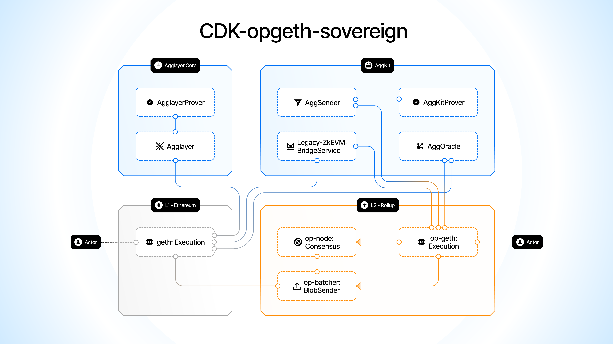

Katana is built using the [Agglayer CDK-opgeth](https://docs.agglayer.dev/cdk/cdk-opgeth/architecture/) stack. CDK-opgeth is natively connected to the Agglayer network, and is an OP Stack-style config built with ZK tech on Ethereum’s most widely adopted execution client, Geth. 

CDK-opgeth-sovereign is connected to Agglayer which uses pessimistic proof, a novel ZK proof whose program logic is written in Rust and proven using the SP1 zkVM and Plonky3 proving system.

