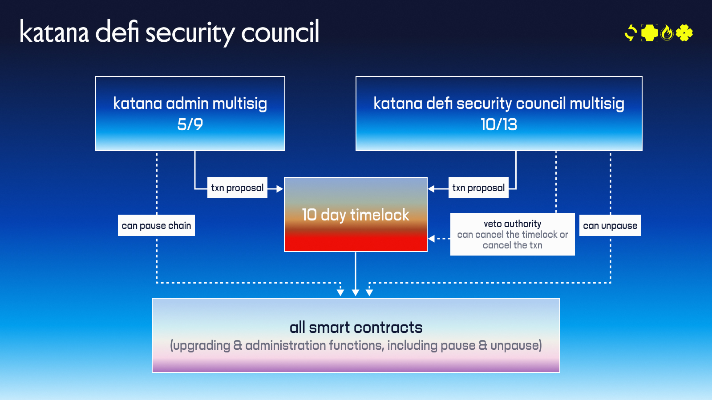

# **Katana Governance**

From day one, **on-chain controls and institutional checks** ensure that governance decisions reflect the interests of a diverse, security-conscious ecosystem. All critical upgrades and administrative functions must be reviewed and approved by a group of independent stakeholders, rather than a single team or company.

## **Overview: Purpose-Built for Security, Speed, and Ecosystem-First Control**

**Katana** is more than a high-yield, deep-liquidity DeFi chain—it’s a governance-first blockchain where infrastructure and decision-making are embedded directly into the chain’s architecture. From day one, Katana’s technical governance ensures rapid iteration and swift emergency response—without compromising decentralization.

Katana launches with a two-tier governance structure: a nimble proposal engine (Katana Admin) and a robust safety mechanism (DeFi Security Council). Together, they ensure Katana Network can evolve quickly, protect user funds, and stay aligned with its ecosystem partners.

## **tl;dr: Two Multisigs, One Coordinated System**

* **Katana Admin (3/5 Multisig):** Proposes all critical system changes. Controlled by foundational engineering contributors at Katana Foundation, Polygon Labs, and GSR.  
* **DeFi Security Council (10/13 Multisig):** Oversees system security. Can veto or fast-track changes. Composed of top-tier infrastructure providers and DeFi integrators offering in-protocol services and tooling within the Katana ecosystem. 

Security and speed shouldn’t be trade-offs. By separating proposal power (Admin) from execution control (Security Council), Katana ensures:

* **Fast iteration** without sacrificing trust.  
* **Robust defense** against bugs or exploits.  
* **Clear accountability** backed by top-tier ecosystem partners.

Just like Katana’s yield-generating tokens and composable apps, governance here is protocol-native—flexible enough to evolve, and secure enough to scale.

## **Katana Admin: Fast, Focused, and Frameworked**

*Multisig Address (Ethereum): 0xd512543315c95506E4209805b888414EEF15C8C4
*Multisig Address (Katana): 0xd512543315c95506E4209805b888414EEF15C8C4

The **Katana Admin** multisig is the operational heartbeat of Katana governance. It initiates all technical upgrades, config changes, and system-level proposals. Here’s how it works:

* **3-of-5 multisig**, controlled by major network partners Katana Foundation, GSR, and Polygon Labs.

* Upgrades and improvements are proposed by the Admin and automatically enter a **10-day timelock**—a cooling-off period designed to give the network time to audit and react.

* The Admin is responsible for **systems-level architecture**: bridge contracts, verifier upgrades, revenue mechanisms, $KAT token issuance, and ecosystem subsidies.

Think of the Admin as the first-mover in a system built for safe agility—ready to evolve Katana without risking centralization.

## **DeFi Security Council: Watchdog with Real Teeth**

*Multisig Address (Ethereum): 0x03105070424FbA70E4FC37A674eB70eD5190F9A0
*Multisig Address (Katana): 0x03105070424FbA70E4FC37A674eB70eD5190F9A0

Sitting above the Admin multisig is the **DeFi Security Council**, a 13-member multisig that provides oversight and final control. It’s designed for **ecosystem-aligned emergency governance**, and it plays two critical roles:

1. **Veto Power:** With a 10-of-13 vote, the Council can stop any Admin proposal before it executes.

2. **Emergency Execution:** In the event of a critical vulnerability or exploit, the Council has power to intervene.

Members include leading DeFi protocols and infrastructure teams operating within Katana—those running core apps, managing stablecoins, or maintaining validator infrastructure.

| Name                                  | Address                                      |
|---------------------------------------|----------------------------------------------|
| Katana Foundation Engineering/Security Multisig | 0xd0673F989bc3BA9314d0AAF28BfC84e99B7898CC |
| Polygon Labs Engineering/Security Multisig     | 0x9d851f8b8751c5FbC09b9E74E6e68E9950949052 |
| Agora     | 0x27213f58e93f61dcbf768aa5dceb1665dbc810e0 |
| Universal     | 0x975F779f455A130bf1aCCdAb2cf5eD2151472168 |
| Lombard     | 0x0e854a88F451b1ba26405F713BfaACdaEB23d9ec |
| Sushi     | 0xcd4BFdD6A70CCc666FE3a29203B466D450C37342 |
| Yearn     | 0xF53D1fB2EeD22Cf1E8f7E90Da7f1CAe88344065F |
| GSR     | 0xFe3F847247a61D8001D2578D92a1123B9784D85C |
| Katana Foundation     | 0xFfdcDbCD5028d2802Fd3B726C16655B4179D264a |
| Gauntlet     | 0x4082A1D91A353b16e112FbE36b55d222bF417919 |
| Stakehouse     | 0xbdcf6aa73772f0b7b70341a13c0a4091b07f98f4 |
| Bitvault     | 0x2749BAE8f3D8f03820B63ae719322D443ea91892 |
| Re7     | 0xa563FEEA4028FADa193f1c1F454d446eEaa6cfD7 |

## **Communication and Coordination**

The Council operates informally via secure channels.

Proposals, upgrades, and emergency signals are shared asynchronously.
