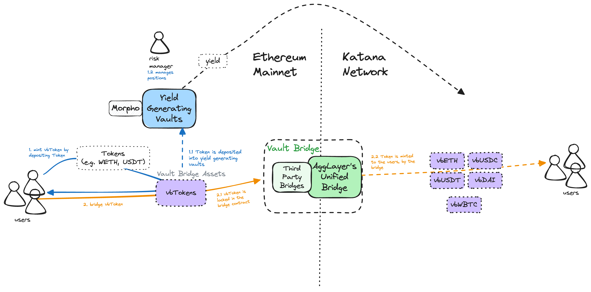

Productive TVL begins at the bridge level. VaultBridge lets users deposit select assets into yield-generating wrappers and bridge them into Katana Network, where the yield is directed to the ecosystem.
The initial set of vbTokens that users on Katana Network receive are vbUSDC, vbUSDS, vbUSDT, vbWBTC, and WETH.

WETH is a yield-generating vbToken that implements the WETH9 interface, serving as Katana Network's drop-in replacement for WETH9.

