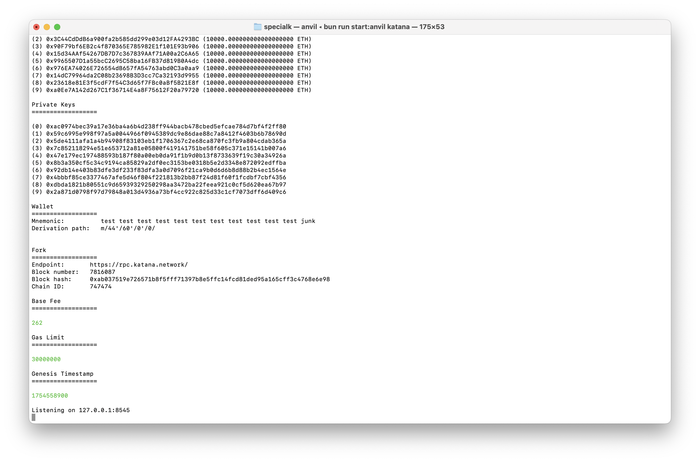
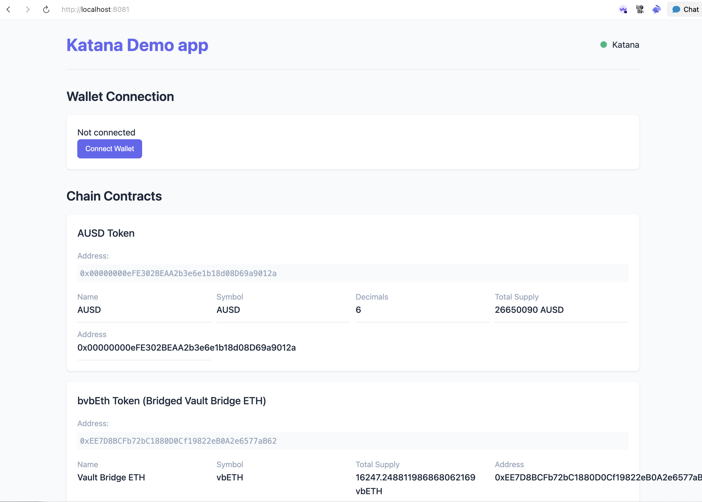

# Katana Development Starter Kit

This tutorial will help you set up and use the Katana Development Starter Kit
for building applications on Katana and its testnet, Bokuto.

## What is Katana?

Katana is a chain focused on providing optimized infrastructure for DeFi
applications with integrated "money legos" - composable financial building
blocks that developers can use to create new financial applications. It is
focused on creating an experience where applications building on it can tap into
deeper liquidity and offer higher yields than is available on any other chain.

## Prerequisites

Make sure you have the following tools installed:

- [Bun](https://bun.sh/) - A fast JavaScript runtime and package manager
- [Foundry](https://book.getfoundry.sh/) - A toolkit for Ethereum application
  development
- [Git](https://git-scm.com/) - Version control

## Setting Up Your Project

1. Clone the repository and navigate to it:

    ```sh
    git clone https://github.com/katana-network/specialk
    cd specialk
    ```

2. Create an environment file by copying the example:

    ```sh
    cp .env.example .env
    ```

3. Edit `.env` to add your RPC endpoints, if desired:

4. Install dependencies:

    ```sh
    bun install
    ```

## Running a Local Fork

To develop locally without spending testnet tokens, you can run a local fork of
the testnets or the mainnet. This will make a local copy of the chain in a few
seconds, running the real state but also providing you with infinite Eth on any
of the open test-addresses provided by Foundry's Anvil.

This is the recommended approach to develop on Katana - it keeps state local and
prevents RPC rate limits, while letting you play with the real state of Katana's
live mainnet.

### Step 1: Start Anvil Fork (Terminal 1)

```sh
bun run start:anvil katana
```



### Step 2: Verify the Fork (Terminal 2)

```sh
bun run verify:anvil
```


## Connecting to the Fork

You can now connect your wallet to your local fork:

- **Network Name**: Katana Local Fork
- **RPC URL**: `http://localhost:8545`
- **Chain ID**: 747474
- **Currency Symbol**: ETH

## Opening the Example App

Build the example app with:

```sh
bun run build:all
```

Going forward, you can just run `bun run build` to rebuild only the app,
but the first `build:all` run will build the ABIs, the MCP server,
and more utilities to bootstrap your environment.

This will:

- Compile your TypeScript code into `dist`
- Copy static assets like HTML, CSS, and images

Then, make sure your local fork is running (Terminal 1) and serve the compiled
web app with any server, e.g.:

```sh
bun run dev
```




## Exploring the Interfaces

One of the key features of this starter kit is the comprehensive set of
interfaces for Katana's "money legos." Browse the `contracts` directory to see
what's available.

Alternatively, for a more readable UI, you can use the
[Katana Contract Directory UI](https://contracts.katana.tools).

## Next Steps

Now that you have a working development environment, you can:

1. Explore the example App code to understand how it interacts with Katana
2. Review the contracts folder to understand available interfaces and ABIs
3. Start building your own application using the "money legos"

For more tutorials, examples, and inspiration, please see the [awesome-katana repo](https://github.com/katana-network/awesome-katana).

## Troubleshooting

If you encounter issues:

- Check that port 8545 isn't already in use by another application
- Ensure Foundry is properly installed and `anvil` is in your PATH
- If the script isn't executable, run `chmod +x scripts/start_anvil.sh`
- If all else fails, let us know in the
  [starter kit issues](https://github.com/katana-network/specialk/issues)!

Happy building on Katana! 🚀
