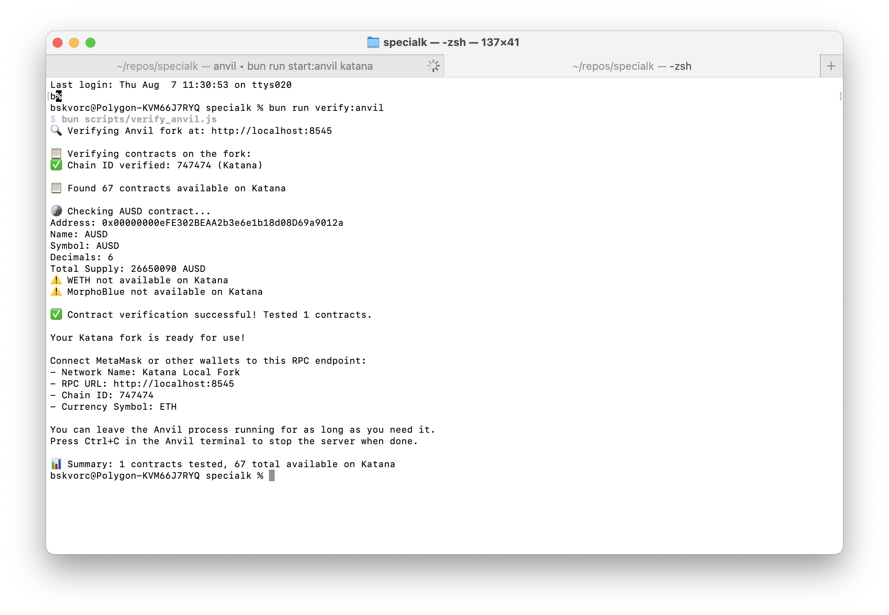

# Katana Development Starter Kit

This tutorial will help you set up and use the Katana Development Starter Kit
for building applications on Katana and its testnet, Tatara.

**Note: Tatara will deprecate on or around the release of Public Mainnet. A new testnet will release along with it...**

## What is Katana?

Katana is a Layer 2 solution focused on providing optimized infrastructure for
DeFi applications with integrated "money legos" - composable financial building
blocks that developers can use to create new financial applications.

## Prerequisites

Before you begin, make sure you have the following tools installed:

- [Bun](https://bun.sh/) - A fast JavaScript runtime and package manager
- [Foundry](https://book.getfoundry.sh/) - A toolkit for Ethereum application
  development
- [Git](https://git-scm.com/) - Version control

### Installing Bun

```sh
curl -fsSL https://bun.sh/install | bash
```

> More info [here](https://bun.sh/docs/installation).

### Installing Foundry

```sh
curl -L https://foundry.paradigm.xyz | bash
foundryup
```

> More info [here](https://book.getfoundry.sh/getting-started/installation)

## Setting Up Your Project

1. Clone the repository and navigate to it:

    ```sh
    git clone https://github.com/katana-network/specialk
    cd specialk
    ```

2. Create an environment file by copying the example:

    ```sh
    cp .env.example .env
    ```

3. Edit `.env` to add your RPC endpoints:

    ```sh
    TATARA_RPC_URL=https://your-tatara-rpc-url
    ```
Get your testnet API Key [here](http://google.com/)

4. Install dependencies:

    ```sh
    bun install
    ```

## Running a Local Tatara Fork

To develop locally without spending testnet tokens, you can run a local fork of
the Tatara testnet.

### Step 1: Start Anvil Fork (Terminal 1)

```sh
bun run start:anvil:tatara
```


### Step 2: Verify the Fork (Terminal 2)

```sh
bun run verify:anvil:tatara
```



## Connecting to the Fork

You can now connect MetaMask or another wallet to your local fork:

- **Network Name**: Tatara Local Fork
- **RPC URL**: `http://localhost:8545`
- **Chain ID**: 471
- **Currency Symbol**: ETH

## Opening the Example App

Build the example app with:

```sh
bun run build
```

This will:

- Compile your TypeScript code
- Create a `dist` folder with your built application
- Copy static assets like HTML, CSS, and images

Then, make sure your local fork is running (Terminal 1) and serve the compiled
web app with any server, e.g.:

```sh
cd dist
npx http-server
```


## Exploring the Interfaces

One of the key features of this starter kit is the comprehensive set of
interfaces for Katana's "money legos." Browse the `interfaces` directory to see
what's available. The README of that folder contains a full list of contracts
and their descriptions.

Alternatively, for a more readable UI, you can use the
[Katana Contract Directory UI](https://contractdir.bruno.id).

## Next Steps

Now that you have a working development environment, you can:

1. Explore the example App code to understand how it interacts with Katana
2. Review the interfaces to understand available contracts
3. Start building your own application using the "money legos"

For more tutorials, examples, and inspiration, please see the [awesome-katana repo](https://github.com/katana-network/awesome-katana).

## Troubleshooting

If you encounter issues:

- Make sure your RPC URL in `.env` is correct
- Check that port 8545 isn't already in use by another application
- Ensure Foundry is properly installed and `anvil` is in your PATH
- If the script isn't executable, run `chmod +x scripts/start_anvil.sh`
- If all else fails, let us know in the
  [starter kit issues](https://github.com/katana-network/specialk/issues)!

Happy building on Katana! 🚀