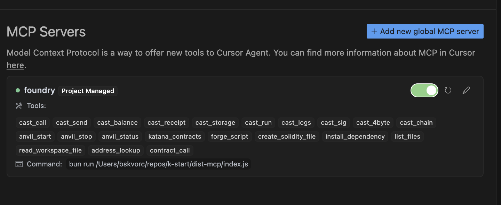
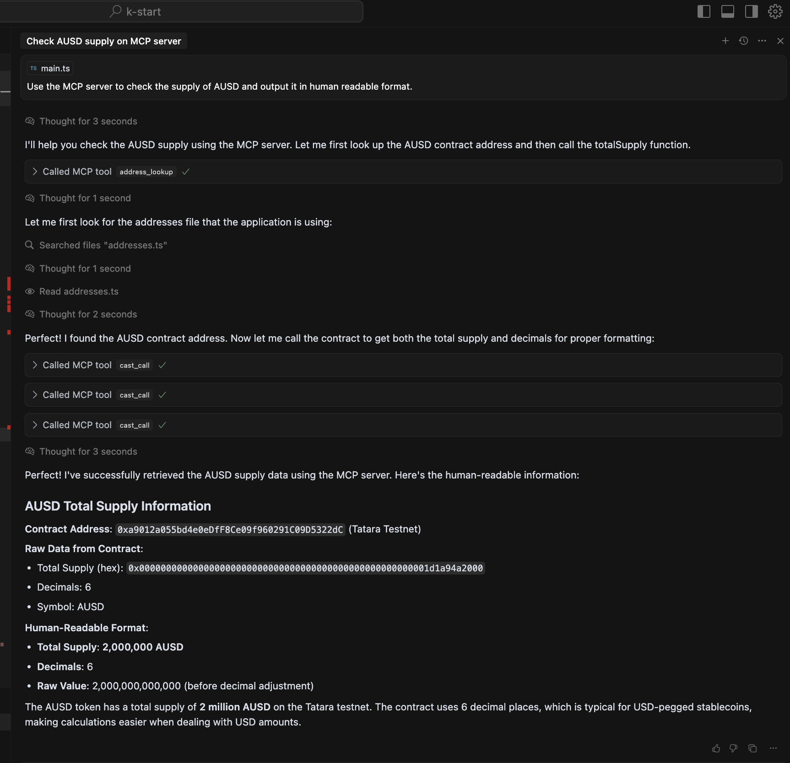
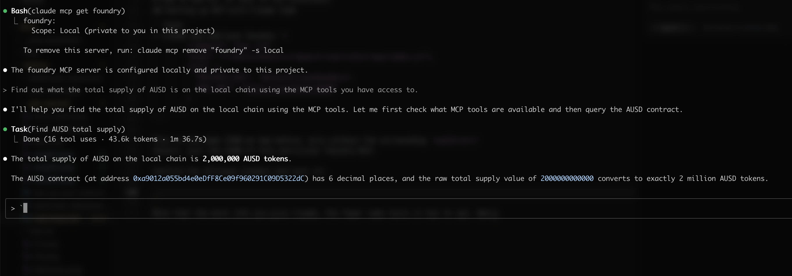

# How to use MCP to talk to the blockchain

The
[starter kit](https://docs.katana.network/katana/get-started/set-up-your-environment/)
comes with a built-in MCP server.

MCP stands for model-context-protocol and allows LLMS to talk to external tools
to enhance their context and change their surroundings by executing API calls.

In our case, this allows an LLM tool (like Cursor, Claude, and others) to talk
to a blockchain and even execute transactions on it. Since the starter kit comes
with its own Anvil script to clone the live chain and run it locally, this also
means the LLM can run simulations, tear down and reboot the chain, and more.

Imagine telling the LLM "find me a flashloan exploit between Morpho's contracts
and AUSD in Yearn" and going to bed, only to come back to either a reportable
exploit, or a bulletproof integration.

## Building the MCP server (optional!)

The MCP server is already built and in the repo when you clone it, but if you
want to rebuild it (in case you made some changes, added features and tools into
it, etc.) you can run the following command:

```bash
% bun run build:mcpserver

$ bun build.js --mcp-only
🏗️ Building MCP server...
Cleaning dist-mcp directory...
✅ MCP server compiled successfully.
✅ MCP server README created.
```

The server's README will be in dist-mcp/README.md containing the server's definition.

## Setting up MCP with Cursor

To activate the MCP server in Cursor, we need to go to Settings -> Cursor
Settings -> MCP. You will probably see an empty list, like this:

[Empty list of MCP servers](./mcp01.png)

Click the only available button, and you'll see an empty MCP JSON settings file:

```json
{
  "mcpServers": {}
}
```

Replace it with the content of your MCP server's README, or the following JSON:

```json
{
  "mcpServers": {
    "foundry": {
      "command": "bun run",
      "args": ["ABSOLUTE_PATH_TO_STARTER_KIT/dist-mcp/index.js"],
      "env": {
        "PRIVATE_KEY": "0xYourPrivateKeyHere",
        "RPC_URL": "http://localhost:8545"
      }
    }
  }
}
```

If you will be executing transactions on your chain of choice, add your private
key as well. For Anvil chains like our localhost:8545 this is not necessary
because Anvil chains have a well known preset of keys that are unlocked on start
and seeded with mock funds.

On a live chain or live testnet, this would be
necessary to execute remote transactions.

Once you save this file, the server's tools (commands) will be indexed by
Cursor, and should appear in the previous screen.



Once you have your Anvil chain running (with `bun run start:anvil:tatara`), you
can ask the chat something about the chain. Let's ask it for the supply of AUSD.



## Setting up MCP with Claude Code

Make sure you have Claude Code installed, then run it with `claude`.

Then we'll tell it to add the MCP from JSON:

```bash
> claude mcp add-json foundry '{
        "command": "bun run",
        "args": ["/Users/bskvorc/repos/k-start/dist-mcp/index.js"],
        "env": {
          "PRIVATE_KEY": "0xYourPrivateKeyHere",
          "RPC_URL": "http://localhost:8545"
        }
      }'
```

This is the same JSON we had before, only without the surrounding `mcpServers`
object, just the JSON of this particular Foundry MCP.

Confirm the followup prompts and test it!



Note that the more info you give claude, the fewer code tools it has to use.

In my example above, it had to grep files for mentions of AUSD. If I had told it
the address is in interfaces/README.md, it would have found what it needs much
sooner.

Remember, with LLMs, it's all about context - the more you can provide in
advance in a concise and compressed way, the better the output will be and the
fewer tokens will be spent.

## Other tools

Other tools function in a similar manner - they all have their own MCP
installation procedure, and they can all ingest the JSON. All the matters is
that the LLM can find the MCP, so when in doubt, build it from the starter kit
with `bun run build:mcpserver` and copy it to wherever you need it.
