# How to build, deploy, and query a Subgraph with Ormi Labs

Indexing and querying blockchain data can be difficult without the right tools. With Ormi’s 0xGraph, anyone can deploy and query subgraphs on the Katana Network in minutes, for free.

## How to deploy a Subgraph
Ormi supports mutiple deployment methods, from beginner friendly to advance:

* **Basic**: Deploy a subgraph using a smart contract address 
* **Basic**: Migrate an existing subgraph using a deployment ID
* **Intermediate**: Deploy via The Graph CLI
* **Advanced**: Build from scratch with your own manifest, schema, and mappings

In this guide, we’ll cover three options:

* [Deploy using a smart contract address](/katana/how-to/Build-and-query-a-Subgraph-with%20-Ormi-Labs/#how-to-deploy-subgraphs-using-a-smart-contract-address)
* [Migrating with a deployment ID](/katana/how-to/Build-and-query-a-Subgraph-with%20-Ormi-Labs/#how-to-deploy-subgraphs-using-a-smart-contract-address)
* [Building a subgraph from scratch](/katana/how-to/Build-and-query-a-Subgraph-with%20-Ormi-Labs/#how-to-build-a-subgraph-from-scratch-using-ormi-0xgraph)

For deploying via CLI, [see our separate guide](https://blog.ormilabs.com/how-to-deploy-a-usdc-subgraph-with-ormi-0xgraph/).

## Prerequisites 
An Ormi Labs account: [create one here](https://app.ormilabs.com/dashboard/0xgraph)

## How to deploy subgraphs using a smart contract address

1. In the Ormi dashboard, click 0xGraph
2. Expand the migrate from contract address section
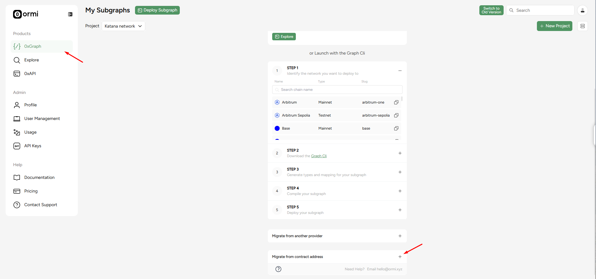

**For this example, we'll use VaultBridge's Bridged USDC**:

**Contract address**: 0x203A662b0BD271A6ed5a60EdFbd04bFce608FD36

**Network**: Katana

**Name**: katana-vbusdc

**Version**: v.1

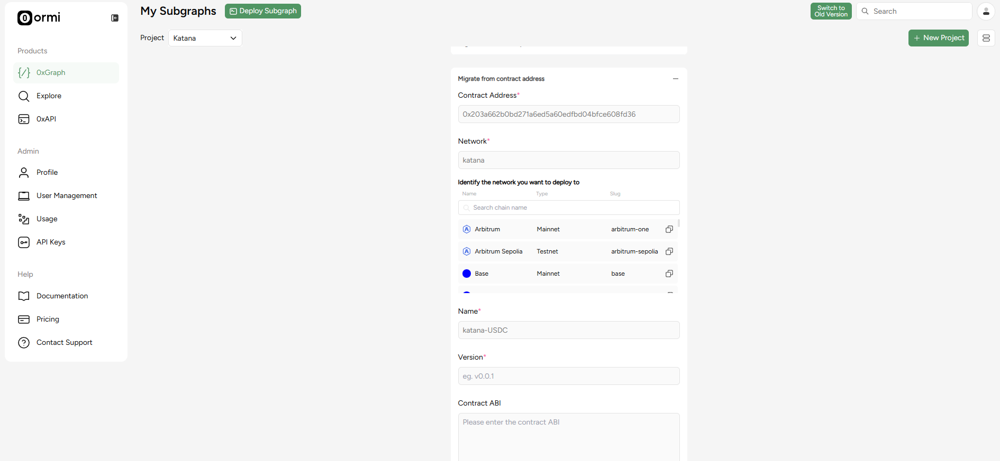

**Note: If the ABI cannot be auto-fetched, you may need to upload it manually.**

For vbUSD, you will need to fetch the implementation contracts’ ABI, so head over to [Katanascan](https://katanascan.com/address/0x5e875267f65537768435c3c6c81cd313a570b422#code).

**Implementation contract**: 0x5e875267f65537768435C3C6C81cd313a570B422

Press on the contract tab.

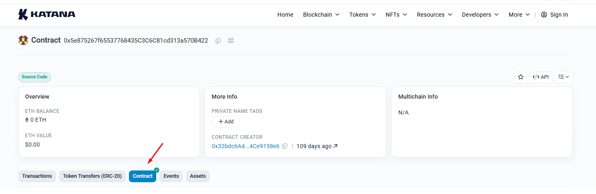

Scroll down to the bottom, and copy the Contract ABI.

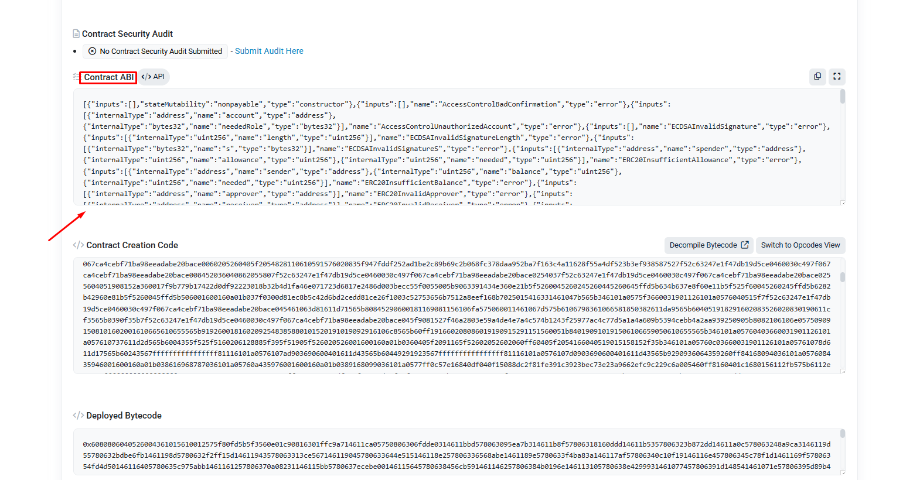

Paste Contract ABI into this section and press submit.

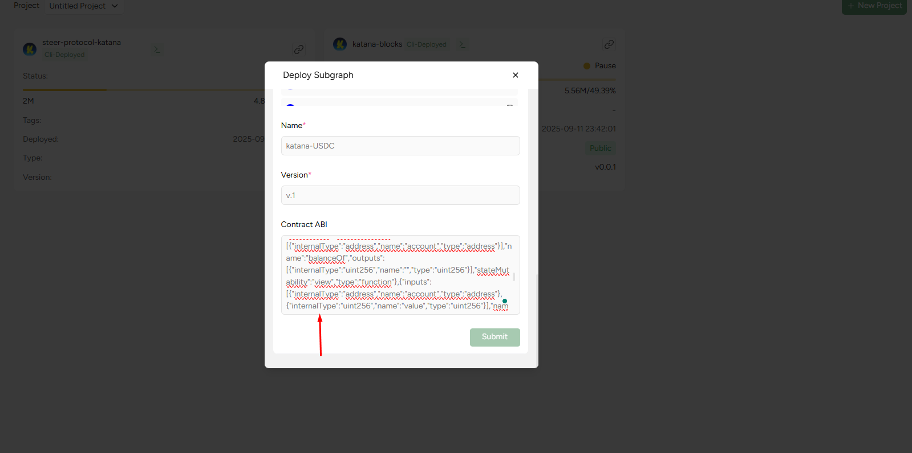

Once submitted, the system will process your request. When it finishes loading, you’ll be taken to the next screen. 

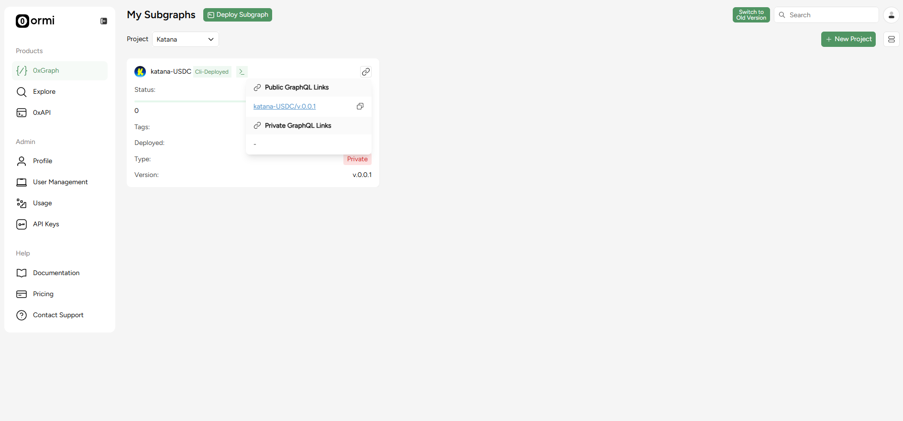

When your subgraph finishes syncing, you can start querying immediately by clicking the graphql link.

---

## Migrate a subgraph using a deployment ID

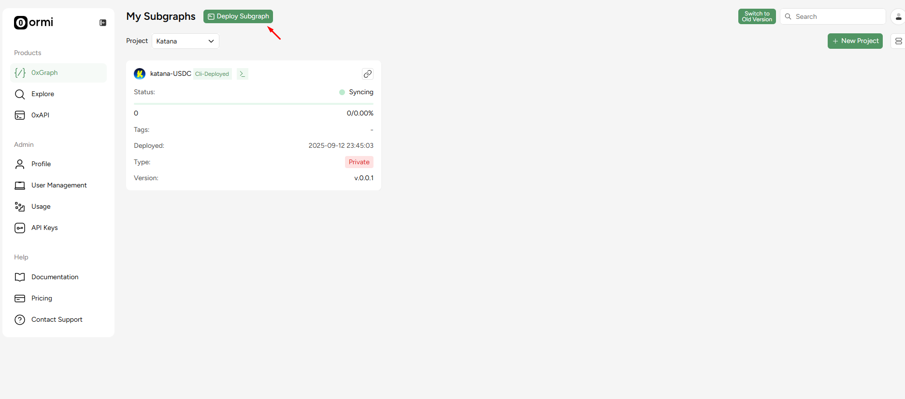

In the dashboard, click Deploy a subgraph (top navigation).

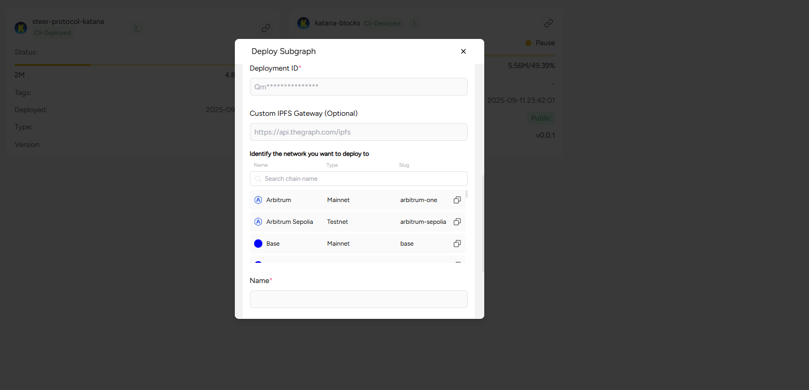

A new window will open. Provide the following:
* Deployment ID
* Name
* Version

For example, to migrate SushiSwap from: [TheGraph’s explorer](https://thegraph.com/explorer/subgraphs/F4BWERAWUduNTwZEF72yYi8GyEbWWsDdDZbJADUEUG16?view=Query&chain=arbitrum-one).

**Deploment ID**: QmQRhuvVQ4MahD7u5Z3d6NJ2BRfaKYhc3RbNY31FuNQdBi
**Name**: katana-v2-sushiswap
**Version**: v.0.0.1

After entering these details, you’ll be redirected to the 0xGraph dashboard, where your subgraph will start syncing automatically.

That’s it! Once your subgraph syncs, you’ll be able to query data directly through Ormi’s 0xGraph

---

## How to build a subgraph from scratch using Ormi 0xGraph

### What you need
* [Graph CLI installed](https://www.npmjs.com/package/@graphprotocol/graph-cli?ref=blog.ormilabs.com)
* [node.js installed](https://nodejs.org/en)
* [Git installed](https://git-scm.com/downloads)

### Getting started
1. Log in to [Ormi](https://app.ormilabs.com/) and go to your dashboard.
2. From the dashboard, create an API key for deployments.

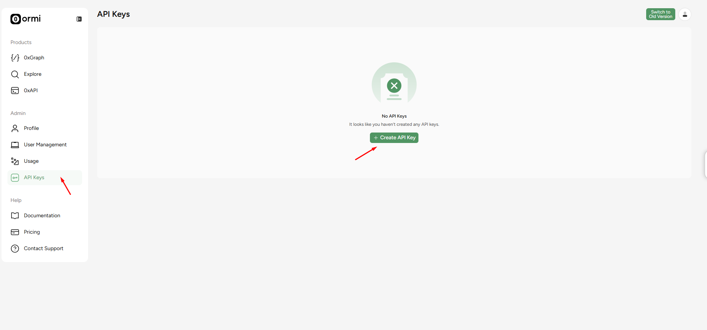

Keep this page open, we’ll need the API key to deploy a subgraph.

### Install Graph CLI

On your local machine, run the following in your terminal:

```
npm install -g @graphprotocol/graph-cli
```

### Create a directory for your subgraph
```
mkdir katana-blocks
cd katana-blocks
```
We’ll call the folder katana-blocks in this example.

### Initialize Node project
Run bash in the directory folder

```
npm init -y
```

### Install dependencies
```
npm install --save-dev @graphprotocol/graph-ts
npm install --save-dev assemblyscript
```

### Create the required files
You will need:

* subgraph.yaml
* schema.graphql
* mappings/blocks.ts
* abis/Dummy.json

#### subgraph.yaml
```
specVersion: 0.0.5
description: Blocks indexer for Katana
schema:
  file: ./schema.graphql

dataSources:
  # We declare a contract data source so we can attach a blockHandler.
  # The "Dummy" ABI is unused but required by the manifest when kind=ethereum/contract.
  - kind: ethereum/contract
    name: KatanaBlocks
    network: katana
    source:
      address: "0x0000000000000000000000000000000000000000"  # not used
      abi: Dummy
      startBlock: 1
    mapping:
      kind: ethereum/events
      apiVersion: 0.0.7
      language: wasm/assemblyscript
      entities:
        - Block
      abis:
        - name: Dummy
          file: ./abis/Dummy.json
      # This is the key: run our handler every block
      blockHandlers:
        - handler: handleBlock
      file: ./mappings/blocks.ts
```

Note: `Dummy.json` is required because every data source must include at least one ABI, even if unused. Just put `[]` inside it.

#### schema.graphql
```
type Block @entity(immutable: true) {
  id: ID!            # we will use the block number as the ID
  number: BigInt!
  timestamp: BigInt!
  hash: Bytes!
  parentHash: Bytes!
}
```

#### Mapping files in typescript
```
import { Block as BlockEntity } from "../generated/schema";
import { ethereum } from "@graphprotocol/graph-ts";

export function handleBlock(block: ethereum.Block): void {
  // Use block number as the stable ID
  let id = block.number.toString();

  let entity = new BlockEntity(id);
  entity.number = block.number;
  entity.timestamp = block.timestamp;
  entity.hash = block.hash;
  entity.parentHash = block.parentHash;
  entity.save();
}
```

### Directory layout
```
katana-blocks/
├─ abis/
│  └─ Dummy.json          
├─ mappings/
│  └─ blocks.ts
├─ schema.graphql
└─ subgraph.yaml
```

You’ll also see `node_modules/` after installing dependencies - that’s expected.

### Build the Subgraph

Generate types:
```
graph codegen
```
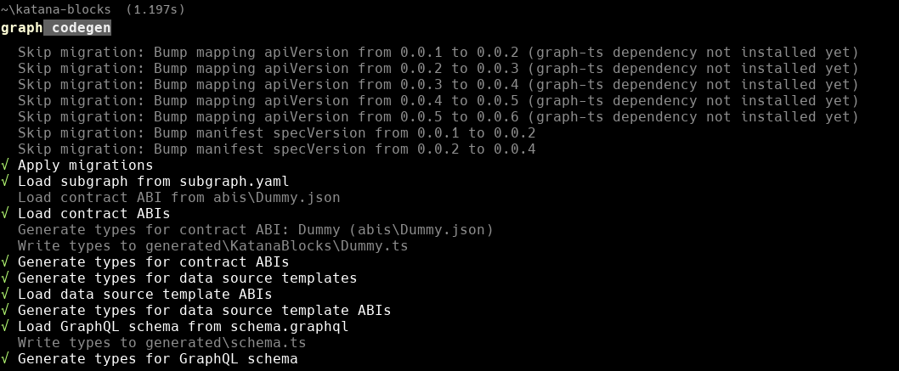

Now run:
```
graph build
```
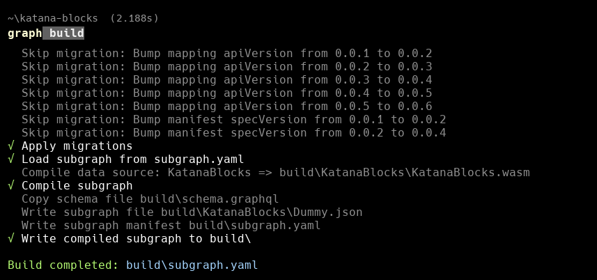

### Deploy the Subgraph to Ormi 0xGraph
Return to your [API key](https://app.ormilabs.com/dashboard/api) from the dashboard. Replace <graph-name> and <API key> with your actual values

```
graph deploy <graph-name> --node  https://subgraph.api.ormilabs.com/deploy --ipfs https://subgraph.api.ormilabs.com/ipfs --deploy-key <API key>
```
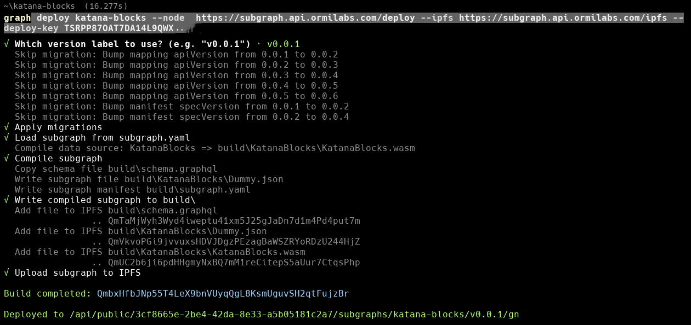

### Track sync status
You can check syncing in the dashboard by going to the Subgraphs tab:

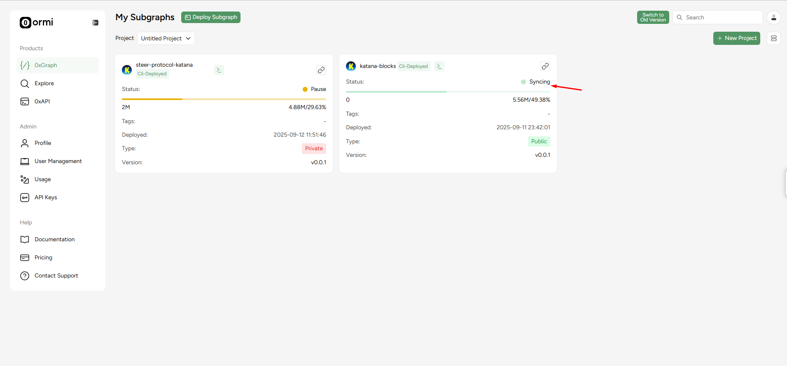

### Query Katana blocks
Click on the button where the red arrow is pointing.


Once synced, click the GraphQL endpoint link in the dashboard.

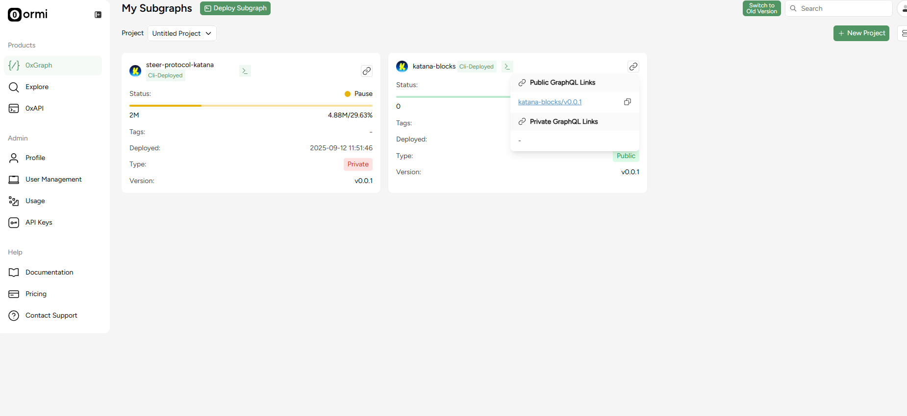

### Sample query
Run this query to fetch the latest 5 blocks

```
{
  blocks(first: 5) {
    id
    number
    timestamp
    parentHash
  }
}
```

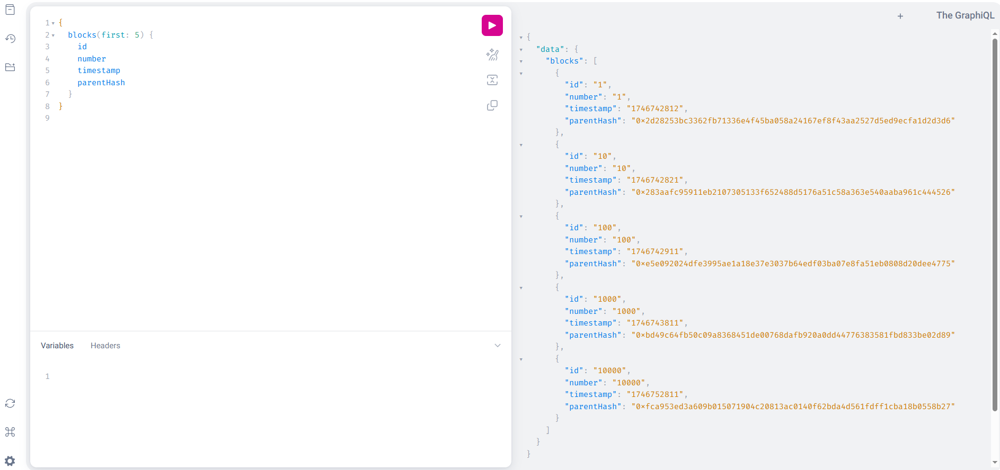

## Done!
You now have a live subgraph indexing Katana blocks through [Ormi’s 0xGraph](https://app.ormilabs.com/).

## Additional resources
* [Start for free](https://app.ormilabs.com/)
* [Ormi Official Website](https://www.ormilabs.com/)
* [0xGraph Documentation](https://docs.ormilabs.com/)