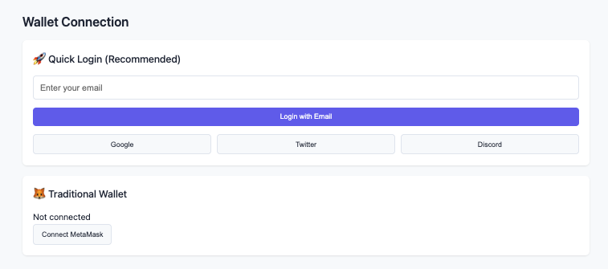
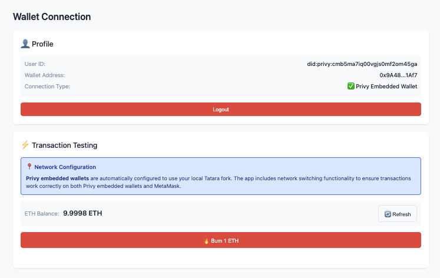

# Onboarding with Privy: From Web3 to Web2.5

A comprehensive tutorial for integrating Privy's embedded wallets into your dapp
while maintaining traditional wallet support as a fallback. This guide will only
implement Privy on the client-side, which is considered less secure than a full
server-side implementation. We will harden the implementation in a future guide.
We will also be building only the email-login part, leaving Oauth for part 2.

## Prerequisites

### Privy Dashboard Setup

- Create an account at [dashboard.privy.io](https://dashboard.privy.io)
- Create a new app and note your App ID
- Enable email and social login in your app settings
- Add `http://localhost:8080` to "Allowed Domains"

### Environment Configuration

Add the app ID and SECRET to your `.env` file:

```bash
PRIVY_APP_ID=...
PRIVY_APP_SECRET=...
```

### Dependencies

Install the Privy SDK:

```bash
bun add @privy-io/js-sdk-core
```

Note that because we are avoiding ReactJS in the sample app to decrease supply
chain attack surface and increase performance, we're are defaulting to the less
documented js-sdk-core, which requires us to write quite a bit more code. 

The tradeoff is coding complexity vs long term security, and we also gain
immunity to vendor lock-in. If you're using React, the integration is
dramatically simpler and only takes a
[single package installation](https://docs.privy.io/basics/react/installation)
with some configuration tweaks.

## Step 1: Update the HTML Structure

Replace your existing `src/index.html` with the enhanced version that includes
Privy authentication UI:

```html
<!DOCTYPE html>
<html lang="en">
<head>
  <meta charset="UTF-8">
  <meta name="viewport" content="width=device-width, initial-scale=1.0">
  <title>Katana Demo app</title>
  <link rel="stylesheet" href="style.css">
</head>
<body>
  <div class="container">
    <header>
      <h1>Katana Demo app</h1>
      <div class="network-status">
        <span id="network-indicator"></span>
        <span id="network-name">Connecting...</span>
      </div>
    </header>

    <!-- Hidden iframe for Privy embedded wallet -->
    <iframe 
      id="privy-embedded-wallet-iframe" 
      style="display: none;"
      sandbox="allow-scripts allow-same-origin allow-forms allow-popups allow-top-navigation"
    ></iframe>

    <main>
      <section id="wallet-section">
        <h2>Wallet Connection</h2>
        
        <!-- Privy Login Card -->
        <div class="card" id="privy-login-card">
          <h3>🚀 Quick Login (Recommended)</h3>
          <div class="login-options">
            <input type="email" id="email-input" placeholder="Enter your email">
            <button id="email-login-btn" class="primary-button">Login with Email</button>
            <div class="social-logins">
              <button id="google-login-btn" class="social-button">Google</button>
              <button id="twitter-login-btn" class="social-button">Twitter</button>
              <button id="discord-login-btn" class="social-button">Discord</button>
            </div>
          </div>
        </div>

        <!-- Traditional Wallet Card -->
        <div class="card" id="traditional-wallet-card">
          <h3>🦊 Traditional Wallet</h3>
          <div id="wallet-status">Not connected</div>
          <button id="connect-wallet" class="secondary-button">Connect MetaMask</button>
        </div>

        <!-- User Profile (hidden initially) -->
        <div class="card" id="user-profile" style="display: none;">
          <h3>👤 Profile</h3>
          <div id="user-info"></div>
          <div class="profile-actions">
            <button id="logout-btn" class="danger-button">Logout</button>
          </div>
        </div>

        <!-- Transaction Testing (hidden initially) -->
        <div class="card" id="transaction-testing" style="display: none;">
          <h3>⚡ Transaction Testing</h3>
          
          <!-- Network Compatibility Warning -->
          <div class="network-warning">
            <h4>📍 Network Configuration</h4>
            <p><strong>Privy embedded wallets</strong> are automatically configured to use your local Bokuto fork. The app includes network switching functionality to ensure transactions work correctly on both Privy embedded wallets and MetaMask.</p>
          </div>
          
          <div class="wallet-balance">
            <div class="balance-display">
              <span class="label">ETH Balance:</span>
              <span id="eth-balance" class="value">Loading...</span>
            </div>
            <button id="refresh-balance-btn" class="secondary-button">🔄 Refresh</button>
          </div>
          <div class="transaction-actions">
            <button id="burn-eth-btn" class="danger-button">🔥 Burn 1 ETH</button>
            <div id="transaction-status" class="transaction-status"></div>
          </div>
        </div>
      </section>

      <section id="contracts-section">
        <h2>Bokuto Contracts</h2>
        
        <!-- AUSD Token -->
        <div class="card">
          <h3>AUSD Token</h3>
          <div class="contract-address">
            <span>Address:</span>
            <code>0xa9012a055bd4e0eDfF8Ce09f960291C09D5322dC</code>
          </div>
          <div class="contract-data" id="ausd-data">
            <div class="spinner"></div>
            <p>Loading data...</p>
          </div>
        </div>

        <!-- WETH Token -->
        <div class="card">
          <h3>WETH Token</h3>
          <div class="contract-address">
            <span>Address:</span>
            <code>0x17B8Ee96E3bcB3b04b3e8334de4524520C51caB4</code>
          </div>
          <div class="contract-data" id="weth-data">
            <div class="spinner"></div>
            <p>Loading data...</p>
          </div>
        </div>

        <!-- MorphoBlue -->
        <div class="card">
          <h3>MorphoBlue Protocol</h3>
          <div class="contract-address">
            <span>Address:</span>
            <code>0xC263190b99ceb7e2b7409059D24CB573e3bB9021</code>
          </div>
          <div class="contract-data" id="morpho-data">
            <div class="spinner"></div>
            <p>Loading data...</p>
          </div>
        </div>
      </section>
    </main>
  </div>

  <script type="module" src="main.js"></script>
</body>
</html>
```

## Step 2: Add Privy Styling

Add the following styles to your `src/style.css` file (append to the existing styles):

```css
/* Privy Login Styles */
.login-options {
  display: flex;
  flex-direction: column;
  gap: 15px;
}

#email-input {
  padding: 12px;
  border: 1px solid var(--border-color);
  border-radius: 6px;
  font-size: 1rem;
  transition: border-color 0.2s ease;
}

#email-input:focus {
  outline: none;
  border-color: var(--primary-color);
  box-shadow: 0 0 0 3px rgba(99, 102, 241, 0.1);
}

.social-logins {
  display: flex;
  gap: 10px;
  flex-wrap: wrap;
}

.social-button {
  flex: 1;
  min-width: 100px;
  background-color: #f8fafc;
  color: var(--text-color);
  border: 1px solid var(--border-color);
  padding: 10px 15px;
  border-radius: 6px;
  cursor: pointer;
  font-weight: 500;
  transition: all 0.2s ease;
}

.social-button:hover {
  background-color: #e2e8f0;
  border-color: var(--primary-color);
}

.secondary-button {
  background-color: #f8fafc;
  color: var(--text-color);
  border: 1px solid var(--border-color);
}

.secondary-button:hover {
  background-color: #e2e8f0;
  border-color: var(--primary-color);
}

.danger-button {
  background-color: var(--error-color);
  color: white;
}

.danger-button:hover {
  background-color: #dc2626;
}

/* User profile styles */
#user-info {
  margin-bottom: 15px;
  padding: 10px;
  background-color: var(--background);
  border-radius: 6px;
}

.user-detail {
  display: flex;
  justify-content: space-between;
  margin-bottom: 5px;
  font-size: 0.9rem;
}

.user-detail .label {
  color: var(--light-text);
}

.user-detail .value {
  font-weight: 500;
}

.profile-actions {
  display: flex;
  gap: 10px;
  justify-content: space-between;
}

.profile-actions button {
  flex: 1;
}

/* Transaction testing styles */
.network-warning {
  background-color: #dbeafe;
  border: 1px solid #3b82f6;
  border-radius: 6px;
  padding: 12px;
  margin-bottom: 15px;
}

.network-warning h4 {
  margin: 0 0 8px 0;
  color: #1e40af;
  font-size: 0.9rem;
  font-weight: 600;
}

.network-warning p {
  margin: 0;
  color: #1e3a8a;
  font-size: 0.85rem;
  line-height: 1.4;
}

.wallet-balance {
  display: flex;
  justify-content: space-between;
  align-items: center;
  margin-bottom: 15px;
  padding: 10px;
  background-color: var(--background);
  border-radius: 6px;
}

.balance-display {
  display: flex;
  gap: 10px;
  align-items: center;
}

.balance-display .label {
  color: var(--light-text);
  font-size: 0.9rem;
}

.balance-display .value {
  font-weight: 600;
  font-size: 1.1rem;
}

.transaction-actions {
  display: flex;
  flex-direction: column;
  gap: 10px;
}

.transaction-status {
  min-height: 20px;
  font-size: 0.9rem;
}

.transaction-status.success {
  color: var(--success-color);
}

.transaction-status.error {
  color: var(--error-color);
}

.transaction-status.pending {
  color: var(--warning-color);
}

/* Responsive design */
@media (max-width: 768px) {
  .social-logins {
    flex-direction: column;
  }
  
  .social-button {
    min-width: auto;
  }
  
  .contract-data.loaded {
    grid-template-columns: 1fr;
  }
}
```

If you rebuild the app and refresh, the UI should look okay.



## Step 3: Logic

This is the meat of the upgrade - the most complex part. Let's go through it
piece by piece.

First, we will add `defineChains` and `Chain` to the viem imports, and import
Privy. We need these new imports to be able to define our local chain as a
supported chain for Privy to consume.

```typescript
import {
  createPublicClient,
  createWalletClient,
  custom,
  formatEther,
  formatUnits,
  http,
  PublicClient,
  WalletClient,
  defineChain, // <- add this
  Chain, // <- and this
} from "viem";

//... other imports

import Privy, {
  getUserEmbeddedEthereumWallet,
  type OAuthProviderType,
  type PrivyEmbeddedWalletProvider,
} from "@privy-io/js-sdk-core";
```

Since, as we mentioned, Privy is not aware of Bokuto or our local chain, let's
define it.

```ts
const BOKUTO_CHAIN = defineChain({
  id: 471,
  name: 'Bokuto Testnet',
  network: 'Bokuto',
  nativeCurrency: {
    decimals: 18,
    name: 'Ether',
    symbol: 'ETH',
  },
  rpcUrls: {
    default: {
      http: ['http://localhost:8545'],
    },
    public: {
      http: ['http://localhost:8545'],
    },
  },
  blockExplorers: {
    default: { 
      name: 'Bokuto Explorer', 
      url: 'http://localhost:8545' // Using RPC URL as placeholder since there's no block explorer
    }
  },
});
```

Privy works by embedding a wallet into a hidden iframe on the website, and by
passing messages between your app and iframe. We need to make sure that these
messages can be passed by setting up a message handler, and we need to also make
sure the iframe loaded. The iframe will load the URL of the embedded wallet of
your configured Privy app.

Let's add some Privy specific things.

```ts
let iframeReady = false;
let messageHandlerSetup = false;

interface WalletProvider {
  type: "privy" | "traditional";
  connect(): Promise<void>;
  getAddress(): Promise<string>;
  getWalletClient(): Promise<WalletClient>;
  disconnect(): Promise<void>;
}

let currentWalletProvider: WalletProvider | null = null;
let embeddedWalletProvider: PrivyEmbeddedWalletProvider | null = null;
let publicClient: PublicClient;

// Privy DOM Elements
const emailInput = document.getElementById("email-input") as HTMLInputElement;
const emailLoginBtn = document.getElementById("email-login-btn") as HTMLButtonElement;
const googleLoginBtn = document.getElementById("google-login-btn") as HTMLButtonElement;
const twitterLoginBtn = document.getElementById("twitter-login-btn") as HTMLButtonElement;
const discordLoginBtn = document.getElementById("discord-login-btn") as HTMLButtonElement;
const userProfile = document.getElementById("user-profile") as HTMLElement;
const userInfo = document.getElementById("user-info") as HTMLElement;
const logoutBtn = document.getElementById("logout-btn") as HTMLButtonElement;
const privyLoginCard = document.getElementById("privy-login-card") as HTMLElement;
const traditionalWalletCard = document.getElementById("traditional-wallet-card") as HTMLElement;

// Transaction Testing DOM Elements
const transactionTesting = document.getElementById("transaction-testing") as HTMLElement;
const ethBalance = document.getElementById("eth-balance") as HTMLElement;
const refreshBalanceBtn = document.getElementById("refresh-balance-btn") as HTMLButtonElement;
const burnEthBtn = document.getElementById("burn-eth-btn") as HTMLButtonElement;
const transactionStatus = document.getElementById("transaction-status") as HTMLElement;
```

We can now remove the `// Create clients` block and replace with some helper functions:

```ts
function shortenAddress(address: string): string {
  return `${address.substring(0, 6)}...${address.substring(address.length - 4)}`;
}

function updateNetworkStatus(status: "connected" | "error" | "warning", name: string) {
  networkIndicator.className = status;
  networkName.textContent = name;
}

function displayRpcError(customMessage?: string) {
  const errorMessage = `
    <div class="error-message">
      <h4>⚠️ RPC Connection Error</h4>
      ${customMessage ? `<p>${customMessage}</p>` : ""}
      <p>Make sure you've started the local Bokuto fork with:</p>
      <pre>bun run start:anvil:bokuto</pre>
      <p>Your local RPC should be running at http://localhost:8545</p>
    </div>
  `;
  ausdDataElement.innerHTML = errorMessage;
  wethDataElement.innerHTML = errorMessage;
  morphoDataElement.innerHTML = errorMessage;
}

// Simplified UI update utility
function updateUserUI(content: string) {
  privyLoginCard.style.display = "none";
  traditionalWalletCard.style.display = "none";
  userProfile.style.display = "block";
  userInfo.innerHTML = content;
}
```

Now here's a tricky part - we need to make sure the iframe is initialized
properly. It is possible there is a simpler way around this, but I have not
found it yet. If you have a solution, please send a pull request!

```ts
async function ensureIframeReady(): Promise<void> {
  if (iframeReady) return;

  const iframe = document.getElementById("privy-embedded-wallet-iframe") as HTMLIFrameElement;
  if (!iframe) throw new Error("Privy iframe not found in DOM");

  await new Promise((resolve) => setTimeout(resolve, 100));

  if (!iframe.src) {
    iframe.src = privy.embeddedWallet.getURL();
  }

  await new Promise<void>((resolve, reject) => {
    const timeout = setTimeout(() => reject(new Error("Iframe load timeout")), 10000);
    if (iframe.contentWindow) {
      clearTimeout(timeout);
      resolve();
    } else {
      iframe.onload = () => {
        clearTimeout(timeout);
        resolve();
      };
    }
  });

  if (!messageHandlerSetup && iframe.contentWindow) {
    // @ts-ignore
    privy.setMessagePoster(iframe.contentWindow);
    
    window.addEventListener("message", (event: MessageEvent) => {
      if (event.origin !== "https://auth.privy.io") return;
      try {
        const messageHandler = (privy.embeddedWallet as any)._messageHandlerAttached || 
                              (privy as any)._messageHandler;
        if (messageHandler) {
          messageHandler(event.data);
        } else if (privy.embeddedWallet.onMessage) {
          privy.embeddedWallet.onMessage(event.data);
        }
      } catch (err) {
        console.error("Error handling iframe message:", err);
      }
    });
    
    messageHandlerSetup = true;
  }
  iframeReady = true;
}
```

Next, let's connect Privy.

```ts
async function connectPrivyWallet(): Promise<void> {
  await ensureIframeReady();
  
  const user = await privy.user.get();
  if (!user.user) throw new Error("No Privy user found. Please login first.");

  let userEmbeddedWallet = getUserEmbeddedEthereumWallet(user.user);
  
  if (!userEmbeddedWallet) {
    // Create wallet with polling
    privy.embeddedWallet.create({}).catch(() => {});
    
    // Poll for wallet creation
    for (let attempt = 0; attempt < 30; attempt++) {
      await new Promise((resolve) => setTimeout(resolve, 1000));
      const updatedUser = await privy.user.get();
      if (updatedUser.user) {
        userEmbeddedWallet = getUserEmbeddedEthereumWallet(updatedUser.user);
        if (userEmbeddedWallet) {
          embeddedWalletProvider = await privy.embeddedWallet.getProvider(userEmbeddedWallet);
          return;
        }
      }
    }
    throw new Error("Wallet creation timeout");
  } else {
    embeddedWalletProvider = await privy.embeddedWallet.getProvider(userEmbeddedWallet);
  }
}
```

What's going on here?

First we wait and see if the iframe is ready. Without it, nothing can proceed.
Then, we check if there's an active privy user session around. If not, the user
is asked to log in. Otherwise, we fetch that user's embedded wallet based on his
login session.

If the user already has a wallet (visible on your Privy dashboard), we grab it.
Otherwise, we attempt to create it, and once the user entry on the Privy side
has been updated, we fetch this information and store it.

Now let's set up the wallet provider - the actual signer entity that attaches
itself to this embedded wallet (and therefore calls this function we just
wrote).

```ts
const privyWalletProvider: WalletProvider = {
  type: "privy",
  async connect() {
    await connectPrivyWallet();
  },
  async getAddress() {
    if (!embeddedWalletProvider) throw new Error("Privy wallet not connected");
    const accounts = await embeddedWalletProvider.request({ method: "eth_accounts" });
    return accounts[0];
  },
  async getWalletClient() {
    if (!embeddedWalletProvider) throw new Error("Privy wallet not connected");
    return createWalletClient({
      chain: BOKUTO_CHAIN,
      transport: custom(embeddedWalletProvider),
      account: await this.getAddress() as `0x${string}`,
    });
  },
  async disconnect() {
    Object.keys(localStorage).forEach((key) => {
      if (key.startsWith("privy:")) localStorage.removeItem(key);
    });
    embeddedWalletProvider = null;
    iframeReady = false;
    messageHandlerSetup = false;
  }
};
```

This sets up some functions for interacting with this wallet.

In case we're logging in the old school way - with a web3 wallet of some kind -
we should handle traditional wallet provider initialization too:

```ts
const traditionalWalletProvider: WalletProvider = {
  type: "traditional",
  walletClient: null as WalletClient | null,
  
  async connect() {
    if (!window.ethereum) throw new Error("No wallet detected");
    
    this.walletClient = createWalletClient({
      chain: BOKUTO_CHAIN,
      transport: custom(window.ethereum),
    });

    await this.walletClient.requestAddresses();
    
    try {
      await this.walletClient.switchChain({ id: BOKUTO_CHAIN_ID });
    } catch {
      await window.ethereum.request({
        method: "wallet_addEthereumChain",
        params: [{
          chainId: `0x${BOKUTO_CHAIN_ID.toString(16)}`,
          chainName: BOKUTO_CHAIN.name,
          nativeCurrency: BOKUTO_CHAIN.nativeCurrency,
          rpcUrls: [BOKUTO_CHAIN.rpcUrls.default.http[0]],
        }],
      });
      await this.walletClient.switchChain({ id: BOKUTO_CHAIN_ID });
    }
  },
  
  async getAddress() {
    if (!this.walletClient) throw new Error("Traditional wallet not connected");
    const addresses = await this.walletClient.getAddresses();
    return addresses[0];
  },
  
  async getWalletClient() {
    if (!this.walletClient) throw new Error("Traditional wallet not connected");
    return this.walletClient;
  },
  
  async disconnect() {
    this.walletClient = null;
  }
};

async function refreshBalance(): Promise<void> {
  if (!currentWalletProvider) {
    ethBalance.textContent = 'No wallet connected';
    return;
  }

  try {
    ethBalance.textContent = 'Loading...';
    const address = await currentWalletProvider.getAddress();
    const balance = await publicClient.getBalance({ address: address as `0x${string}` });
    ethBalance.textContent = `${parseFloat(formatEther(balance)).toFixed(4)} ETH`;
  } catch (error) {
    console.error('Error fetching balance:', error);
    ethBalance.textContent = 'Error loading balance';
  }
}
```

At the end there we also add a balance checking function.

It's time to BURN now 🔥:

```ts
async function burnOneEth(): Promise<void> {
  if (!currentWalletProvider) {
    alert('Please connect a wallet first');
    return;
  }

  if (!confirm('Are you sure you want to burn 1 ETH? This cannot be undone.')) return;

  try {
    burnEthBtn.textContent = 'Burning...';
    burnEthBtn.disabled = true;
    transactionStatus.textContent = 'Preparing transaction...';
    transactionStatus.className = 'transaction-status pending';

    const walletClient = await currentWalletProvider.getWalletClient();
    const address = await currentWalletProvider.getAddress();

    const balance = await publicClient.getBalance({ address: address as `0x${string}` });
    const oneEth = BigInt('1000000000000000000');
    
    if (balance < oneEth) throw new Error('Insufficient balance. You need at least 1 ETH.');

    const txHash = await walletClient.sendTransaction({
      account: address as `0x${string}`,
      to: '0x0000000000000000000000000000000000000000',
      value: oneEth,
    });

    transactionStatus.textContent = 'Waiting for confirmation...';
    const receipt = await publicClient.waitForTransactionReceipt({ hash: txHash });

    if (receipt.status === 'success') {
      transactionStatus.textContent = `✅ Successfully burned 1 ETH! TX: ${shortenAddress(txHash)}`;
      transactionStatus.className = 'transaction-status success';
      setTimeout(() => refreshBalance(), 1000);
    } else {
      throw new Error('Transaction failed');
    }
  } catch (error: any) {
    console.error('Burn transaction error:', error);
    transactionStatus.textContent = `❌ ${error.message || 'Transaction failed'}`;
    transactionStatus.className = 'transaction-status error';
  } finally {
    burnEthBtn.textContent = '🔥 Burn 1 ETH';
    burnEthBtn.disabled = false;
  }
}
```



This function lets us send 1 eth to the 0x0 address, just to make sure
transaction sending works. Since our signer is abstracted, we just call a single
active client and ask it to send the TX.

Naturally, we wouldn't get very far if our users can't actually log in, so let's
add in email processing and web3-connecting functionality.

```ts
async function handleEmailLogin(): Promise<void> {
  const email = emailInput.value.trim();
  if (!email || !/^[^\s@]+@[^\s@]+\.[^\s@]+$/.test(email)) {
    alert("Please enter a valid email address");
    return;
  }

  try {
    await privy.auth.email.sendCode(email);

    updateUserUI(`
      <div class="user-detail">
        <span class="label">Verification code sent to:</span>
        <span class="value">${email}</span>
      </div>
      <input type="text" id="verification-code" placeholder="Enter 6-digit code" maxlength="6" style="margin: 10px 0; padding: 8px; width: 100%; border: 1px solid #ddd; border-radius: 4px;">
      <button id="verify-email-btn" class="primary-button">Verify Code</button>
    `);

    const verifyBtn = document.getElementById("verify-email-btn") as HTMLButtonElement;
    const codeInput = document.getElementById("verification-code") as HTMLInputElement;

    const verify = async () => {
      const code = codeInput.value.trim();
      if (code.length === 6) {
        try {
          const { user } = await privy.auth.email.loginWithCode(email, code);
          await postLogin(user);
        } catch (error) {
          alert("Invalid verification code. Please try again.");
        }
      }
    };

    verifyBtn.addEventListener("click", verify);
    codeInput.addEventListener("keypress", (e) => {
      if (e.key === "Enter" && codeInput.value.trim().length === 6) verify();
    });
  } catch (error) {
    alert("Failed to send verification code. Please try again.");
  }
}

async function handleTraditionalWalletConnect(): Promise<void> {
  try {
    currentWalletProvider = traditionalWalletProvider;
    await currentWalletProvider.connect();
    const address = await currentWalletProvider.getAddress();

    walletStatus.textContent = `Connected: ${shortenAddress(address)}`;
    connectWalletButton.textContent = "Connected";
    connectWalletButton.disabled = true;

    updateUserUI(`
      <div class="user-detail">
        <span class="label">Wallet Address:</span>
        <span class="value">${shortenAddress(address)}</span>
      </div>
      <div class="user-detail">
        <span class="label">Connection Type:</span>
        <span class="value">Traditional Wallet (MetaMask)</span>
      </div>
    `);
    
    transactionTesting.style.display = 'block';
    await refreshBalance();
  } catch (error) {
    console.error("Traditional wallet connection error:", error);
    walletStatus.textContent = "Connection failed";
    alert("Failed to connect wallet. Please try again.");
  }
}

async function postLogin(user: any): Promise<void> {
  updateUserUI(`
    <div class="user-detail">
      <span class="label">User ID:</span>
      <span class="value">${user.id}</span>
    </div>
    <div class="user-detail">
      <span class="label">Wallet Status:</span>
      <span class="value">🔄 Creating embedded wallet...</span>
    </div>
  `);

  try {
    currentWalletProvider = privyWalletProvider;
    await currentWalletProvider.connect();
    const address = await currentWalletProvider.getAddress();

    updateUserUI(`
      <div class="user-detail">
        <span class="label">User ID:</span>
        <span class="value">${user.id}</span>
      </div>
      <div class="user-detail">
        <span class="label">Wallet Address:</span>
        <span class="value">${shortenAddress(address)}</span>
      </div>
      <div class="user-detail">
        <span class="label">Connection Type:</span>
        <span class="value">✅ Privy Embedded Wallet</span>
      </div>
    `);
    
    transactionTesting.style.display = 'block';
    await refreshBalance();
  } catch (error: any) {
    updateUserUI(`
      <div class="user-detail">
        <span class="label">User ID:</span>
        <span class="value">${user.id}</span>
      </div>
      <div class="user-detail">
        <span class="label">Embedded Wallet:</span>
        <span class="value">❌ Creation Failed</span>
      </div>
      <div style="margin-top: 15px;">
        <button onclick="location.reload()" class="secondary-button">Retry</button>
      </div>
    `);
  }
}

async function handleLogout(): Promise<void> {
  try {
    if (currentWalletProvider) {
      await currentWalletProvider.disconnect();
      currentWalletProvider = null;
    }

    privyLoginCard.style.display = "block";
    traditionalWalletCard.style.display = "block";
    userProfile.style.display = "none";
    transactionTesting.style.display = "none";

    walletStatus.textContent = "Not connected";
    connectWalletButton.textContent = "Connect MetaMask";
    connectWalletButton.disabled = false;
    emailInput.value = "";
  } catch (error) {
    console.error("Logout error:", error);
  }
}

// Check for existing Privy session
async function checkExistingSession(): Promise<void> {
  try {
    const user = await privy.user.get();
    if (user.user) {
      await postLogin(user.user);
    }
  } catch (error) {
    console.error("Error checking existing session:", error);
  }
}
```

Finally, under the `initialize` function, we need to check for existing sessions
at the very beginning of the try block:

```ts
async function initialize() {
  try {
    await checkExistingSession();
// ....
```

Under "event listeners", we need to activate our buttons and inputs, initialize
the iframe, and only then init the rest:

```ts
emailLoginBtn.addEventListener("click", handleEmailLogin);
googleLoginBtn.addEventListener("click", () => handleSocialLogin("google"));
twitterLoginBtn.addEventListener("click", () => handleSocialLogin("twitter"));
discordLoginBtn.addEventListener("click", () => handleSocialLogin("discord"));
logoutBtn.addEventListener("click", handleLogout);
refreshBalanceBtn.addEventListener("click", refreshBalance);
burnEthBtn.addEventListener("click", burnOneEth);

// Initialize iframe when DOM is ready
function initializePrivyWallet() {
  const iframe = document.getElementById("privy-embedded-wallet-iframe") as HTMLIFrameElement;
  if (!iframe) {
    console.error("Iframe element not found");
  }
}

if (document.readyState === "loading") {
  document.addEventListener("DOMContentLoaded", initializePrivyWallet);
} else {
  initializePrivyWallet();
}

// Initialize the app
initialize();

// Add window.ethereum type
declare global {
  interface Window {
    ethereum: any;
  }
}
```

## Step 4: Test Your Implementation

1. **Start your local Bokuto fork** (if not already running):

   ```bash
   bun run start:anvil:bokuto
   ```

2. **Build your app**:

   ```bash
   bun run build
   ```

3. **Serve your app** (from the `dist` directory):

   ```bash
   cd dist && http-serve
   ```

   If you are not using the dead simple
   [http-server](https://formulae.brew.sh/formula/http-server), serve with your
   own server of choice.

4. **Test the features**:
   - Email authentication with verification codes
   - Embedded wallet creation
   - Traditional MetaMask fallback
   - Contract data loading
   - Burning of Eth on the embedded wallet by clicking the "Burn 1 eth" button

## Next Steps

Your app now has a solid foundation. Right now, we cannot yet log in with OAuth
providers like Twitter, Google, Discord, only email - we'll focus on those next!

We'll add:

- **Phase 2**: OAuth callback handling and health monitoring
- **Phase 3**: Server-side JWT verification for production security
- **Phase 4**: Advanced features and production deployment

The modular design allows you to implement additional features incrementally
while maintaining a working application at each stage.
