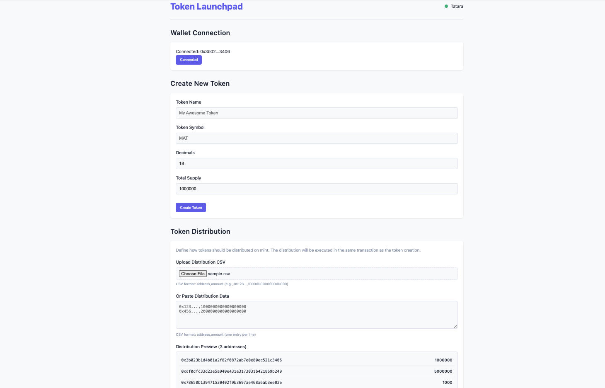

# Building a token launchpad

### Estimated Time: 30 minutes

In this guide, we'll create a simple token launchpad. The
launchpad will allow us to define the name and ticker of the token, the total
supply, the number of decimals, and will offer us to add it to our wallet with
an "Add to Wallet" button after it's been created.

The launchpad UI will also allow us to distribute the tokens on mint to a comma
separated list of addresses in some predefined amounts. This allows an instant
distribution on mint in a single transaction.

In subsequent guides, we'll be upgrading it with indexers, social functions, and
even vesting functionality.

To start, please make sure you've downloaded or cloned the SpecialK starter kit
for Katana development and initialized your environment. To find out how to do
this, see the [Getting Started 5-minute guide](../get-started/set-up-your-environment.md).

We'll be copying the demo app from `src` into `src-demo`, so that we can get to
work on turning the demo app into a launchpad.

```bash
cp -R src src-demo
```

## Step 1: Vibing the UI

I strongly encourage you to just ask your LLM to build a UI for this. Here's a
good prompt:

```txt
Rebuild the demo app in @src such that it becomes a form for input of token information. The inputs should be token name, an auto-assumed but user-changeable ticker, supply, decimals. The form should also have a textarea input for pasting CSV values in, and an upload button to upload a CSV. Values pasted in override values from the upload, if there is a conflict. Under the CSV inputs should be a visible area for distribution preview, showing how many tokens each address will get. For the typescript functionality, modify the @main.ts file. There should be an error area under the form that notes if there's a CSV formatting error on every input change, and it should also check if the sum of distribution amounts exceed total supply of the token. The token creation button should become disabled if the form inputs are in any way invalid.
```

Your code may vary, but here's what it should look like.

For `index.html`, we have a simple form and connect wallet structure:

```html
<!DOCTYPE html>
<html lang="en">
<head>
  <meta charset="UTF-8">
  <meta name="viewport" content="width=device-width, initial-scale=1.0">
  <title>Token Launchpad</title>
  <link rel="stylesheet" href="style.css">
</head>
<body>
  <div class="container">
    <header>
      <h1>Token Launchpad</h1>
      <div class="network-status">
        <span id="network-indicator"></span>
        <span id="network-name">Connecting...</span>
      </div>
    </header>

    <main>
      <section id="wallet-section">
        <h2>Wallet Connection</h2>
        <div class="card">
          <div id="wallet-status">Not connected</div>
          <button id="connect-wallet" class="primary-button">Connect Wallet</button>
        </div>
      </section>

      <section id="token-creation-section">
        <h2>Create New Token</h2>
        <div class="card">
          <div class="form-group">
            <label for="token-name">Token Name</label>
            <input type="text" id="token-name" placeholder="My Awesome Token" autocomplete="off">
          </div>
          
          <div class="form-group">
            <label for="token-symbol">Token Symbol</label>
            <input type="text" id="token-symbol" placeholder="MAT" autocomplete="off">
          </div>
          
          <div class="form-group">
            <label for="token-decimals">Decimals</label>
            <input type="number" id="token-decimals" value="18" min="0" max="18">
          </div>
          
          <div class="form-group">
            <label for="token-supply">Total Supply</label>
            <input type="number" id="token-supply" value="1000000" min="0" step="1">
          </div>

          <div class="button-group">
            <button id="create-token-button" class="primary-button" disabled>Create Token</button>
          </div>
        </div>
      </section>

      <section id="distribution-section">
        <h2>Token Distribution</h2>
        <div class="card">
          <p class="description">Define how tokens should be distributed on mint. The distribution will be executed in the same transaction as the token creation.</p>
          
          <div class="form-group">
            <label for="csv-upload">Upload Distribution CSV</label>
            <div class="file-upload">
              <input type="file" id="csv-upload" accept=".csv">
              <div class="file-upload-info">CSV format: address,amount (e.g., 0x123...,100000000000000000)</div>
            </div>
          </div>
          
          <div class="form-group">
            <label for="csv-paste">Or Paste Distribution Data</label>
            <textarea id="csv-paste" placeholder="0x123...,1000000000000000000&#10;0x456...,2000000000000000000"></textarea>
            <div class="textarea-info">CSV format: address,amount (one entry per line)</div>
          </div>
          
          <div id="distribution-error" class="error-message hidden"></div>
          
          <div class="form-group">
            <label>Distribution Preview <span id="distribution-count">(0 addresses)</span></label>
            <div id="distribution-preview" class="preview-box">
              <p class="empty-message">No distribution data yet</p>
            </div>
          </div>
        </div>
      </section>
    </main>

    <footer>
      <p>Built with Katana Development Starter Kit</p>
    </footer>
  </div>

  <script type="module" src="main.js"></script>
</body>
</html>
```

The typescript is worth understanding, so it's good to go through it:

First, we pull in the imports we'll need - the addresses file has CHAIN IDs for
us, and viem is needed for connecting to our wallet and sending transactions
later on.

```ts
import { createPublicClient, createWalletClient, http, custom, formatUnits, parseUnits, PublicClient, WalletClient, encodeAbiParameters, decodeEventLog } from 'viem';
import { CHAIN_IDS } from '../utils/addresses';
```

We then do some admin work - need to declare our DOM elements:

```ts
// DOM Elements
const networkIndicator = document.getElementById('network-indicator') as HTMLElement;
const networkName = document.getElementById('network-name') as HTMLElement;
const walletStatus = document.getElementById('wallet-status') as HTMLElement;
const connectWalletButton = document.getElementById('connect-wallet') as HTMLButtonElement;
const createTokenButton = document.getElementById('create-token-button') as HTMLButtonElement;

// Form elements
const tokenNameInput = document.getElementById('token-name') as HTMLInputElement;
const tokenSymbolInput = document.getElementById('token-symbol') as HTMLInputElement;
const tokenDecimalsInput = document.getElementById('token-decimals') as HTMLInputElement;
const tokenSupplyInput = document.getElementById('token-supply') as HTMLInputElement;

// Distribution elements
const csvUploadInput = document.getElementById('csv-upload') as HTMLInputElement;
const csvPasteInput = document.getElementById('csv-paste') as HTMLTextAreaElement;
const distributionPreview = document.getElementById('distribution-preview') as HTMLElement;
const distributionCount = document.getElementById('distribution-count') as HTMLElement;
const distributionError = document.getElementById('distribution-error') as HTMLElement;

// Success section elements
let tokenSuccessSection: HTMLElement | null = null;
let addToWalletButton: HTMLButtonElement | null = null;
let tokenAddressDisplay: HTMLElement | null = null;
```

After that, we'll init the wallet connection, and a transport to our RPC - in
this case, the local anvil node.

```ts
// Check for wallet
const hasEthereum = typeof window !== 'undefined' && window.ethereum;

// Create clients
let publicClient: PublicClient;
let walletClient: WalletClient;
let account: string | undefined;

// Store created token address
let createdTokenAddress: string | undefined;

// Store distribution data
interface DistributionEntry {
  address: string;
  amount: bigint;
}

let uploadedDistribution: DistributionEntry[] = [];
let pastedDistribution: DistributionEntry[] = [];
let finalDistribution: DistributionEntry[] = [];

// Create transport with retry logic
function createRobustTransport() {
  return http('http://localhost:8545', {
    timeout: 10000, // 10 seconds
    fetchOptions: {
      headers: {
        'Content-Type': 'application/json',
      },
      cache: 'no-cache',
    },
    // Basic retry with exponential backoff
    retryCount: 3,
    retryDelay: 1000,
  });
}
```

Then, seeing as we will need a common format for the distribution data, let's
declare that.

```ts
// Store distribution data
interface DistributionEntry {
  address: string;
  amount: bigint;
}

let uploadedDistribution: DistributionEntry[] = [];
let pastedDistribution: DistributionEntry[] = [];
let finalDistribution: DistributionEntry[] = [];
```

Most of our initialize function is the same as in the demo, but we need to add
form related logic to it now - add these into the `initialize` function at the end:

```ts
// Setup
async function initialize() {
  try {
    // Create a public client with custom config
    publicClient = createPublicClient({
      transport: createRobustTransport(),
      chain: tatara
    });

    // Test connection with a simple method first
    try {
      // Ping the RPC with a simple request before attempting more complex calls
      await publicClient.getBlockNumber();
      
      // Then try to get chain ID
      const chainId = await publicClient.getChainId();
      
      if (chainId === CHAIN_IDS.TATARA) {
        updateNetworkStatus('connected', 'Tatara');
      } else {
        updateNetworkStatus('error', `Wrong network: ${chainId}`);
        displayRpcError(`Connected to wrong network. Expected ${CHAIN_IDS.TATARA} (Tatara), got ${chainId}`);
      }
    } catch (error) {
      console.error('RPC connection error:', error);
      updateNetworkStatus('error', 'Fork not running');
      displayRpcError('Unable to connect to local Tatara fork');
    }
  } catch (error) {
    console.error('Initialization error:', error);
    updateNetworkStatus('error', 'Connection error');
    displayRpcError();
  }

  // Handle wallet connection separately from RPC connection
  if (!hasEthereum) {
    walletStatus.textContent = 'No wallet detected';
  }

  // Set up form event listeners
  setupFormListeners();
  setupDistributionListeners();
  
  // Create success section (hidden initially)
  createSuccessSection();

  // Make sure error is hidden initially
  hideDistributionError();
}
```

Now for the form logic. Let's add these functions:

```ts
// Set up form event listeners
function setupFormListeners() {
  // Auto-generate token symbol based on name
  tokenNameInput.addEventListener('input', () => {
    const name = tokenNameInput.value.trim();
    if (name) {
      // Generate symbol from first letter of each word, uppercase
      const symbol = name
        .split(' ')
        .map(word => word.charAt(0).toUpperCase())
        .join('');
      
      tokenSymbolInput.value = symbol.length > 0 ? symbol : '';
    }
    
    validateForm();
  });
  
  // Add validation to all inputs
  tokenNameInput.addEventListener('input', validateForm);
  tokenSymbolInput.addEventListener('input', validateForm);
  tokenDecimalsInput.addEventListener('input', validateForm);
  tokenSupplyInput.addEventListener('input', validateForm);
  
  // Add listener for decimals changes to update distribution preview
  tokenDecimalsInput.addEventListener('change', () => {
    updateDistributionPreview();
  });
  
  // Create token button handler
  createTokenButton.addEventListener('click', createToken);
}

// Set up distribution listeners
function setupDistributionListeners() {
  // Handle CSV file upload
  csvUploadInput.addEventListener('change', handleCsvUpload);
  
  // Handle CSV paste
  csvPasteInput.addEventListener('input', handleCsvPaste);
  
  // Set the preview box to empty initially
  updateDistributionPreview();
}

// Form validation
function validateForm() {
  const isValid = 
    tokenNameInput.value.trim() !== '' && 
    tokenSymbolInput.value.trim() !== '' &&
    Number(tokenDecimalsInput.value) >= 0 &&
    Number(tokenDecimalsInput.value) <= 18 &&
    Number(tokenSupplyInput.value) > 0 &&
    !isDistributionExceedingSupply();
  
  // Only enable if form is valid AND wallet is connected
  createTokenButton.disabled = !isValid || !account;
}

// Utility that checks if the distribution sum is larger than supply
function isDistributionExceedingSupply(): boolean {
  const decimals   = Number(tokenDecimalsInput.value) || 18;
  const supply     = parseUnits(tokenSupplyInput.value || '0', decimals);
  const distroSum  = finalDistribution.reduce((acc, entry) => acc + entry.amount, 0n);
  return distroSum > supply;
}

// Show / hide an error banner and disable the button accordingly
function validateDistributionTotal() {
  if (isDistributionExceedingSupply()) {
    showDistributionError('Distribution amount exceeds total supply');
  } else {
    hideDistributionError();
  }
  validateForm(); // re-runs the generic form validation
}
```

Here, we create a ticker, we add form validation, and we make sure we call the distro list updating process every time one of the
distro inputs changes (pasted CSV or uploaded CSV).

We need that CSV processor and updater though:

```ts
// Parse CSV data into distribution entries
function parseCsvData(csvText: string): DistributionEntry[] {
  if (!csvText.trim()) {
    return [];
  }
  
  const lines = csvText.split(/\r?\n/).filter(line => line.trim() !== '');
  const entries: DistributionEntry[] = [];
  
  lines.forEach((line, index) => {
    const parts = line.split(',');
    
    // Check if the line has exactly 2 parts
    if (parts.length !== 2) {
      throw new Error(`Line ${index + 1}: Expected 2 columns (address,amount), found ${parts.length}`);
    }
    
    const address = parts[0].trim();
    const amountStr = parts[1].trim();
    
    // Validate Ethereum address (simple check)
    if (!address.match(/^0x[a-fA-F0-9]{40}$/)) {
      throw new Error(`Line ${index + 1}: Invalid Ethereum address format: ${address}`);
    }
    
    // Validate amount (should be a positive number)
    let amount: bigint;
    try {
      amount = BigInt(amountStr);
      if (amount <= 0n) {
        throw new Error(`Amount must be positive`);
      }
    } catch (error) {
      throw new Error(`Line ${index + 1}: Invalid amount: ${amountStr}. Must be a positive integer.`);
    }
    
    entries.push({ address: address.toLowerCase(), amount });
  });
  
  return entries;
}

// Handle CSV file upload
async function handleCsvUpload(event: Event) {
  const input = event.target as HTMLInputElement;
  const file = input.files?.[0];
  
  try {
    if (!file) {
      uploadedDistribution = [];
      mergeDistributions();
      return;
    }
    
    const text = await file.text();
    uploadedDistribution = parseCsvData(text);
    mergeDistributions();
  } catch (error) {
    console.error('Error reading CSV file:', error);
    showDistributionError(error instanceof Error ? error.message : 'Error reading CSV file');
    uploadedDistribution = [];
    mergeDistributions();
  }
}

// Handle CSV paste
function handleCsvPaste() {
  const text = csvPasteInput.value.trim();
  
  try {
    if (!text) {
      pastedDistribution = [];
    } else {
      pastedDistribution = parseCsvData(text);
    }
    mergeDistributions();
  } catch (error) {
    console.error('Error parsing pasted CSV data:', error);
    showDistributionError(error instanceof Error ? error.message : 'Error parsing CSV data');
  }
}

// Merge uploaded and pasted distributions
function mergeDistributions() {
  // Start with a clean final distribution
  finalDistribution = [];
  
  // Create a map for faster lookups
  const distributionMap = new Map<string, bigint>();
  
  // First add all uploaded entries
  uploadedDistribution.forEach(entry => {
    distributionMap.set(entry.address.toLowerCase(), entry.amount);
  });
  
  // Then override with pasted entries (or add if not present)
  pastedDistribution.forEach(entry => {
    distributionMap.set(entry.address.toLowerCase(), entry.amount);
  });
  
  // Convert map back to array
  finalDistribution = Array.from(distributionMap.entries()).map(([address, amount]) => ({
    address,
    amount
  }));
  
  // Hide error if parse error but we will re-evaluate after merge
  hideDistributionError();

  // Update the preview
  updateDistributionPreview();

  // Validate against supply
  validateDistributionTotal();
}

// Show distribution error without immediately hiding it
function showDistributionError(message: string) {
  distributionError.textContent = message;
  distributionError.classList.remove('hidden');
  
  // Update the preview but don't hide the error
  updateDistributionPreviewWithoutHidingError();
}

// Hide distribution error
function hideDistributionError() {
  distributionError.textContent = '';
  distributionError.classList.add('hidden');
}

// Update distribution preview without affecting error state
function updateDistributionPreviewWithoutHidingError() {
  // If there's no distribution data
  if (finalDistribution.length === 0) {
    distributionPreview.innerHTML = '<p class="empty-message">No distribution data yet</p>';
    distributionCount.textContent = '(0 addresses)';
    return;
  }
  
  // Get the token decimals for formatting
  const decimals = Number(tokenDecimalsInput.value) || 18;
  
  // Clear the preview
  distributionPreview.innerHTML = '';
  
  // Add each entry to the preview
  finalDistribution.forEach(entry => {
    const item = document.createElement('div');
    item.className = 'distribution-item';
    
    // Format the address
    const addressSpan = document.createElement('span');
    addressSpan.className = 'distribution-address';
    addressSpan.textContent = entry.address;
    
    // Format the amount
    const amountSpan = document.createElement('span');
    amountSpan.className = 'distribution-amount';
    try {
      amountSpan.textContent = formatUnits(entry.amount, decimals);
    } catch (error) {
      amountSpan.textContent = entry.amount.toString();
    }
    
    // Add to the item
    item.appendChild(addressSpan);
    item.appendChild(amountSpan);
    
    // Add to the preview
    distributionPreview.appendChild(item);
  });
  
  // Update the count
  distributionCount.textContent = `(${finalDistribution.length} addresses)`;
}

// Update distribution preview with smart error handling
function updateDistributionPreview() {
  // Only hide errors if there are no validation issues
  if (!isDistributionExceedingSupply()) {
    hideDistributionError();
  }
  
  updateDistributionPreviewWithoutHidingError();
}
```

These functions help us process CSV in both formats, merge them, and show the
output. If there's an error in the data, it will also show the error so that our
token distribution doesn't go wrong.

The styling mostly matches the demo app's CSS, with minor additions for the new
form elements:

```css
/* File upload styling */
.file-upload {
  position: relative;
  margin-bottom: 5px;
}

.file-upload input[type="file"] {
  width: 100%;
  padding: 10px;
  border: 1px dashed var(--border-color);
  border-radius: 6px;
  cursor: pointer;
  background-color: var(--background);
}

.file-upload-info, .textarea-info {
  font-size: 0.8rem;
  color: var(--light-text);
  margin-top: 5px;
}

/* Textarea styling */
textarea {
  width: 100%;
  min-height: 100px;
  padding: 10px;
  border: 1px solid var(--border-color);
  border-radius: 6px;
  font-size: 0.9rem;
  font-family: monospace;
  resize: vertical;
  background-color: var(--background);
}

textarea:focus {
  outline: none;
  border-color: var(--primary-color);
  box-shadow: 0 0 0 2px rgba(99, 102, 241, 0.1);
}

/* Preview box */
.preview-box {
  max-height: 200px;
  overflow-y: auto;
  border: 1px solid var(--border-color);
  border-radius: 6px;
  padding: 10px;
  background-color: var(--background);
}

.distribution-item {
  padding: 8px;
  border-bottom: 1px solid var(--border-color);
  display: flex;
  justify-content: space-between;
  font-size: 0.9rem;
}

.distribution-item:last-child {
  border-bottom: none;
}

.distribution-address {
  font-family: monospace;
  overflow: hidden;
  text-overflow: ellipsis;
  white-space: nowrap;
  max-width: 60%;
}

.distribution-amount {
  font-weight: 600;
  text-align: right;
}

.empty-message {
  color: var(--light-text);
  text-align: center;
  padding: 20px 0;
}

/* Success section styling */
#token-success-section {
  margin-top: 20px;
}

#token-success-section.hidden {
  display: none;
}

.success-message {
  text-align: center;
  padding: 20px 0;
}

.token-details {
  margin: 20px 0;
  padding: 15px;
  background-color: var(--light-background);
  border-radius: 6px;
}

.token-address {
  font-family: monospace;
  word-break: break-all;
  padding: 10px;
  background-color: var(--background);
  border: 1px solid var(--border-color);
  border-radius: 4px;
  margin-top: 5px;
}

/* Utility classes */
.hidden {
  display: none !important;
}
```

We can now build the launchpad with `bun run build` and start anvil with
`bun run start:anvil:tatara`. Once we host the `/dist` contents with something
like `cd dist && http-server`, we should see the app running fine:



## Step 2: Minting the token

Now we need to add functionality to actually mint the ERC20 token based on the
user's inputs. We'll implement a token with Permit2 support and a factory
contract to handle token creation and distribution.

### Understanding Permit2 and ERC7702

Before diving into the code, let's briefly understand what Permit2 is:

[Permit2](https://github.com/Uniswap/permit2) is a protocol developed by Uniswap
that extends ERC20 tokens to allow for more efficient approvals and transfers.
It enables gasless approvals through signatures, allowing users to approve token
transfers without sending a transaction.

While newer standards like ERC7702 (which we'll use for distribution in Step 3)
are becoming popular, many wallets and interfaces still have better support for
Permit2. Including Permit2 compatibility ensures our tokens work well with the
broader ecosystem.

### Step 2.1: Create the Token and Factory Contracts

First, let's create the smart contracts. We'll need:

1. **SimpleToken**: An ERC20 token with Permit2 support
2. **TokenFactory**: A factory contract to deploy new tokens and handle initial
   distribution

Create a new file `forge/src/TokenFactory.sol` with the following content:

```solidity
// SPDX-License-Identifier: MIT
pragma solidity ^0.8.28;

import "@openzeppelin/contracts/token/ERC20/ERC20.sol";
import "@openzeppelin/contracts/access/Ownable.sol";
import "@openzeppelin/contracts/token/ERC20/extensions/ERC20Permit.sol";
import "@openzeppelin/contracts/token/ERC20/utils/SafeERC20.sol";
import "@openzeppelin/contracts/utils/ReentrancyGuard.sol";

/**
 * @title SimpleToken
 * @dev An ERC20 token with ERC20Permit support for use with Permit2
 */
contract SimpleToken is ERC20, ERC20Permit, Ownable {
    uint8 private _decimals;

    /**
     * @dev Constructor that sets token details and mints the initial supply to the deployer
     * @param name_ The name of the token
     * @param symbol_ The symbol of the token
     * @param decimals_ The number of decimals for the token
     * @param initialSupply The initial supply to mint
     * @param initialHolder The address to receive the initial supply
     */
    constructor(
        string memory name_,
        string memory symbol_,
        uint8 decimals_,
        uint256 initialSupply,
        address initialHolder
    ) ERC20(name_, symbol_) ERC20Permit(name_) Ownable(initialHolder) {
        _decimals = decimals_;
        _mint(initialHolder, initialSupply);
    }

    /**
     * @dev Returns the number of decimals used to get its user representation.
     */
    function decimals() public view virtual override returns (uint8) {
        return _decimals;
    }
}

/**
 * @title TokenFactory
 * @dev A factory contract to deploy new SimpleToken instances with distribution
 */
contract TokenFactory is ReentrancyGuard {
    using SafeERC20 for IERC20;
    
    event TokenCreated(address indexed tokenAddress, string name, string symbol, uint8 decimals, uint256 totalSupply);
    event TokenDistributed(address indexed tokenAddress, address indexed recipient, uint256 amount);

    /**
     * @dev Create a new token and distribute it to multiple recipients
     * @param name The name of the token
     * @param symbol The symbol of the token
     * @param decimals The number of decimals for the token
     * @param totalSupply The total supply to mint
     * @param recipients Array of recipient addresses
     * @param amounts Array of amounts to send to each recipient
     * @return tokenAddress The address of the newly created token
     */
    function createTokenWithDistribution(
        string memory name,
        string memory symbol,
        uint8 decimals,
        uint256 totalSupply,
        address[] memory recipients,
        uint256[] memory amounts
    ) external nonReentrant returns (address tokenAddress) {
        require(recipients.length == amounts.length, "Recipients and amounts length mismatch");
        
        // Calculate the sum of distributed amounts
        uint256 distributionSum = 0;
        for (uint256 i = 0; i < amounts.length; i++) {
            distributionSum += amounts[i];
        }
        
        // Check if distribution sum exceeds total supply
        require(distributionSum <= totalSupply, "Distribution exceeds total supply");
        
        // Deploy the new token, with factory as the initial holder
        SimpleToken token = new SimpleToken(name, symbol, decimals, totalSupply, address(this));
        tokenAddress = address(token);
        
        // Distribute tokens if recipients array is not empty
        if (recipients.length > 0) {
            for (uint256 i = 0; i < recipients.length; i++) {
                if (amounts[i] > 0) {
                    IERC20(tokenAddress).safeTransfer(recipients[i], amounts[i]);
                    emit TokenDistributed(tokenAddress, recipients[i], amounts[i]);
                }
            }
        }
        
        // Transfer any remaining tokens to the caller
        uint256 remaining = IERC20(tokenAddress).balanceOf(address(this));
        if (remaining > 0) {
            IERC20(tokenAddress).safeTransfer(msg.sender, remaining);
        }
        
        emit TokenCreated(tokenAddress, name, symbol, decimals, totalSupply);
        return tokenAddress;
    }
} 
```

Let's break down what these contracts do:

- **SimpleToken**:
  - Inherits from OpenZeppelin's `ERC20`, `ERC20Permit`, and `Ownable` contracts
  - Allows for configurable decimals (unlike standard ERC20 which always uses 18)
  - Includes Permit functionality to enable gasless approvals and compatibility
    with Permit2
  - Mints the initial supply to the specified address (usually the deployer)

- **TokenFactory**:
  - Provides a single method for creating tokens with optional initial distribution
  - Validates inputs (e.g., ensures recipient and amount arrays match)
  - Checks that the distributed amount doesn't exceed total supply
  - Creates the token and transfers portions to recipients in the same transaction
  - Emits events for token creation and distribution for easy tracking

> **How TokenFactory and SimpleToken work together:** During compilation, the
> SimpleToken bytecode is embedded within the TokenFactory contract's own
> bytecode. When someone calls `createTokenWithDistribution()`, the factory uses
> Solidity's `new` keyword (which uses the CREATE opcode) to deploy a brand new
> instance of SimpleToken with the provided parameters. Each token created is a
> completely new contract deployment with its own unique address. This is why
> the factory needs the full SimpleToken code - it contains the "blueprint" for
> each token it will create.

### Step 2.2: Install OpenZeppelin Dependencies

We depend on OpenZeppelin contracts for our token implementation, so let's
install them:

```bash
forge install OpenZeppelin/openzeppelin-contracts --no-commit
```

This command adds the OpenZeppelin contracts as a dependency to our project
without creating a commit.

### Step 2.3: Create a Deployment Script

Next, let's create a deployment script for our factory contract. Create a file
at `forge/script/DeployTokenFactory.s.sol`:

```solidity
// SPDX-License-Identifier: MIT
pragma solidity ^0.8.28;

import "forge-std/Script.sol";
import "../src/TokenFactory.sol";

contract DeployTokenFactory is Script {
    function run() public {
        uint256 deployerPrivateKey = vm.envUint("PRIVATE_KEY");
        vm.startBroadcast(deployerPrivateKey);

        TokenFactory factory = new TokenFactory();
        
        console.log("TokenFactory deployed at:", address(factory));
        
        vm.stopBroadcast();
    }
}
```

This script will:

1. Read the deployer's private key from environment variables
2. Start broadcasting transactions
3. Deploy the TokenFactory contract
4. Log the deployed contract address
5. Stop broadcasting transactions

### Step 2.4: Deploy the Factory Contract

Now we can deploy our factory contract to the local Tatara fork:

```bash
PRIVATE_KEY=0xac0974bec39a17e36ba4a6b4d238ff944bacb478cbed5efcae784d7bf4f2ff80 forge script forge/script/DeployTokenFactory.s.sol:DeployTokenFactory --rpc-url http://localhost:8545 --broadcast
```

This uses the default Anvil private key to deploy our contract. After
deployment, you should see a message with the contract address, which you'll
need for the frontend integration.

### Step 2.5: Update the Frontend

Now, let's update our frontend to interact with the deployed factory contract.
We need to:

1. Add the contract ABI definitions
2. Implement the token creation function with proper chain configuration
3. Add a success section that appears after token creation
4. Implement the "Add to Wallet" functionality

Here are the key changes to `main.ts`:

#### 1. Add Contract ABIs and Chain Configuration

First, we generate the TokenFactory interface's ABI. We start by adding the
interface into the `interfaces` subfolder:

Create the file `interfaces/ITokenFactory.sol`:

```sol
// SPDX-License-Identifier: MIT
pragma solidity ^0.8.13;

/**
 * @title ITokenFactory
 * @dev Interface for the TokenFactory contract to create and deploy ERC20 tokens with distribution
 */
interface ITokenFactory {
    /**
     * @dev Emitted when a new token is created
     * @param tokenAddress The address of the newly created token
     * @param name The name of the token
     * @param symbol The symbol of the token 
     * @param decimals The number of decimals for the token
     * @param totalSupply The total supply of the token
     */
    event TokenCreated(address indexed tokenAddress, string name, string symbol, uint8 decimals, uint256 totalSupply);
    
    /**
     * @dev Emitted when tokens are distributed to a recipient
     * @param tokenAddress The address of the token being distributed
     * @param recipient The address receiving the tokens
     * @param amount The amount of tokens distributed
     */
    event TokenDistributed(address indexed tokenAddress, address indexed recipient, uint256 amount);

    /**
     * @dev Create a new token and distribute it to multiple recipients
     * @param name The name of the token
     * @param symbol The symbol of the token
     * @param decimals The number of decimals for the token
     * @param totalSupply The total supply to mint
     * @param recipients Array of recipient addresses
     * @param amounts Array of amounts to send to each recipient
     * @return tokenAddress The address of the newly created token
     */
    function createTokenWithDistribution(
        string memory name,
        string memory symbol,
        uint8 decimals,
        uint256 totalSupply,
        address[] memory recipients,
        uint256[] memory amounts
    ) external returns (address tokenAddress);
} 
```

Next, we generate the ABI by running `bun run build:abi`.

Then, we can import the ABIs for our TokenFactory and token contracts, and set
up chain configuration:

```typescript
// Import Viem with decodeEventLog for proper event parsing
import { createPublicClient, createWalletClient, http, custom, formatUnits, parseUnits, decodeEventLog } from 'viem';
import { CHAIN_IDS } from '../utils/addresses';

// Import ABIs - using require() to avoid module resolution issues
// These ABIs are generated from our Solidity interfaces
const TOKEN_FACTORY_ABI = require('../abis/ITokenFactory.json');
const TOKEN_ABI = require('../abis/IERC20.json');

// Define chain configuration once to reuse
const tatara = {
  id: CHAIN_IDS.TATARA,
  name: 'Tatara Testnet',
  nativeCurrency: {
    name: 'Ether',
    symbol: 'ETH',
    decimals: 18
  },
  rpcUrls: {
    default: {
      http: ['http://localhost:8545']
    }
  }
};

// Token Factory Address (from deployment)
const TOKEN_FACTORY_ADDRESS = '0x9fE46736679d2D9a65F0992F2272dE9f3c7fa6e0';
```

**Important:** Replace the `TOKEN_FACTORY_ADDRESS` with the actual address you
get from your deployment step.

Make sure to apply the chain configuration to both your public and wallet clients:

```typescript
// Create a public client with custom config
publicClient = createPublicClient({
  transport: createRobustTransport(),
  chain: tatara
});

// In connectWallet function
walletClient = createWalletClient({
  transport: custom(window.ethereum),
  chain: tatara
});
```

#### 2. Implement Token Creation Function

Now, add the function to create the token with proper chain configuration and
log decoding:

```typescript
// Create the token
async function createToken() {
  if (!account || !walletClient) {
    alert('Please connect your wallet first');
    return;
  }
  
  try {
    // UI feedback
    createTokenButton.disabled = true;
    createTokenButton.textContent = 'Creating Token...';
    
    // Prepare token data
    const name = tokenNameInput.value.trim();
    const symbol = tokenSymbolInput.value.trim();
    const decimals = Number(tokenDecimalsInput.value);
    const totalSupply = parseUnits(
      tokenSupplyInput.value, 
      decimals
    );
    
    // Prepare distribution data
    const recipients = finalDistribution.map(entry => entry.address);
    const amounts = finalDistribution.map(entry => entry.amount);
    
    // Call the factory contract
    const hash = await walletClient.writeContract({
      address: TOKEN_FACTORY_ADDRESS as `0x${string}`,
      abi: TOKEN_FACTORY_ABI,
      functionName: 'createTokenWithDistribution',
      args: [name, symbol, decimals, totalSupply, recipients, amounts],
      account: account as `0x${string}`,
      chain: tatara // Important: provide chain information
    });
    
    // Wait for transaction receipt
    const receipt = await publicClient.waitForTransactionReceipt({ hash });
    
    // Extract the token address from the event logs using Viem's decodeEventLog
    createdTokenAddress = undefined;

    for (const log of receipt.logs) {
      try {
        // Only try to decode logs from our contract
        if (log.address.toLowerCase() === TOKEN_FACTORY_ADDRESS.toLowerCase()) {
          const event = decodeEventLog({
            abi: TOKEN_FACTORY_ABI,
            data: log.data,
            topics: log.topics,
          });
          
          if (event.eventName === 'TokenCreated') {
            createdTokenAddress = event.args.tokenAddress;
            break;
          }
        }
      } catch (error) {
        // Skip logs that can't be decoded as our event
        console.log('Error decoding log:', error);
        continue;
      }
    }

    if (createdTokenAddress) {
      showTokenSuccessSection(createdTokenAddress);
    } else {
      throw new Error('Token creation transaction succeeded but token address not found in logs');
    }
  } catch (error) {
    console.error('Error creating token:', error);
    alert(`Error creating token: ${error instanceof Error ? error.message : String(error)}`);
  } finally {
    // Reset UI
    createTokenButton.textContent = 'Create Token';
    createTokenButton.disabled = false;
  }
}
```

The key improvements in this implementation:

1. We use Viem's built-in `decodeEventLog` function for reliable event parsing
2. We provide proper chain configuration to all transactions
3. We only try to decode logs from our contract address to avoid errors
4. We use a robust loop approach to process logs instead of mapping

#### 3. Implement "Add to Wallet" Functionality

Next, add the function to add the token to the user's wallet:

```typescript
// Add token to wallet
async function addTokenToWallet() {
  if (!window.ethereum || !createdTokenAddress) {
    alert('Wallet not available or token not created');
    return;
  }
  
  try {
    // Get token details from contract
    const tokenName = await publicClient.readContract({
      address: createdTokenAddress as `0x${string}`,
      abi: TOKEN_ABI,
      functionName: 'name',
      args: [] // Empty args array is required
    }) as string;
    
    const tokenSymbol = await publicClient.readContract({
      address: createdTokenAddress as `0x${string}`,
      abi: TOKEN_ABI,
      functionName: 'symbol',
      args: [] // Empty args array is required
    }) as string;
    
    const tokenDecimals = await publicClient.readContract({
      address: createdTokenAddress as `0x${string}`,
      abi: TOKEN_ABI,
      functionName: 'decimals',
      args: [] // Empty args array is required
    }) as number;
    
    // Request to add token to wallet
    await window.ethereum.request({
      method: 'wallet_watchAsset',
      params: {
        type: 'ERC20',
        options: {
          address: createdTokenAddress,
          symbol: tokenSymbol,
          decimals: tokenDecimals,
          name: tokenName
        },
      },
    });
    
    // UI feedback
    if (addToWalletButton) {
      addToWalletButton.textContent = 'Added to Wallet';
      setTimeout(() => {
        if (addToWalletButton) {
          addToWalletButton.textContent = 'Add to Wallet';
        }
      }, 3000);
    }
  } catch (error) {
    console.error('Error adding token to wallet:', error);
    alert(`Error adding token to wallet: ${error instanceof Error ? error.message : String(error)}`);
  }
}
```

Note that when using Viem's `readContract` method, you must provide an `args`
array even if the function doesn't take any parameters.

#### 4. Helper Functions

Finally, add helper functions to show the success section:

```typescript
// Create the token success section (initially hidden)
function createSuccessSection() {
  // Create the section element
  tokenSuccessSection = document.createElement('section');
  tokenSuccessSection.id = 'token-success-section';
  tokenSuccessSection.className = 'hidden';
  
  // Create the content
  tokenSuccessSection.innerHTML = `
    <h2>Token Created Successfully!</h2>
    <div class="card">
      <div class="success-message">
        <p>Your token has been successfully created and deployed.</p>
        <div class="token-details">
          <div class="form-group">
            <label>Token Address:</label>
            <div id="token-address" class="token-address"></div>
          </div>
        </div>
        <div class="button-group">
          <button id="add-to-wallet-button" class="primary-button">Add to Wallet</button>
        </div>
      </div>
    </div>
  `;
  
  // Add it to the main section
  const mainElement = document.querySelector('main');
  if (mainElement) {
    const distributionSection = document.getElementById('distribution-section');
    if (distributionSection) {
      mainElement.insertBefore(tokenSuccessSection, distributionSection.nextSibling);
    } else {
      mainElement.appendChild(tokenSuccessSection);
    }
  }
  
  // Get references to the elements
  tokenAddressDisplay = document.getElementById('token-address');
  addToWalletButton = document.getElementById('add-to-wallet-button') as HTMLButtonElement;
  
  // Add event listener for the Add to Wallet button
  if (addToWalletButton) {
    addToWalletButton.addEventListener('click', addTokenToWallet);
  }
}

// Show token success section
function showTokenSuccessSection(tokenAddress: string) {
  if (!tokenSuccessSection || !tokenAddressDisplay) return;
  
  // Update token address
  tokenAddressDisplay.textContent = tokenAddress;
  
  // Show success section
  tokenSuccessSection.classList.remove('hidden');
  
  // Scroll to the success section
  tokenSuccessSection.scrollIntoView({ behavior: 'smooth' });
}
```

Finally, make sure you add the event listeners for supply input validation:

```typescript
// Add listener for supply input to revalidate distribution totals
tokenSupplyInput.addEventListener('input', () => {
  validateDistributionTotal();
});

// Connect wallet button listener
connectWalletButton.addEventListener('click', connectWallet);

// Initialize the app
initialize();

// Add window.ethereum type declaration
declare global {
  interface Window {
    ethereum: any;
  }
}
```

### Step 2.6: Build and Test

After making all these changes, build your project:

```bash
bun run build
```

And then serve the `/dist` folder with a static server to test your application:

```bash
cd dist && http-server
```

Now you should be able to:

1. Connect your wallet
2. Fill in token details and distribution data
3. Create your token
4. See the success screen with your token address
5. Add the token to your wallet with a single click


You now have a basic token launchpad which will automatically distribute the
tokens to the recipients provided and send the remainder to you. Good luck
customizing it!
