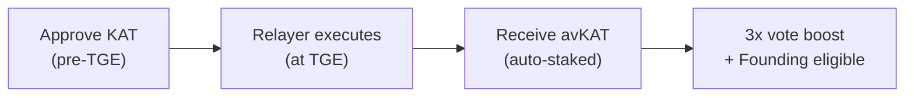

# Pre-Staking KAT

Pre-staking lets you commit KAT before TGE so it is automatically staked into
avKAT the moment the network launches. Pre-stakers receive a temporary vote
boost and qualify for Founding Staker status.

## Goal

By the end of this guide, you'll understand:

- What pre-staking is and why it matters
- How the commitment and auto-execution flow works
- Commitment requirements and how to update your commitment
- What happens at TGE

## How Pre-Staking Works

Pre-staking is a two-phase process:

1. **Before TGE** — You approve a specific amount of KAT for the relayer
   contract. This on-chain approval is your commitment.
2. **At TGE** — The relayer atomically executes all commitments, staking your
   KAT into avKAT. Largest commitments execute first.

Because avKAT auto-delegates voting power, every pre-staker is immediately
productive for the network from block one.



## Commitment Requirements

| Requirement | Detail |
|-------------|--------|
| **Minimum commitment** | 100 KAT |
| **Approval type** | Fixed amount only — no infinite approvals |
| **What counts as your commitment** | The exact approval amount you set |

The approval amount **is** the commitment. Setting an infinite approval defeats
the purpose of pre-staking as a credible signal, so only fixed, user-determined
amounts are accepted.

<!-- ## Making a Commitment

To pre-stake, approve the relayer contract to spend your KAT:

```typescript
import { parseEther } from "viem";

const KAT_ADDRESS = "0x7f1f4b4b29f5058fa32cc7a97141b8d7e5abdc2d";
const RELAYER = "0x..."; // Relayer contract address

const commitAmount = parseEther("10000"); // 10,000 KAT

const approvalHash = await walletClient.writeContract({
  address: KAT_ADDRESS,
  abi: [
    {
      name: "approve",
      type: "function",
      stateMutability: "nonpayable",
      inputs: [
        { name: "spender", type: "address" },
        { name: "amount", type: "uint256" },
      ],
      outputs: [{ type: "bool" }],
    },
  ],
  functionName: "approve",
  args: [RELAYER, commitAmount],
});

await publicClient.waitForTransactionReceipt({ hash: approvalHash });
console.log("Pre-stake commitment confirmed");
``` -->

<!-- ## Updating Your Commitment

To change your commitment amount, revoke the existing approval and set a new
one:

```typescript
// Step 1: Revoke existing approval
const revokeHash = await walletClient.writeContract({
  address: KAT_ADDRESS,
  abi: katAbi,
  functionName: "approve",
  args: [RELAYER, 0n],
});
await publicClient.waitForTransactionReceipt({ hash: revokeHash });

// Step 2: Set new commitment
const newAmount = parseEther("20000");
const newApprovalHash = await walletClient.writeContract({
  address: KAT_ADDRESS,
  abi: katAbi,
  functionName: "approve",
  args: [RELAYER, newAmount],
});
await publicClient.waitForTransactionReceipt({ hash: newApprovalHash });
console.log("Commitment updated");
``` -->

## What Happens at TGE

At TGE, the relayer executes all valid commitments atomically:

1. Your approved KAT is transferred to the avKAT vault
2. You receive avKAT tokens representing your staked position
3. Your 3x vote boost activates immediately
4. You are tracked as a Founding Staker candidate

After TGE, you can continue holding avKAT or convert to vKAT through the
in-app flow. **Switching between avKAT and vKAT via the app does not reset your
vote boost or Founding Staker eligibility** — only unstaking to liquid KAT or
selling on the open market resets these.

## Pre-Staker Benefits

| Benefit | Detail |
|---------|--------|
| **Vote boost** | 3x voting power and reward weight, decaying to 1x over 8 weeks (see [Vote Boost](kat-vote-boost.md)) |
| **Founding Staker eligibility** | Qualify for a share of accumulated exit fees (see [Founding Stakers](kat-founding-stakers.md)) |
| **Auto-execution** | No manual action needed at TGE — the relayer handles staking |
| **Immediate productivity** | avKAT auto-delegates, so you're voting and earning from block one |

## What's Next

- [Vote Boost](kat-vote-boost.md) — Understand the 3x decaying boost schedule
- [Founding Stakers](kat-founding-stakers.md) — Learn about Founding Staker
  eligibility and rewards
- [Deposit KAT to avKAT](kat-deposit-to-avkat.md) — How the avKAT vault works
