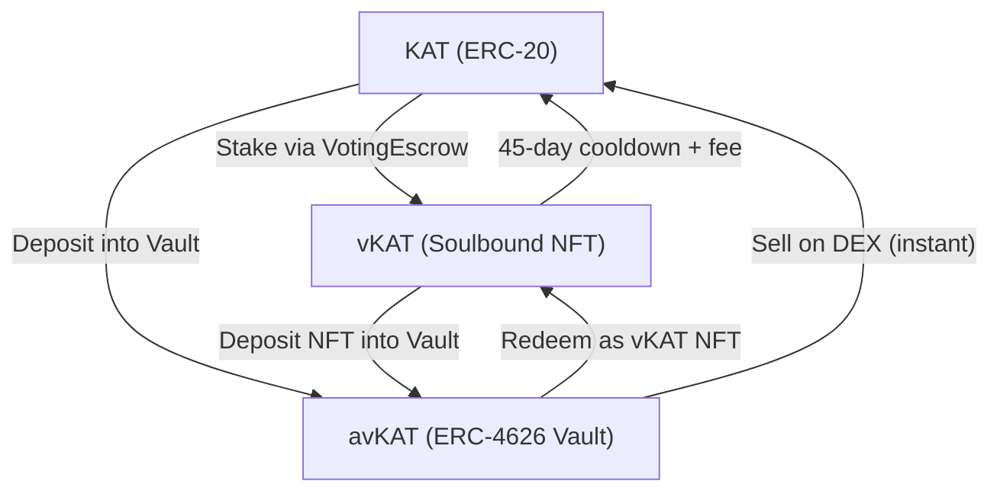

# Understanding the KAT Token Ecosystem

This guide introduces the KAT token ecosystem and the different token types you
will encounter when participating in Katana governance and staking. Understanding
these tokens and how they relate to each other is essential before diving into
the step-by-step tutorials that follow.

## Goal

By the end of this guide, you'll understand:

- What KAT is and its role in the Katana network
- The three token types: KAT, vKAT, and avKAT
- When to use each token type
- The flows between tokens and their trade-offs

## The Three Token Types

The KAT ecosystem has three distinct token types, each serving a different
purpose:

### KAT — The Base Token (ERC-20)

KAT is a standard ERC-20 token and the foundation of the Katana governance
system. It is fungible, transferable, and can be held in any Ethereum-compatible
wallet.

| Property | Value |
|----------|-------|
| **Standard** | ERC-20 |
| **Contract** | `0x7f1f4b4b29f5058fa32cc7a97141b8d7e5abdc2d` |
| **Decimals** | 18 |
| **Transferable** | Yes |
| **Voting Power** | None (must be staked) |

On its own, KAT does not grant voting power. To participate in governance, you
must stake KAT into one of the two staking paths described below.

### vKAT — Active Governance (Soulbound NFT)

When you stake KAT into the Voting Escrow contract, you receive a **vKAT** NFT
(non-fungible token). Each vKAT represents a locked position with voting power.

| Property | Value |
|----------|-------|
| **Standard** | ERC-721 (Soulbound) |
| **Contract** | `0x4d6fC15Ca6258b168225D283262743C623c13Ead` |
| **Transferable** | No |
| **Voting Power** | Yes — scales with lock amount |
| **Reward Claiming** | Manual |
| **Exit** | 45-day cooldown with 2.5%–25% fee |

vKAT is designed for **active participants** who want direct control over their
votes and reward preferences. Because vKAT is soulbound (non-transferable), your
staked position is tied to your wallet.

Key characteristics:

- You can hold multiple vKAT NFTs, each representing a separate lock
- You vote directly on gauge allocations to direct incentives
- You claim rewards manually through the Merkl distributor
- You can set preferences for which tokens you receive as rewards
- Exiting requires a 45-day cooldown period

### avKAT — Automated Staking (ERC-4626 Vault)

Alternatively, you can deposit KAT into the avKAT vault.
The vault issues **avKAT** shares — a liquid, transferable ERC-4626 token
representing a proportional share of the vault's staked position.

| Property | Value |
|----------|-------|
| **Standard** | ERC-4626 (Tokenized Vault) |
| **Contract** | `0x7231dbaCdFc968E07656D12389AB20De82FbfCeB` |
| **Transferable** | Yes |
| **Voting Power** | Indirect (via CompoundStrategy) |
| **Reward Claiming** | Automatic |
| **Exit** | Instant (sell on DEX) or 45-day (redeem as vKAT) |

The vault holds a master vKAT NFT internally. A CompoundStrategy contract
manages voting and reward compounding for the vault's master position.

Key characteristics:

- avKAT is a liquid ERC-4626 — you can transfer, trade, or use it in DeFi
- The exchange rate between avKAT and KAT reflects accumulated rewards compounded by the vault
- No manual voting or claiming required
- You can exit instantly by selling avKAT on a DEX (subject to market liquidity)
- Alternatively, redeem avKAT back to a vKAT NFT and go through the standard
  exit process

## Choosing Your Path

| Feature | vKAT (Direct) | avKAT (Vault) |
|---------|---------------|-----------------|
| **Token Type** | Soulbound NFT | Liquid ERC-4626 |
| **Transferable** | No | Yes |
| **Voting** | Manual — you choose gauges | Automatic — strategy votes |
| **Reward Claiming** | Manual | Handled by vault |
| **Reward Preferences** | Customizable | Default (strategy) |
| **Exit Speed** | 45-day cooldown | Instant (DEX) or 45-day |
| **Exit Fee** | 2.5%–25% (decays over cooldown) | DEX slippage or 2.5%–25% |
| **Best For** | Users who vote on gauges directly | Users who prefer the vault interface |

**Choose vKAT if** you want to actively participate in governance, vote on gauge
allocations, and customize your reward preferences.

**Choose avKAT if** you want a liquid, transferable token with a vault-based
staking interface.

**You can always convert** from vKAT to avKAT later by depositing your NFT into
the vault (see [Convert vKAT to avKAT](kat-convert-vkat-to-avkat.md)).

## Contract Addresses Reference

| Contract | Address | Purpose |
|----------|---------|---------|
| KAT | `0x7f1f4b4b29f5058fa32cc7a97141b8d7e5abdc2d` | Base ERC-20 token |
| VotingEscrow | `0x4d6fC15Ca6258b168225D283262743C623c13Ead` | vKAT lock management |
| NFT Lock | `0x106F7D67Ea25Cb9eFf5064CF604ebf6259Ff296d` | vKAT NFT contract |
| avKAT Vault | `0x7231dbaCdFc968E07656D12389AB20De82FbfCeB` | ERC-4626 vault |
| GaugeVoter | `0x5e755A3C5dc81A79DE7a7cEF192FFA60964c9352` | Gauge voting |
| CompoundStrategy | `0x60233D1c150F9C08D886906d597aA79a205b0463` | Vault reward reinvestment |
| Exit Queue | `0x6dE9cAAb658C744aD337Ca5d92D084c97ffF578d` | Withdrawal queue |
| Merkl Distributor | `0x3Ef3D8bA38EBe18DB133cEc108f4D14CE00Dd9Ae` | Reward distribution |
| Clock | `0x17049d374A2bcdA70F8939C21ad92bcF6B2A95ab` | Epoch timing |

## What's Next

Follow the tutorials in order to get hands-on experience with each part of the
KAT ecosystem:

1. [Stake KAT to vKAT](kat-stake-to-vkat.md) — Lock KAT and receive a voting NFT
2. [Deposit KAT to avKAT](kat-deposit-to-avkat.md) — Deposit into the avKAT vault
3. [Convert vKAT to avKAT](kat-convert-vkat-to-avkat.md) — Move from direct staking to the vault
4. [Vote on Gauges](kat-vote-on-gauges.md) — Direct incentives with your vKAT voting power
5. [Claim Voting Incentives](kat-claim-rewards.md) — Collect earned rewards
6. [Unstake and Exit](kat-unstake-and-exit.md) — Withdraw your KAT with exit fee details
