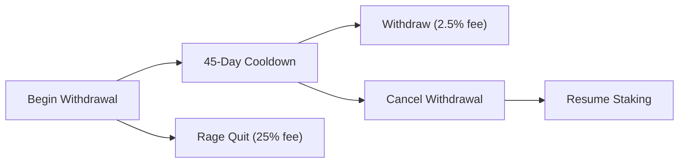

# Unstake and Exit

This tutorial covers all the ways to exit your KAT staking positions, including
the cooldown period, exit fee schedule, and rage quit option.

## Goal

By the end of this tutorial, you'll understand:

- The 45-day cooldown and exit fee decay curve
- How to begin, complete, or cancel a withdrawal
- The rage quit option for immediate exit
- How to exit an avKAT position
- How exit fees are calculated

## Prerequisites

- A vKAT NFT or avKAT tokens

## Stabilization Window (Day 0-60)

<!-- !!! warning
    During the first 60 days after TGE, elevated exit fees apply to protect
    price discovery and early staker positions. These fees are **in addition
    to** the standard cooldown-based fees described below. -->

| Period | Max Exit Fee | Rationale |
|--------|-------------|-----------|
| **Day 0-14** | 80% | Full stabilization. Price discovery protected. |
| **Day 15-30** | 60% | Easing. Still prohibitive for short-term exits. |
| **Day 31-45** | 45% | Continued easing. |
| **Day 46-60** | 30% | Approaching steady state. |
| **Day 61+** | (steady state discovery) | Steady state will be defined. |

Exit fees collected during this window are accumulated and distributed to
[Founding Stakers](kat-founding-stakers.md) after Day 60. From Day 61 onward,
exit fees are distributed in real-time to all active vKAT holders.

**avKAT holders**: During the stabilization window, avKAT is tradeable on the
DEX, the rate users will receive will be based on market demand.

## Steady-State Exit Fee Schedule (Day 61+ after steady state is discovered)

After the stabilization window (sometime after day 61), exiting a vKAT position incurs a fee that
decays linearly over a 45-day cooldown period. The earlier you withdraw, the
higher the fee.

| Timing | Fee | Example (1,000 KAT staked) |
|--------|-----|---------------------------|
| **Immediate** (rage quit) | 25% | Receive 750 KAT |
| **Day 7** | ~21.5% | Receive ~785 KAT |
| **Day 15** | ~16.7% | Receive ~833 KAT |
| **Day 30** | ~7.5% | Receive ~925 KAT |
| **Day 45** (full cooldown) | 2.5% | Receive 975 KAT |

The fee formula:

```
feePercent = 25% - ((25% - 2.5%) × daysWaited / 45)
received = staked × (1 - feePercent)
```

Key constants:

```typescript
const EXIT_FEE = {
  MIN_FEE_BPS: 250n,            // 2.5% (after 45 days)
  MAX_FEE_BPS: 2500n,           // 25% (immediate)
  COOLDOWN_PERIOD: 3_888_000,   // 45 days in seconds
  BPS_DENOMINATOR: 10_000n,
};
```



## Contract Addresses

```typescript
const VOTING_ESCROW = "0x4d6fC15Ca6258b168225D283262743C623c13Ead";
const GAUGE_VOTER = "0x5e755A3C5dc81A79DE7a7cEF192FFA60964c9352";
const VAULT = "0x7231dbaCdFc968E07656D12389AB20De82FbfCeB";
const EXIT_QUEUE = "0x6dE9cAAb658C744aD337Ca5d92D084c97ffF578d";
```

## ABIs

??? note "VotingEscrow ABI (click to expand)"

    ```typescript
    const votingEscrowAbi = [
      {
        name: "beginWithdrawal",
        type: "function",
        stateMutability: "nonpayable",
        inputs: [{ name: "tokenId", type: "uint256" }],
        outputs: [],
      },
      {
        name: "withdraw",
        type: "function",
        stateMutability: "nonpayable",
        inputs: [{ name: "tokenId", type: "uint256" }],
        outputs: [],
      },
      {
        name: "cancelWithdrawalRequest",
        type: "function",
        stateMutability: "nonpayable",
        inputs: [{ name: "tokenId", type: "uint256" }],
        outputs: [],
      },
      {
        name: "resetVotesAndBeginWithdrawal",
        type: "function",
        stateMutability: "nonpayable",
        inputs: [{ name: "tokenId", type: "uint256" }],
        outputs: [],
      },
      {
        name: "isVoting",
        type: "function",
        stateMutability: "view",
        inputs: [{ name: "tokenId", type: "uint256" }],
        outputs: [{ type: "bool" }],
      },
      {
        name: "locked",
        type: "function",
        stateMutability: "view",
        inputs: [{ name: "tokenId", type: "uint256" }],
        outputs: [
          { name: "amount", type: "uint256" },
          { name: "start", type: "uint256" },
        ],
      },
      {
        name: "ownedTokens",
        type: "function",
        stateMutability: "view",
        inputs: [{ name: "owner", type: "address" }],
        outputs: [{ type: "uint256[]" }],
      },
    ] as const;
    ```

??? note "Exit Queue ABI (click to expand)"

    ```typescript
    const exitQueueAbi = [
      {
        name: "getQueueEntry",
        type: "function",
        stateMutability: "view",
        inputs: [{ name: "tokenId", type: "uint256" }],
        outputs: [
          { name: "holder", type: "address" },
          { name: "queuedAt", type: "uint256" },
          { name: "cooldown", type: "uint256" },
        ],
      },
    ] as const;
    ```

??? note "GaugeVoter ABI (click to expand)"

    ```typescript
    const gaugeVoterAbi = [
      {
        name: "reset",
        type: "function",
        stateMutability: "nonpayable",
        inputs: [{ name: "tokenId", type: "uint256" }],
        outputs: [],
      },
    ] as const;
    ```

??? note "avKAT Vault ABI (click to expand)"

    ```typescript
    const vaultAbi = [
      {
        name: "balanceOf",
        type: "function",
        stateMutability: "view",
        inputs: [{ name: "account", type: "address" }],
        outputs: [{ type: "uint256" }],
      },
      {
        name: "convertToAssets",
        type: "function",
        stateMutability: "view",
        inputs: [{ name: "shares", type: "uint256" }],
        outputs: [{ type: "uint256" }],
      },
      {
        name: "withdrawTokenId",
        type: "function",
        stateMutability: "nonpayable",
        inputs: [
          { name: "assets", type: "uint256" },
          { name: "receiver", type: "address" },
          { name: "owner", type: "address" },
        ],
        outputs: [{ type: "uint256" }],
      },
      {
        name: "previewRedeem",
        type: "function",
        stateMutability: "view",
        inputs: [{ name: "shares", type: "uint256" }],
        outputs: [{ type: "uint256" }],
      },
    ] as const;
    ```

## Exit Path 1: Standard Withdrawal (vKAT)

The standard exit process has three steps: reset votes, begin cooldown, and
withdraw after 45 days.

### Step 1: Reset Votes (If Voting)

If your vKAT is actively voting on gauges, you must reset your votes before
beginning withdrawal. You can either reset votes separately or use the combined
function:

**Option A: Reset and begin withdrawal in one transaction:**

```typescript
import { formatEther, parseEther } from "viem";

const tokenId = 42n; // Your vKAT token ID

const hash = await walletClient.writeContract({
  address: VOTING_ESCROW,
  abi: votingEscrowAbi,
  functionName: "resetVotesAndBeginWithdrawal",
  args: [tokenId],
});

await publicClient.waitForTransactionReceipt({ hash });
console.log("Votes reset and cooldown started");
```

**Option B: Reset votes first, then begin withdrawal:**

```typescript
// Check if voting
const isVoting = await publicClient.readContract({
  address: VOTING_ESCROW,
  abi: votingEscrowAbi,
  functionName: "isVoting",
  args: [tokenId],
});

if (isVoting) {
  const resetHash = await walletClient.writeContract({
    address: GAUGE_VOTER,
    abi: gaugeVoterAbi,
    functionName: "reset",
    args: [tokenId],
  });
  await publicClient.waitForTransactionReceipt({ hash: resetHash });
  console.log("Votes reset");
}
```

### Step 2: Begin Withdrawal

Start the 45-day cooldown:

```typescript
const beginHash = await walletClient.writeContract({
  address: VOTING_ESCROW,
  abi: votingEscrowAbi,
  functionName: "beginWithdrawal",
  args: [tokenId],
});

await publicClient.waitForTransactionReceipt({ hash: beginHash });
console.log("Cooldown started");
```

### Step 3: Check Withdrawal Status

Monitor your cooldown progress:

```typescript
const [holder, queuedAt, cooldown] = await publicClient.readContract({
  address: EXIT_QUEUE,
  abi: exitQueueAbi,
  functionName: "getQueueEntry",
  args: [tokenId],
});

const cooldownEnd = new Date((Number(queuedAt) + Number(cooldown)) * 1000);
const now = Date.now();
const remaining = cooldownEnd.getTime() - now;

console.log(`Queued at: ${new Date(Number(queuedAt) * 1000).toLocaleDateString()}`);
console.log(`Cooldown ends: ${cooldownEnd.toLocaleDateString()}`);

if (remaining > 0) {
  const daysLeft = Math.ceil(remaining / (1000 * 60 * 60 * 24));
  console.log(`${daysLeft} days remaining`);
} else {
  console.log("Cooldown complete — ready to withdraw!");
}
```

### Step 4: Complete Withdrawal

After the cooldown period (or earlier, with a higher fee):

```typescript
const withdrawHash = await walletClient.writeContract({
  address: VOTING_ESCROW,
  abi: votingEscrowAbi,
  functionName: "withdraw",
  args: [tokenId],
});

await publicClient.waitForTransactionReceipt({ hash: withdrawHash });
console.log("Withdrawal complete! KAT returned to your wallet.");
```

### Cancel a Withdrawal

If you change your mind during the cooldown, you can cancel and resume staking:

```typescript
const cancelHash = await walletClient.writeContract({
  address: VOTING_ESCROW,
  abi: votingEscrowAbi,
  functionName: "cancelWithdrawalRequest",
  args: [tokenId],
});

await publicClient.waitForTransactionReceipt({ hash: cancelHash });
console.log("Withdrawal cancelled. Voting power restored.");
```

## Exit Path 2: Rage Quit (Immediate, 25% Fee)

If you need your KAT immediately and are willing to pay the maximum 25% fee,
you can begin withdrawal and immediately complete it in two transactions:

```typescript
// Step 1: Begin withdrawal (or resetVotesAndBeginWithdrawal if voting)
const beginHash = await walletClient.writeContract({
  address: VOTING_ESCROW,
  abi: votingEscrowAbi,
  functionName: "beginWithdrawal",
  args: [tokenId],
});
await publicClient.waitForTransactionReceipt({ hash: beginHash });

// Step 2: Immediately withdraw (25% fee applies)
const withdrawHash = await walletClient.writeContract({
  address: VOTING_ESCROW,
  abi: votingEscrowAbi,
  functionName: "withdraw",
  args: [tokenId],
});
await publicClient.waitForTransactionReceipt({ hash: withdrawHash });

console.log("Rage quit complete. KAT returned (minus 25% fee).");
```

!!! warning
    Rage quit incurs the maximum exit fee of 25%. For 1,000 KAT staked, you
    would receive only 750 KAT. Consider whether waiting for the cooldown
    to reduce fees is worthwhile for your situation.

## Exit Path 3: avKAT to KAT

If you hold avKAT vault tokens, there are two exit strategies:

### Option A: Sell on a DEX (Instant, No Cooldown)

avKAT is an ERC-4626 vault token, which means it implements the full ERC-20
interface. It is transferable, tradeable, and compatible with any DEX that has
liquidity. No cooldown or exit fee applies, but you are subject to market
slippage.

### Option B: Redeem Through the Vault (45-Day Cooldown)

This converts your avKAT tokens into a new vKAT NFT and starts the standard
cooldown process:

```typescript
// Step 1: Check your avKAT balance and its KAT value
const avkatTokens = await publicClient.readContract({
  address: VAULT,
  abi: vaultAbi,
  functionName: "balanceOf",
  args: [account.address],
});

const katValue = await publicClient.readContract({
  address: VAULT,
  abi: vaultAbi,
  functionName: "convertToAssets",
  args: [avkatTokens],
});

console.log(`avKAT tokens: ${formatEther(avkatTokens)}`);
console.log(`Underlying KAT: ${formatEther(katValue)}`);

// Step 2: Withdraw avKAT tokens as a new vKAT NFT
const withdrawHash = await walletClient.writeContract({
  address: VAULT,
  abi: vaultAbi,
  functionName: "withdrawTokenId",
  args: [katValue, account.address, account.address],
});

const receipt = await publicClient.waitForTransactionReceipt({
  hash: withdrawHash,
});
console.log("Received vKAT NFT!", receipt);

// Step 3: Begin cooldown on the new vKAT NFT
// (Get the new token ID from the transaction logs, then begin withdrawal)
const newTokenId = /* extract from receipt logs */;

const beginHash = await walletClient.writeContract({
  address: VOTING_ESCROW,
  abi: votingEscrowAbi,
  functionName: "beginWithdrawal",
  args: [newTokenId],
});
await publicClient.waitForTransactionReceipt({ hash: beginHash });
console.log("Cooldown started on new vKAT NFT");

// Step 4: Wait 45 days, then withdraw
// (after cooldown)
const finalHash = await walletClient.writeContract({
  address: VOTING_ESCROW,
  abi: votingEscrowAbi,
  functionName: "withdraw",
  args: [newTokenId],
});
await publicClient.waitForTransactionReceipt({ hash: finalHash });
console.log("KAT returned to wallet");
```

## Calculating Exit Fees

You can calculate the expected exit fee at any point during the cooldown:

```typescript
function calculateExitFee(
  amount: bigint,
  secondsInCooldown: bigint
): { fee: bigint; netAmount: bigint; feePercentage: number } {
  const MIN_FEE_BPS = 250n;
  const MAX_FEE_BPS = 2500n;
  const COOLDOWN_SECONDS = 3_888_000n; // 45 days
  const BPS_DENOMINATOR = 10_000n;

  // Clamp to cooldown period
  const elapsed = secondsInCooldown > COOLDOWN_SECONDS
    ? COOLDOWN_SECONDS
    : secondsInCooldown;

  // Linear interpolation: fee decreases from MAX to MIN over cooldown
  const feeBps = MAX_FEE_BPS -
    ((MAX_FEE_BPS - MIN_FEE_BPS) * elapsed) / COOLDOWN_SECONDS;

  const fee = (amount * feeBps) / BPS_DENOMINATOR;
  const netAmount = amount - fee;
  const feePercentage = Number(feeBps) / 100;

  return { fee, netAmount, feePercentage };
}

// Example usage:
const amount = parseEther("1000");
const daysWaited = 15n;
const secondsWaited = daysWaited * 24n * 60n * 60n;

const { fee, netAmount, feePercentage } = calculateExitFee(amount, secondsWaited);

console.log(`After ${daysWaited} days:`);
console.log(`  Fee: ${formatEther(fee)} KAT (${feePercentage}%)`);
console.log(`  You receive: ${formatEther(netAmount)} KAT`);
```

## Reading Your Full Position

Get a complete summary of all your KAT positions:

```typescript
const KAT_ADDRESS = "0x7f1f4b4b29f5058fa32cc7a97141b8d7e5abdc2d";

// KAT balance
const katBalance = await publicClient.readContract({
  address: KAT_ADDRESS,
  abi: [{ name: "balanceOf", type: "function", stateMutability: "view",
    inputs: [{ name: "account", type: "address" }], outputs: [{ type: "uint256" }] }],
  functionName: "balanceOf",
  args: [account.address],
});

// vKAT NFTs
const tokenIds = await publicClient.readContract({
  address: VOTING_ESCROW,
  abi: votingEscrowAbi,
  functionName: "ownedTokens",
  args: [account.address],
});

// avKAT tokens
const avkatTokens = await publicClient.readContract({
  address: VAULT,
  abi: vaultAbi,
  functionName: "balanceOf",
  args: [account.address],
});

const avkatValue = await publicClient.readContract({
  address: VAULT,
  abi: vaultAbi,
  functionName: "convertToAssets",
  args: [avkatTokens],
});

console.log(`KAT Balance: ${formatEther(katBalance)}`);
console.log(`vKAT NFTs: ${tokenIds.length}`);
console.log(`avKAT Tokens: ${formatEther(avkatTokens)}`);
console.log(`avKAT Value: ${formatEther(avkatValue)} KAT`);
```

## Using wagmi (React)

Here's a React component showing the unstaking flow:

```typescript
import { useWriteContract, useWaitForTransactionReceipt, useReadContract } from "wagmi";

const VOTING_ESCROW = "0x4d6fC15Ca6258b168225D283262743C623c13Ead";

function UnstakeVKAT({ tokenId }: { tokenId: bigint }) {
  const { writeContract, data: hash, isPending } = useWriteContract();
  const { isLoading, isSuccess } = useWaitForTransactionReceipt({ hash });

  // Check if voting
  const { data: isVoting } = useReadContract({
    address: VOTING_ESCROW,
    abi: votingEscrowAbi,
    functionName: "isVoting",
    args: [tokenId],
  });

  const handleResetAndBegin = () => {
    writeContract({
      address: VOTING_ESCROW,
      abi: votingEscrowAbi,
      functionName: "resetVotesAndBeginWithdrawal",
      args: [tokenId],
    });
  };

  const handleBeginWithdrawal = () => {
    writeContract({
      address: VOTING_ESCROW,
      abi: votingEscrowAbi,
      functionName: "beginWithdrawal",
      args: [tokenId],
    });
  };

  const handleWithdraw = () => {
    writeContract({
      address: VOTING_ESCROW,
      abi: votingEscrowAbi,
      functionName: "withdraw",
      args: [tokenId],
    });
  };

  const handleCancel = () => {
    writeContract({
      address: VOTING_ESCROW,
      abi: votingEscrowAbi,
      functionName: "cancelWithdrawalRequest",
      args: [tokenId],
    });
  };

  return (
    <div>
      {isVoting ? (
        <button onClick={handleResetAndBegin} disabled={isPending}>
          Reset Votes & Begin Withdrawal
        </button>
      ) : (
        <button onClick={handleBeginWithdrawal} disabled={isPending}>
          Begin Withdrawal
        </button>
      )}
      <button onClick={handleWithdraw} disabled={isPending}>
        Complete Withdrawal
      </button>
      <button onClick={handleCancel} disabled={isPending}>
        Cancel
      </button>
    </div>
  );
}
```

## Summary

| Exit Path | Time | Fee | Steps |
|-----------|------|-----|-------|
| vKAT → Standard | 45 days | 2.5% | Reset votes → Begin → Wait → Withdraw |
| vKAT → Rage Quit | Instant | 25% | Begin + Withdraw immediately |
| vKAT → Early Exit | 1–44 days | 25%–2.5% | Begin → Wait partially → Withdraw |
| avKAT → DEX | Instant | Market slippage | Sell on DEX |
| avKAT → Vault Redeem | 45 days | 2.5% | Redeem as vKAT → Standard exit |
