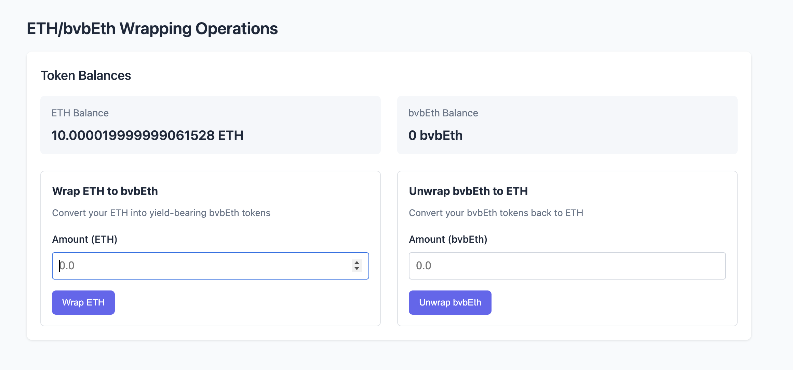
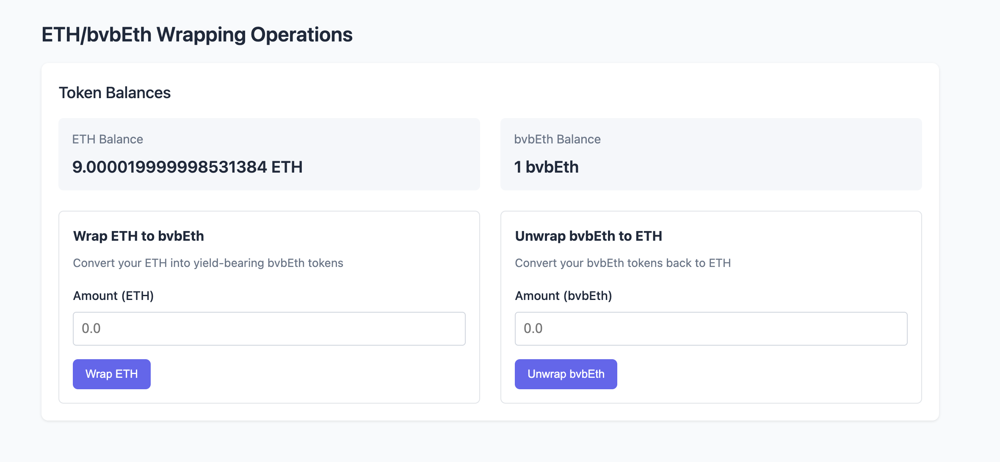

# Read Balances & Wrap ETH into WETH

This tutorial will guide you through the process of interacting with Katana's
core tokens, specifically how to read token balances and wrap ETH into the yield
bearing WETH using a local Tatara fork.

## Goal

By the end of this tutorial, you'll be able to:

- Read ETH and WETH balances using viem
- Wrap ETH into WETH
- Unwrap WETH back to ETH
- Understand the relationship between ETH and WETH in the Katana ecosystem

## Prerequisites

- Completed [Tutorial 01: Getting Started](../get-started/set-up-your-environment.md)
- Basic understanding of ERC20 tokens and ETH wrapping
- Local Tatara fork running

## Introduction to Katana's Core Tokens

### ETH and WETH

Ethereum's native currency (ETH) doesn't conform to the ERC20 standard. This
presents challenges when applications need consistent token interfaces. Wrapped
ETH (WETH) solves this problem by wrapping ETH in an ERC20-compliant token
contract.

In Katana, WETH has special properties:

- Maintains the standard WETH9 interface for compatibility
- Acts as a drop-in replacement for WETH across DeFi applications
- Yield from bridged ETH can be distributed to active network participants

### AUSD

AUSD is Katana's native stablecoin, fully collateralized and designed with
yield-sharing capabilities:

- Unlike traditional stablecoins, AUSD shares yield with chain operators based
  on their AUSD TVL
- This yield can be used to increase on-chain yields and incentivize participation

## Setting Up the Local Environment

Before starting, make sure your local Tatara fork is running:

### Terminal 1: Start Anvil Fork

```sh
bun run start:anvil:tatara
```

### Terminal 2: Verify the Fork

```sh
bun run verify:anvil:tatara
```

### Configure Your Wallet

Connect your wallet to the local fork with these settings:

- **Network Name**: Tatara Local Fork
- **RPC URL**: `http://localhost:8545`
- **Chain ID**: 471
- **Currency Symbol**: ETH

Note that the local fork of the chain is initialized with some unlocked and
Eth-rich accounts. You should either import one of those into your wallet and
use its balance, or send one such account's balance to your main testing wallet.

> A note on Metamask shenanigans: when using Metamask to issue transactions on a
> custom chain, if you reset the chain, the nonce in the wallet will stay the
> same. Because the nonce in the chain for this account will have reset to 0,
> and the nonce in the wallet will have stayed at what it was during the last
> test, Metamask will no longer work (it is not known why Metamask doesn't
> simply read the nonce from the chain). To fix this, you need to "Clear
> Activity Data" for an account in Metamask's advanced settings. More info
> [here](https://support.metamask.io/configure/accounts/how-to-clear-your-account-activity-reset-account/).

## Understanding the Example App Structure

The starter kit provides a foundation we'll build upon. The main files are:

- `src/index.html`: The UI entry point
- `src/main.ts`: Core application logic with viem setup
- `src/style.css`: Styling for the application

The application is unopinionated on purpose, and as close to vanilla as possible
to reduce the chances of a supply chain attack. Only a simple esbuild script is
responsible for compiling the very rudimentary `main.ts` file into JavaScript.

If you find a need for frameworks, alternative build systems, or any other
dependencies, please feel free to pull those in as desired. For the purposes of
this tutorial, modifying this simple app skeleton will be just fine.

## Building the App: Reading Balances and Wrapping ETH

Let's create a new component that reads ETH and WETH balances and allows users
to wrap/unwrap ETH.

### Step 1: Update the HTML

First, we'll add a new section to `index.html` for our functionality:

```html
<!-- ETH/WETH Operations Section -->
<section id="eth-weth-section">
  <h2>ETH/WETH Operations</h2>
  <div class="card">
    <h3>Token Balances</h3>
    <div class="balances-container">
      <div class="balance-item">
        <div class="label">ETH Balance</div>
        <div id="eth-balance" class="value">-</div>
      </div>
      <div class="balance-item">
        <div class="label">WETH Balance</div>
        <div id="weth-balance" class="value">-</div>
      </div>
    </div>
    
    <div class="operations-container">
      <div class="operation-card">
        <h4>Wrap ETH to WETH</h4>
        <div class="form-group">
          <label for="wrap-amount">Amount (ETH)</label>
          <input type="number" id="wrap-amount" min="0" step="0.01" placeholder="0.0">
        </div>
        <button id="wrap-button" class="primary-button" disabled>Wrap ETH</button>
      </div>
      
      <div class="operation-card">
        <h4>Unwrap WETH to ETH</h4>
        <div class="form-group">
          <label for="unwrap-amount">Amount (WETH)</label>
          <input type="number" id="unwrap-amount" min="0" step="0.01" placeholder="0.0">
        </div>
        <button id="unwrap-button" class="primary-button" disabled>Unwrap WETH</button>
      </div>
    </div>
  </div>
</section>
```

Add this section just before the closing `</main>` tag in the `index.html` file.

### Step 2: Update the TypeScript Code

Now we'll add the necessary code to `main.ts` to handle:

1. Reading ETH and WETH balances
2. Wrapping ETH to WETH
3. Unwrapping WETH back to ETH

First, we will modify our imports.

```ts
import { createPublicClient, parseUnits, createWalletClient, http, custom, formatEther, formatUnits, PublicClient, WalletClient, Chain } from 'viem';
import getContractAddress, { CHAIN_IDS } from '../utils/addresses';

// Define the Tatara chain
const tataraChain: Chain = {
  id: CHAIN_IDS.TATARA,
  name: 'Tatara',
  nativeCurrency: {
    decimals: 18,
    name: 'Ether',
    symbol: 'ETH',
  },
  rpcUrls: {
    default: {
      http: ['http://localhost:8545'],
    },
    public: {
      http: ['http://localhost:8545'],
    },
  },
};
```

Other than adding `parseUnits` for some number juggling later on, we used
`Chain` to define a new chain for viem to use.

Following that, we'll add references to our new DOM elements.

```ts
const ethBalanceElement = document.getElementById('eth-balance') as HTMLElement;
const wethBalanceElement = document.getElementById('weth-balance') as HTMLElement;
const wrapAmountInput = document.getElementById('wrap-amount') as HTMLInputElement;
const unwrapAmountInput = document.getElementById('unwrap-amount') as HTMLInputElement;
const wrapButton = document.getElementById('wrap-button') as HTMLButtonElement;
const unwrapButton = document.getElementById('unwrap-button') as HTMLButtonElement;
```

Before we get into wrapping and unwrapping, let's read the WETH and ETH balance.

```ts
async function loadBalances() {
  if (!walletClient || !publicClient) {
    ethBalanceElement.textContent = 'Wallet not connected';
    wethBalanceElement.textContent = 'Wallet not connected';
    return;
  }
  
  try {
    // Get connected account
    const accounts = await walletClient.getAddresses();
    if (accounts.length === 0) {
      return;
    }
    const account = accounts[0];
    
    // Get WETH address for the current chain
    const chainId = await publicClient.getChainId();
    const wethAddress = getContractAddress('WETH', chainId);
    
    // Read ETH balance
    const ethBalance = await publicClient.getBalance({ address: account });
    ethBalanceElement.textContent = `${formatEther(ethBalance)} ETH`;
    
    // Read WETH balance
    const wethBalance = await publicClient.readContract({
      address: wethAddress,
      abi: WETH_ABI,
      functionName: 'balanceOf',
      args: [account]
    });
    
    wethBalanceElement.textContent = `${formatEther(wethBalance as bigint)} WETH`;
    
    // Enable buttons if wallet is connected
    wrapButton.disabled = false;
    unwrapButton.disabled = false;
  } catch (error) {
    console.error('Error loading balances:', error);
    ethBalanceElement.textContent = 'Error loading';
    wethBalanceElement.textContent = 'Error loading';
  }
}
```

We want this to run on wallet connect, so let's modify the function.

```ts
async function connectWallet() {
  if (!hasEthereum) {
    alert('Please install MetaMask or another Ethereum wallet');
    return;
  }

  try {
    // Request account access
    walletClient = createWalletClient({
      transport: custom(window.ethereum)
    });
    
    const accounts = await walletClient.requestAddresses();
    
    if (accounts.length > 0) {
      walletStatus.textContent = `Connected: ${shortenAddress(accounts[0])}`;
      connectWalletButton.textContent = 'Connected';
      connectWalletButton.disabled = true;
      
      // Load balances after wallet connection
      loadBalances();
    }
  } catch (error) {
    console.error('Connection error:', error);
    walletStatus.textContent = 'Connection failed';
  }
}
```

This should already be runnable now - if you build the app with `bun run build`
and then host it with something like `cd dist && http-server`, you should be
able to see the balances when you connect at `localhost:8080`.



The wrapping functions are next.

```ts
async function wrapEth() {
  if (!walletClient || !publicClient) {
    alert('Please connect your wallet first');
    return;
  }
  
  const wrapAmount = wrapAmountInput.value;
  if (!wrapAmount || parseFloat(wrapAmount) <= 0) {
    alert('Please enter a valid amount');
    return;
  }
  
  try {
    const accounts = await walletClient.getAddresses();
    const account = accounts[0];
    
    // Get WETH address for the current chain
    const chainId = await publicClient.getChainId();
    const wethAddress = getContractAddress('WETH', chainId);
    
    // Convert the input value to Wei (bigint)
    const wrapAmountWei = parseUnits(wrapAmount, 18);
    
    // Show loading state
    wrapButton.disabled = true;
    wrapButton.textContent = 'Processing...';
    
    // Call WETH deposit function
    const hash = await walletClient.writeContract({
      address: wethAddress,
      abi: WETH_ABI,
      functionName: 'deposit',
      value: wrapAmountWei,
      account
    });
    
    // Wait for transaction to be mined
    const receipt = await publicClient.waitForTransactionReceipt({ hash });
    
    if (receipt.status === 'success') {
      alert(`Successfully wrapped ${wrapAmount} ETH to WETH!`);
      
      // Clear input and update balances
      wrapAmountInput.value = '';
      loadBalances();
    } else {
      alert('Transaction failed. Please try again.');
    }
  } catch (error) {
    console.error('Error wrapping ETH:', error);
    alert('Error wrapping ETH. See console for details.');
  } finally {
    // Reset button state
    wrapButton.disabled = false;
    wrapButton.textContent = 'Wrap ETH';
  }
}

async function unwrapWeth() {
  if (!walletClient || !publicClient) {
    alert('Please connect your wallet first');
    return;
  }
  
  const unwrapAmount = unwrapAmountInput.value;
  if (!unwrapAmount || parseFloat(unwrapAmount) <= 0) {
    alert('Please enter a valid amount');
    return;
  }
  
  try {
    const accounts = await walletClient.getAddresses();
    const account = accounts[0];
    
    // Get WETH address for the current chain
    const chainId = await publicClient.getChainId();
    const wethAddress = getContractAddress('WETH', chainId);
    
    // Convert the input value to Wei (bigint)
    const unwrapAmountWei = parseUnits(unwrapAmount, 18);
    
    // Show loading state
    unwrapButton.disabled = true;
    unwrapButton.textContent = 'Processing...';
    
    // Call WETH withdraw function
    const hash = await walletClient.writeContract({
      address: wethAddress,
      abi: WETH_ABI,
      functionName: 'withdraw',
      args: [unwrapAmountWei],
      account
    });
    
    // Wait for transaction to be mined
    const receipt = await publicClient.waitForTransactionReceipt({ hash });
    
    if (receipt.status === 'success') {
      alert(`Successfully unwrapped ${unwrapAmount} WETH to ETH!`);
      
      // Clear input and update balances
      unwrapAmountInput.value = '';
      loadBalances();
    } else {
      alert('Transaction failed. Please try again.');
    }
  } catch (error) {
    console.error('Error unwrapping WETH:', error);
    alert('Error unwrapping WETH. See console for details.');
  } finally {
    // Reset button state
    unwrapButton.disabled = false;
    unwrapButton.textContent = 'Unwrap WETH';
  }
}
```

We only have trivialities left now - add event listeners, and init them on page
load (for this we need to change the initialize function).

```ts

// Add event listeners for the wrap and unwrap buttons
function setupEventListeners() {
  connectWalletButton.addEventListener('click', connectWallet);
  wrapButton.addEventListener('click', wrapEth);
  unwrapButton.addEventListener('click', unwrapWeth);
}

// Update the initialize function to setup event listeners
async function initialize() {
  try {
    // Create a public client with custom config
    publicClient = createPublicClient({
      transport: createRobustTransport()
    });

    // Test connection with a simple method first
    try {
      // Ping the RPC with a simple request before attempting more complex calls
      await publicClient.getBlockNumber();
      
      // Then try to get chain ID
      const chainId = await publicClient.getChainId();
      
      if (chainId === 471) {
        updateNetworkStatus('connected', 'Tatara');
        
        // Validate that we can read contract data before attempting to load everything
        // This acts as a sanity check
        try {
          const ausdSymbol = await publicClient.readContract({
            address: ADDRESSES.AUSD,
            abi: ERC20_ABI,
            functionName: 'symbol'
          });
          console.log(`Connected and able to read contracts. AUSD symbol: ${ausdSymbol}`);
          
          // Now load all contract data
          loadContractData();
          
          // Setup event listeners for ETH/WETH operations
          setupEventListeners();
        } catch (contractError) {
          console.error('Contract read test failed:', contractError);
          updateNetworkStatus('error', 'Contract read failed');
          displayRpcError('Contract read error. The fork might not have the contract state loaded correctly.');
        }
      } else {
        updateNetworkStatus('error', `Wrong network: ${chainId}`);
        displayRpcError(`Connected to wrong network. Expected 471 (Tatara), got ${chainId}`);
      }
    } catch (error) {
      console.error('RPC connection error:', error);
      updateNetworkStatus('error', 'Fork not running');
      displayRpcError('Unable to connect to local Tatara fork');
    }
  } catch (error) {
    console.error('Initialization error:', error);
    updateNetworkStatus('error', 'Connection error');
    displayRpcError();
  }

  // Handle wallet connection separately from RPC connection
  if (!hasEthereum) {
    walletStatus.textContent = 'No wallet detected';
  }
}
```

### Step 3: Add CSS Styles

Add these styles to your `style.css` file to make the new section look nice:

```css
/* ETH/WETH Operations */
#eth-weth-section {
  margin-top: 2rem;
}

.balances-container {
  display: flex;
  gap: 1.5rem;
  margin-bottom: 1.5rem;
}

.balance-item {
  flex: 1;
  background-color: #f5f7fa;
  border-radius: 6px;
  padding: 0.8rem 1rem;
}

.balance-item .label {
  font-size: 0.9rem;
  color: #687588;
  margin-bottom: 0.4rem;
}

.balance-item .value {
  font-weight: 600;
  font-size: 1.2rem;
}

.operations-container {
  display: flex;
  gap: 1.5rem;
}

.operation-card {
  flex: 1;
  border: 1px solid #e0e4e9;
  border-radius: 6px;
  padding: 1rem;
}

.operation-card h4 {
  margin-top: 0;
  margin-bottom: 1rem;
  font-size: 1rem;
}

.form-group {
  margin-bottom: 1rem;
}

.form-group label {
  display: block;
  margin-bottom: 0.5rem;
  font-size: 0.9rem;
}

.form-group input {
  width: 100%;
  padding: 0.6rem;
  border: 1px solid #d0d6df;
  border-radius: 4px;
  font-size: 1rem;
}

.form-group input:focus {
  outline: none;
  border-color: #1a73e8;
}

@media (max-width: 768px) {
  .balances-container,
  .operations-container {
    flex-direction: column;
  }
}
```

### Step 4: Build and Test

Now let's build and test our updated application:

1. Make sure your local Tatara fork is still running
2. Build the app:

   ```sh
   bun run build
   ```

3. Open the app in your browser (`cd dist && npx http-server`)
4. Connect your wallet to see your balances
5. Try wrapping some ETH into WETH and vice versa




## Extending the Example

Here are some ideas to further enhance your application:

1. **Add support for other tokens**:
    - Read and display AUSD balances
    - Interact with vbTokens (yield-bearing vault bridge tokens)

2. **Improve the UI**:
    - Add loading indicators during transactions
    - Show transaction history
    - Display the current gas cost estimation

3. **Add advanced WETH functions**:
    - Implement `transfer()` to send WETH to another address
    - Implement `approve()` and `transferFrom()` for allowances

## Conclusion

In this tutorial, you've learned how to read ETH and WETH balances, wrap ETH
into WETH, and unwrap WETH back to ETH using a local Tatara fork. These are
fundamental operations for interacting with DeFi applications on Katana.

The ability to convert between ETH and WETH is essential for participating in
DeFi protocols, as most require tokens to conform to the ERC20 standard. With
this knowledge, you're now ready to explore more complex interactions with
Katana's "money legos."

In the next tutorial, we'll explore more advanced interactions with Katana's
core contracts.