# Integrate Enso DeFi Shortcuts

Enso [DeFi Shortcuts](https://docs.enso.build/pages/build/get-started/overview) simplify protocol interactions by offering a unified interface to different DeFi protocols. 

Enso's crosschain APIs return **executable atomic transaction objects** that represent the optimal route between positions:

- [**/route API**](https://docs.enso.build/pages/build/get-started/route): Define input/output positions and receive optimized execution pathways. 
- [**/bundle API**](https://docs.enso.build/pages/build/get-started/bundling-actions): Construct custom sequences of protocol interactions.

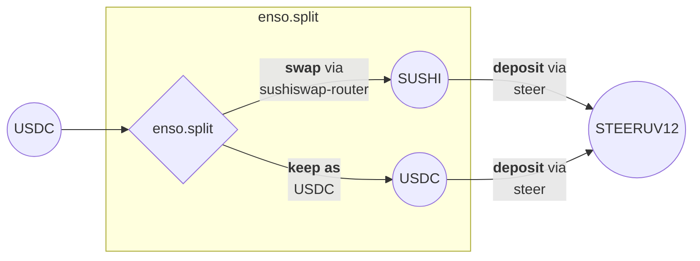

The supporting APIs provide comprehensive data about:

- available [positions](https://navigator.enso.build/tokens),  
- integrated projects and [protocols](https://docs.enso.build/pages/build/get-started/protocol-data#get-supported-protocols),
- [interaction methods](https://docs.enso.build/pages/build/reference/actions) - the standardized interfaces enabling declarative route construction,  
- portfolio [holdings and DeFi positions](https://docs.enso.build/pages/build/get-started/balances) for any wallet address.

For additional examples, browse the [Use Case Library](https://docs.enso.build/pages/use-cases).

## Integration

To accelerate development, explore:

- [Crosschain Swap Widget](https://happypath.enso.build) - an off-the-shelf React component enabling crosschain routing of DeFi positions and native tokens, available as a standalone application or for [embedding into your platform](https://docs.enso.build/pages/templates/cross-chain-route-widget)  
- Available [projects](https://navigator.enso.build/projects?&chainId=1) and [positions](https://navigator.enso.build/tokens?chainId=1)   
- Cross-chain [routing & asset bridging](https://docs.enso.build/pages/build/examples/bridging)
- Building with Enso through REST [API](https://docs.enso.build/pages/api-reference/overview) & [SDK](https://github.com/EnsoBuild/sdk-ts) integration

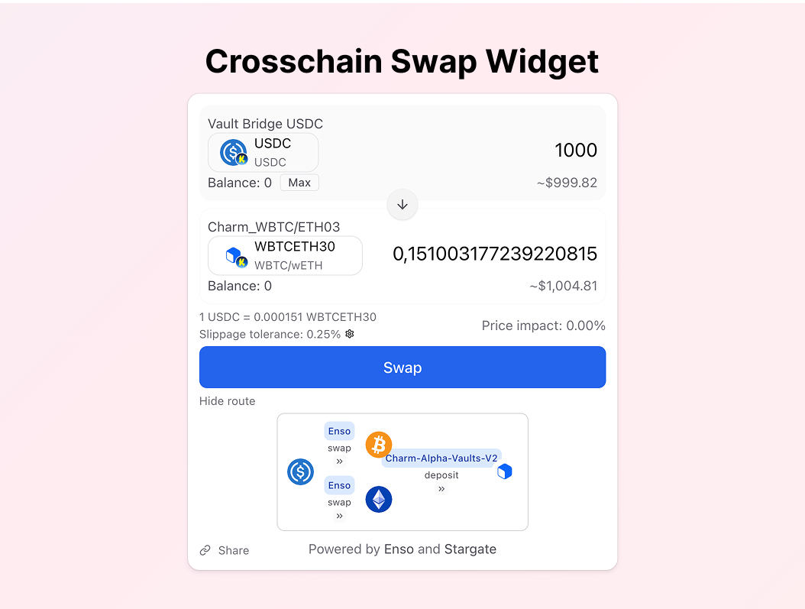

## Zap deposit USDC to SushiSwap USDC-wETH Liquidity Pool

This route creates SushiSwap LP tokens by splitting USDC and providing liquidity to the USDC/wETH pool.

[Try this route →](https://happypath.enso.build/?tokenIn=0x203A662b0BD271A6ed5a60EdFbd04bFce608FD36&outChainId=747474&chainId=747474&tokenOut=0xf9B1AE5F1929F9A4De548e98e0393ae1A9d1D0f8&amountIn=1000000)

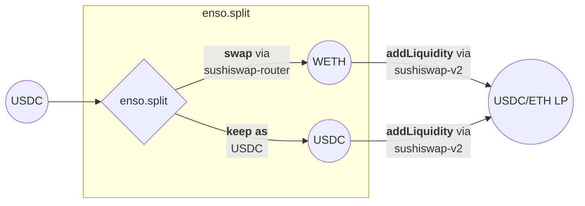

**Route mechanics:**

1. Split `USDC` into two paths via enso
    1. Swap a portion of `USDC` to `wETH` via sushiswap-router
    2. Keep a portion of `USDC`
2. Deposit `USDC` and `wETH` to `SLP` via sushiswap-v2

```ts  linenums="1" 
export async function usdcSushiswapLpToken() {
  const chainId = 747474;
  const TOKEN_IN = "0x203A662b0BD271A6ed5a60EdFbd04bFce608FD36"; // USDC
  const TOKEN_OUT = "0xf9B1AE5F1929F9A4De548e98e0393ae1A9d1D0f8"; // SLP
  const amountIn = parseUnits("100", 6);

  const routeParams: RouteParams = {
    fromAddress: userAddress,
    receiver: userAddress,
    chainId: chainId,
    destinationChainId: 747474,
    amountIn: [amountIn.toString()],
    tokenIn: [TOKEN_IN],
    tokenOut: [TOKEN_OUT],
    routingStrategy: "router",
    slippage: "150",
    referralCode: "build-on-katana"
  };

  const approvalData = await client.getApprovalData({
    amount: amountIn.toString(),
    chainId: chainId,
    tokenAddress: TOKEN_IN,
    fromAddress: userAddress,
  });
  
  await sendEoa(approvalData.tx, approvalData.gas);
  const route = await client.getRouteData(routeParams);
  await sendEoa(route.tx, route.gas);
  return route;
}
```

## Deposit into a SushiSwap V3 LP

To deposit into Sushiswap V3 `AUSD/USDC` pool, you need to use the `bundle` API.


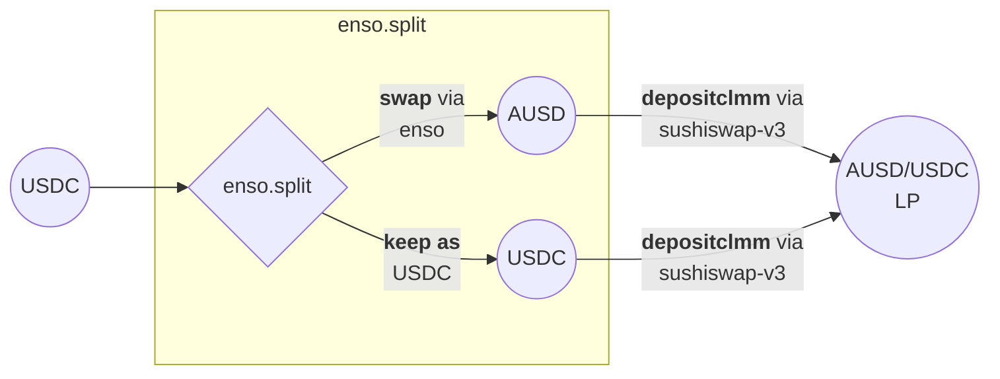

**Bundle Design**:

- Input of 100 `USDC` must be split into 2 tokens: `AUSD` and `USDC`, using Enso's `split` action that converts 50% of USDC into AUSD, and keeps the rest untouched
- Deposit using `depositclmm` action of `sushiswap-v3` protocol. 
  - `tokenIn` are the pool's tokens (`USDC/AUSD`)
  - `amountIn` is an array of amounts obtained from the split into `USDC` and `AUSD` respectively, using dynamic quantity reference (`useOutputOfCallAt`).
  - The `tokenOut` value is the address of Sushiswap's position manager contract.
  - Provide correct fee and ticks.


```ts linenums="1" 
export async function sushiswapV3() {
  const chainId = 747474;
  const fromAddress = "0xd8da6bf26964af9d7eed9e03e53415d37aa96045";

  const tokenIn_USDC = "0x203A662b0BD271A6ed5a60EdFbd04bFce608FD36";
  const tokenIn_AUSD = "0x00000000eFE302BEAA2b3e6e1b18d08D69a9012a";
  const sushiswapManager = "0x2659C6085D26144117D904C46B48B6d180393d27";

  const amountIn = parseUnits("100", 6); // 100 USDC

  const bundle = await client.getBundleData(
    {
      chainId,
      fromAddress,
      routingStrategy: "router",
    },
    [
      {
        // Split USDC into 2 parts for the LP position
        protocol: "enso",
        action: "split",
        args: {
          tokenIn: tokenIn_USDC,
          tokenOut: [tokenIn_AUSD, tokenIn_USDC],
          amountIn: amountIn.toString(),
        },
      },
      {
        protocol: "sushiswap-v3", 
        action: "depositclmm",
        args: {
          tokenOut: sushiswapManager,
          ticks: [-114, -86],
          poolFee: "100", 
          tokenIn: [tokenIn_AUSD, tokenIn_USDC],
          amountIn: [
            { useOutputOfCallAt: 0, index: 0 }, // AUSD from split
            { useOutputOfCallAt: 0, index: 1 }, // USDC from split
          ],
        },
      },
    ]
  );

  const approvalData = await client.getApprovalData({
    amount: amountIn.toString(),
    chainId,
    fromAddress,
    tokenAddress: tokenIn_USDC,
  });

  // Approve Enso Router contract to operate with USDC
  await sendEoa(approvalData.tx, approvalData.gas);

  // Execute the bundle transaction
  await sendEoa(bundle.tx, bundle.gas);
  return bundle;
}
```

## Deposit WBTC to SushiSwap V2 USDC-ETH LP Position via Multi-Swap

This route uses WBTC to create SushiSwap LP tokens through token splitting and liquidity provision.

[Try this route →](https://happypath.enso.build/?tokenIn=0x0913DA6Da4b42f538B445599b46Bb4622342Cf52&outChainId=747474&chainId=747474&tokenOut=0xf9B1AE5F1929F9A4De548e98e0393ae1A9d1D0f8&amountIn=100000000)

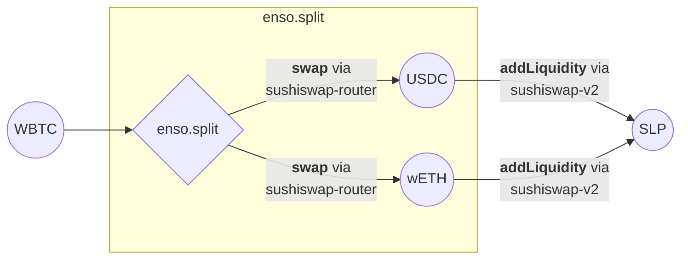

**Route mechanics:**

1. Split `WBTC` into two paths via enso
    1. Swap a portion of `WBTC` to `USDC` via sushiswap-router
    2. Swap a portion `WBTC` to `wETH` via sushiswap-router
2. Deposit `USDC` and `wETH` to `SLP` via sushiswap-v2

```ts  linenums="1" 
export async function wbtcSushiswapLpToken() {
  const chainId = 747474;
  const TOKEN_IN = "0x0913DA6Da4b42f538B445599b46Bb4622342Cf52"; // WBTC
  const TOKEN_OUT = "0xf9B1AE5F1929F9A4De548e98e0393ae1A9d1D0f8"; // SLP
  const amountIn = parseUnits("1", 8);

  const routeParams: RouteParams = {
    fromAddress: userAddress,
    receiver: userAddress,
    chainId: chainId,
    destinationChainId: 747474,
    amountIn: [amountIn.toString()],
    tokenIn: [TOKEN_IN],
    tokenOut: [TOKEN_OUT],
    routingStrategy: "router",
    slippage: "150",
    referralCode: "build-on-katana"
  };

  const approvalData = await client.getApprovalData({
    amount: amountIn.toString(),
    chainId: chainId,
    tokenAddress: TOKEN_IN,
    fromAddress: userAddress,
  });
  
  await sendEoa(approvalData.tx, approvalData.gas);
  const route = await client.getRouteData(routeParams);
  await sendEoa(route.tx, route.gas);
  return route;
}
```

## Deposit USDT to Morpho Blue steakUSDC Lending Vault

This route deposits USDT to steakUSDC through a simple swap and deposit mechanism using Morpho Blue vaults.

[Try this route →](https://happypath.enso.build/?tokenIn=0x2DCa96907fde857dd3D816880A0df407eeB2D2F2&outChainId=747474&chainId=747474&tokenOut=0x61D4F9D3797BA4dA152238c53a6f93Fb665C3c1d&amountIn=1000000)

**Route mechanics:**

1. Swap `USDT` to `USDC` via sushiswap-router
2. Deposit `USDC` to `steakUSDC` via morpho-blue-vaults

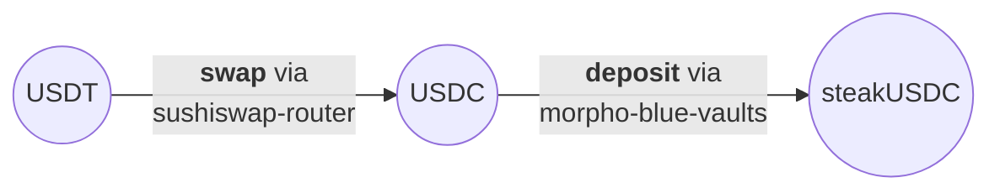

```ts  linenums="1" 
export async function vaultBridgeUsdtSteakusdc(){
  const chainId = 747474;
  const TOKEN_IN = "0x2DCa96907fde857dd3D816880A0df407eeB2D2F2"; // USDT
  const TOKEN_OUT = "0x61D4F9D3797BA4dA152238c53a6f93Fb665C3c1d"; // steakUSDC
  const amountIn = parseUnits("100", 6);

  const routeParams: RouteParams = {
    fromAddress: userAddress,
    receiver: userAddress,
    chainId: chainId,
    destinationChainId: 747474,
    amountIn: [amountIn.toString()],
    tokenIn: [TOKEN_IN],
    tokenOut: [TOKEN_OUT],
    routingStrategy: "router",
    slippage: "150",
    referralCode: "build-on-katana"
  };

  const approvalData = await client.getApprovalData({
    amount: amountIn.toString(),
    chainId: chainId,
    tokenAddress: TOKEN_IN,
    fromAddress: userAddress,
  });
  
  await sendEoa(approvalData.tx, approvalData.gas);
  const route = await client.getRouteData(routeParams);
  await sendEoa(route.tx, route.gas);
  return route;
}
```


## Withdraw from Morpho Blue with conversion

This route withdraws from a Morpho Blue vault position and converts the underlying asset to WBTC. The function redeems the vault token to get the underlying AUSD and then swaps it to WBTC.

[Try this route →](https://happypath.enso.build/?tokenIn=0xdE6a4F28Acfe431DD1CfA2D9c7A3d8301624a841&outChainId=747474&chainId=747474&tokenOut=0x0913DA6Da4b42f538B445599b46Bb4622342Cf52&amountIn=1000000000000000000)

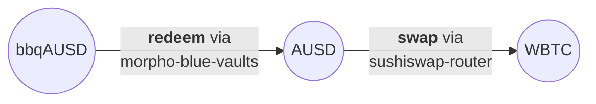

**Route mechanics:**

1. Redeem `bbqAUSD` to `AUSD` via morpho-blue-vaults
2. Swap `AUSD` to `WBTC` via sushiswap-router

```ts
export async function withdrawFromMorphoBlueAndSwapToWbtc() {
  const chainId = 747474;
  const TOKEN_IN = "0xdE6a4F28Acfe431DD1CfA2D9c7A3d8301624a841"; // bbqAUSD
  const TOKEN_OUT = "0x0913DA6Da4b42f538B445599b46Bb4622342Cf52"; // WBTC
  const amountIn = parseUnits("1", 18);

  const routeParams: RouteParams = {
    fromAddress: userAddress,
    receiver: userAddress,
    chainId: chainId,
    destinationChainId: 747474,
    amountIn: [amountIn.toString()],
    tokenIn: [TOKEN_IN],
    tokenOut: [TOKEN_OUT],
    routingStrategy: "router",
    slippage: "150",
    referralCode: "build-on-katana"
  };

  happyPathLog(routeParams);
  const approvalData = await client.getApprovalData({
    amount: amountIn.toString(),
    chainId: chainId,
    tokenAddress: TOKEN_IN,
    fromAddress: userAddress,
  });
  
  await sendEoa(approvalData.tx, approvalData.gas);
  const route = await client.getRouteData(routeParams);
  await sendEoa(route.tx, route.gas);
  return route;
}
```

## Strategy vault position migration: Morpho to Yearn

This route redeems bbqUSDC, converts to ETH, and deposits into a Yearn vbETH vault.

[Try this route →](https://happypath.enso.build/?tokenIn=0x1445A01a57D7B7663CfD7B4EE0a8Ec03B379aabD&outChainId=747474&chainId=747474&tokenOut=0xE007CA01894c863d7898045ed5A3B4Abf0b18f37&amountIn=1000000000000000000)

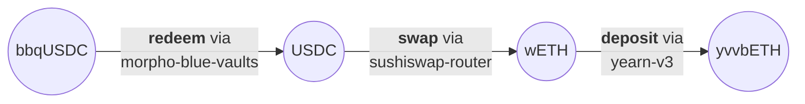

**Route mechanics:**

1. Redeem `bbqUSDC` to `USDC` via morpho-blue-vaults
2. Swap `USDC` to `wETH` via sushiswap-router
3. Deposit `wETH` to `yvvbETH` via yearn-v3

```ts  linenums="1" 
export async function steakhouseHighYieldUsdcVbethYvault() {
  const chainId = 747474;
  const TOKEN_IN = "0x1445A01a57D7B7663CfD7B4EE0a8Ec03B379aabD"; // bbqUSDC
  const TOKEN_OUT = "0xE007CA01894c863d7898045ed5A3B4Abf0b18f37"; // yvvbETH
  const amountIn = parseUnits("1", 18);

  const routeParams: RouteParams = {
    fromAddress: userAddress,
    receiver: userAddress,
    chainId: chainId,
    destinationChainId: 747474,
    amountIn: [amountIn.toString()],
    tokenIn: [TOKEN_IN],
    tokenOut: [TOKEN_OUT],
    routingStrategy: "router",
    slippage: "150",
    referralCode: "build-on-katana"
  };

  const approvalData = await client.getApprovalData({
    amount: amountIn.toString(),
    chainId: chainId,
    tokenAddress: TOKEN_IN,
    fromAddress: userAddress,
  });
  
  await sendEoa(approvalData.tx, approvalData.gas);
  const route = await client.getRouteData(routeParams);
  await sendEoa(route.tx, route.gas);
  return route;
}
```

## Zap deposit USDT to Yearn vbETH vault

This route swaps USDT to ETH and deposits into a Yearn vault for vbETH exposure.

[Try this route →](https://happypath.enso.build/?tokenIn=0x2DCa96907fde857dd3D816880A0df407eeB2D2F2&outChainId=747474&chainId=747474&tokenOut=0xE007CA01894c863d7898045ed5A3B4Abf0b18f37&amountIn=1000000)

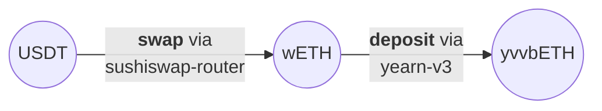

**Route mechanics:**

1. Swap `USDT` to `wETH` via sushiswap-router
2. Deposit `wETH` to `yvvbETH` via yearn-v3

```ts  linenums="1" 
export async function usdTVbethYvault() {
  const chainId = 747474;
  const TOKEN_IN = "0x2DCa96907fde857dd3D816880A0df407eeB2D2F2"; // USDT
  const TOKEN_OUT = "0xE007CA01894c863d7898045ed5A3B4Abf0b18f37"; // yvvbETH
  const amountIn = parseUnits("100", 6);

  const routeParams: RouteParams = {
    fromAddress: userAddress,
    receiver: userAddress,
    chainId: chainId,
    destinationChainId: 747474,
    amountIn: [amountIn.toString()],
    tokenIn: [TOKEN_IN],
    tokenOut: [TOKEN_OUT],
    routingStrategy: "router",
    slippage: "150",
    referralCode: "build-on-katana"
  };

  happyPathLog(routeParams);
  const approvalData = await client.getApprovalData({
    amount: amountIn.toString(),
    chainId: chainId,
    tokenAddress: TOKEN_IN,
    fromAddress: userAddress,
  });
  
  await sendEoa(approvalData.tx, approvalData.gas);
  const route = await client.getRouteData(routeParams);
  await sendEoa(route.tx, route.gas);
  return route;
}
```

## Deposit USDC to Charm Alpha

This route deposits USDC into a Charm Alpha vault position containing WBTC and ETH. The function splits the input USDC between WBTC and wETH tokens before depositing them into the vault.

[Try this route →](https://happypath.enso.build/?tokenIn=0x203A662b0BD271A6ed5a60EdFbd04bFce608FD36&outChainId=747474&chainId=747474&tokenOut=0x85b88F8ACEB5CaA67e240E6C2567F954B0C58D99&amountIn=1000000)

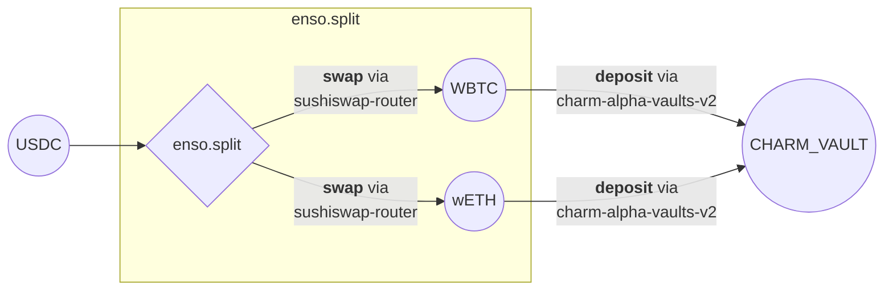

**Route mechanics:**

1. Split `USDC` to `WBTC` and `wETH` via enso
    1. Swap a portion of `USDC` to `WBTC`
    2. Swap a portion `USDC` to `wETH`
2. Deposit `WBTC` and `wETH` to `WBTCETH30` via charm-alpha-vaults-v2

```ts
export async function depositUsdcToCharmWbtcEth03() {
  const chainId = 747474;
  const TOKEN_IN = "0x203A662b0BD271A6ed5a60EdFbd04bFce608FD36"; // USDC
  const TOKEN_OUT = "0x85b88F8ACEB5CaA67e240E6C2567F954B0C58D99"; // WBTCETH30
  const amountIn = parseUnits("100", 6);

  const routeParams: RouteParams = {
    fromAddress: userAddress,
    receiver: userAddress,
    chainId: chainId,
    destinationChainId: 747474,
    amountIn: [amountIn.toString()],
    tokenIn: [TOKEN_IN],
    tokenOut: [TOKEN_OUT],
    routingStrategy: "router",
    slippage: "150",
    referralCode: "build-on-katana"
  };

  happyPathLog(routeParams);
  const approvalData = await client.getApprovalData({
    amount: amountIn.toString(),
    chainId: chainId,
    tokenAddress: TOKEN_IN,
    fromAddress: userAddress,
  });
  
  await sendEoa(approvalData.tx, approvalData.gas);
  const route = await client.getRouteData(routeParams);
  await sendEoa(route.tx, route.gas);
  return route;
}
```

## Withdraw from Charm Alpha vault with conversion

This route redeems a Charm Alpha vault position and converts the underlying assets to AUSD. The function withdraws USDC and wETH from the vault and swaps both tokens to the target AUSD token.

[Try this route →](https://happypath.enso.build/?tokenIn=0xc78c51F88adFbAdcDfafCfeF7F5E3d3c6C7d5129&outChainId=747474&chainId=747474&tokenOut=0x00000000eFE302BEAA2b3e6e1b18d08D69a9012a&amountIn=1000000000000000000)

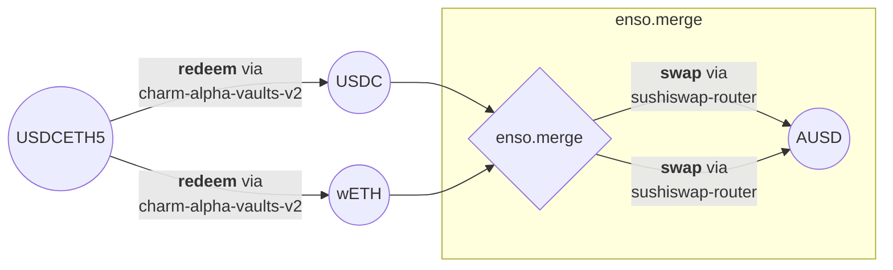

**Route mechanics:**

1. Redeem `USDCETH5` to `USDC` and `wETH` via charm-alpha-vaults-v2
2. Merge `USDC` and `wETH` to `AUSD` via enso with swapping

```ts
export async function withdrawCharmVbusdcVbeth005ToAusd() {
  const chainId = 747474;
  const TOKEN_IN = "0xc78c51F88adFbAdcDfafCfeF7F5E3d3c6C7d5129"; // USDCETH5
  const TOKEN_OUT = "0x00000000eFE302BEAA2b3e6e1b18d08D69a9012a"; // AUSD
  const amountIn = parseUnits("1", 18);

  const routeParams: RouteParams = {
    fromAddress: userAddress,
    receiver: userAddress,
    chainId: chainId,
    destinationChainId: 747474,
    amountIn: [amountIn.toString()],
    tokenIn: [TOKEN_IN],
    tokenOut: [TOKEN_OUT],
    routingStrategy: "router",
    slippage: "150",
    referralCode: "build-on-katana"
  };

  happyPathLog(routeParams);
  const approvalData = await client.getApprovalData({
    amount: amountIn.toString(),
    chainId: chainId,
    tokenAddress: TOKEN_IN,
    fromAddress: userAddress,
  });
  
  await sendEoa(approvalData.tx, approvalData.gas);
  const route = await client.getRouteData(routeParams);
  await sendEoa(route.tx, route.gas);
  return route;
}
```

## Deposit USDC to Midas Restaked SOL (Re7SOL)

This route deposits USDC to Midas Re7SOL tokens.

[Try this route →](https://happypath.enso.build/?tokenIn=0x203A662b0BD271A6ed5a60EdFbd04bFce608FD36&outChainId=747474&chainId=747474&tokenOut=0xC6135d59F8D10c9C035963ce9037B3635170D716&amountIn=1000000)

**Route mechanics:**

1. Swap `USDC` to `uSOL` via sushiswap-router
2. Deposit `uSOL` to `mRe7SOL` via midas-rwa

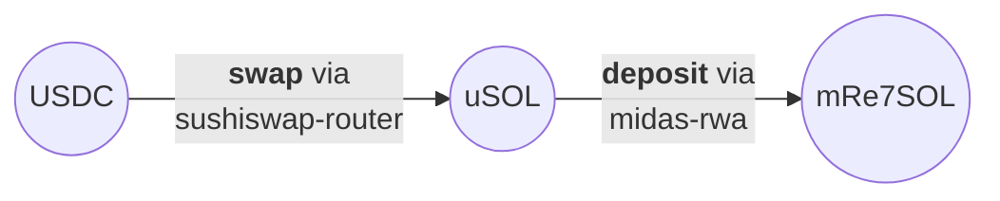

```ts  linenums="1" 
export async function usdcMidasRe7sol(){
  const chainId = 747474;
  const TOKEN_IN = "0x203A662b0BD271A6ed5a60EdFbd04bFce608FD36"; // USDC
  const TOKEN_OUT = "0xC6135d59F8D10c9C035963ce9037B3635170D716"; // mRe7SOL
  const amountIn = parseUnits("100", 6);

  const routeParams: RouteParams = {
    fromAddress: userAddress,
    receiver: userAddress,
    chainId: chainId,
    destinationChainId: 747474,
    amountIn: [amountIn.toString()],
    tokenIn: [TOKEN_IN],
    tokenOut: [TOKEN_OUT],
    routingStrategy: "router",
    slippage: "150",
    referralCode: "build-on-katana"
  };

  const approvalData = await client.getApprovalData({
    amount: amountIn.toString(),
    chainId: chainId,
    tokenAddress: TOKEN_IN,
    fromAddress: userAddress,
  });
  
  await sendEoa(approvalData.tx, approvalData.gas);
  const route = await client.getRouteData(routeParams);
  await sendEoa(route.tx, route.gas);
  return route;
}
```

## Deposit USDC to Steer SUSHI-USDC Automated LP Management

This route creates a Steer UniV3 vault position by splitting USDC into SUSHI and USDC components.

[Try this route →](https://happypath.enso.build/?tokenIn=0x203A662b0BD271A6ed5a60EdFbd04bFce608FD36&outChainId=747474&chainId=747474&tokenOut=0x4d3C354499389c52F1090Ba4c79bf4F4C083b274&amountIn=1000000)

**Route mechanics:**

1. Split `USDC` into two paths via enso
    1. Swap a portion `USDC` to `SUSHI` via sushiswap-router
    2. Keep a portion as `USDC`
2. Deposit `SUSHI` and `USDC` to `STEERUV12` via steer

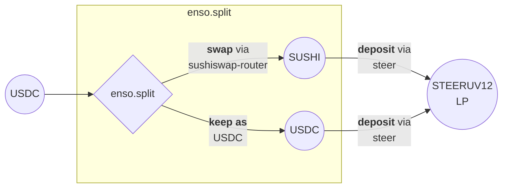

```ts  linenums="1" 
export async function usdcSteerUniv3Vault() {
  const chainId = 747474;
  const TOKEN_IN = "0x203A662b0BD271A6ed5a60EdFbd04bFce608FD36"; // USDC
  const TOKEN_OUT = "0x4d3C354499389c52F1090Ba4c79bf4F4C083b274"; // STEERUV12
  const amountIn = parseUnits("100", 6);

  const routeParams: RouteParams = {
    fromAddress: userAddress,
    receiver: userAddress,
    chainId: chainId,
    destinationChainId: 747474,
    amountIn: [amountIn.toString()],
    tokenIn: [TOKEN_IN],
    tokenOut: [TOKEN_OUT],
    routingStrategy: "router",
    slippage: "150",
    referralCode: "build-on-katana"
  };

  const approvalData = await client.getApprovalData({
    amount: amountIn.toString(),
    chainId: chainId,
    tokenAddress: TOKEN_IN,
    fromAddress: userAddress,
  });
  
  await sendEoa(approvalData.tx, approvalData.gas);
  const route = await client.getRouteData(routeParams);
  await sendEoa(route.tx, route.gas);
  return route;
}
```

## Transform WBTC to Midas Restaked SOL with High Slippage

This route converts WBTC to Midas Re7SOL tokens through SOL bridging with extremely high price impact.

[Try this route →](https://happypath.enso.build/?tokenIn=0x0913DA6Da4b42f538B445599b46Bb4622342Cf52&outChainId=747474&chainId=747474&tokenOut=0xC6135d59F8D10c9C035963ce9037B3635170D716&amountIn=100000000)

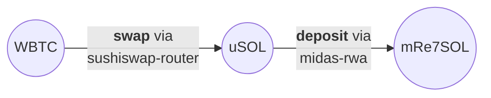

**Route mechanics:**

1. Swap `WBTC` to `uSOL` via sushiswap-router
2. Deposit `uSOL` to `mRe7SOL` via midas-rwa

```ts  linenums="1" 
export async function wbtcMidasRe7sol() {
  const chainId = 747474;
  const TOKEN_IN = "0x0913DA6Da4b42f538B445599b46Bb4622342Cf52"; // WBTC
  const TOKEN_OUT = "0xC6135d59F8D10c9C035963ce9037B3635170D716"; // mRe7SOL
  const amountIn = parseUnits("1", 8);

  const routeParams: RouteParams = {
    fromAddress: userAddress,
    receiver: userAddress,
    chainId: chainId,
    destinationChainId: 747474,
    amountIn: [amountIn.toString()],
    tokenIn: [TOKEN_IN],
    tokenOut: [TOKEN_OUT],
    routingStrategy: "router",
    slippage: "150",
    referralCode: "build-on-katana"
  };

  const approvalData = await client.getApprovalData({
    amount: amountIn.toString(),
    chainId: chainId,
    tokenAddress: TOKEN_IN,
    fromAddress: userAddress,
  });
  
  await sendEoa(approvalData.tx, approvalData.gas);
  const route = await client.getRouteData(routeParams);
  await sendEoa(route.tx, route.gas);
  return route;
}

```

## Resources

- [Enso Website](https://enso.build)  
- [Crosschain Route Widget](https://happypath.enso.build)  
- [Developer Docs](https://docs.enso.build)  
- [Use Case Library](https://docs.enso.build/pages/use-cases)  
- [Developer Support](https://t.me/enso_intent_engine)
