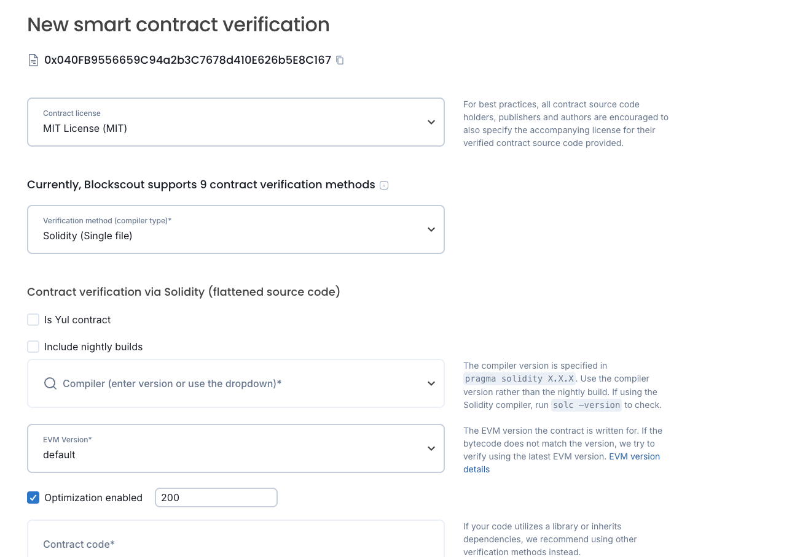

# Verifying Contracts

After you deploy some of your smart contracts on our Testnet (Bokuto), you may want
to verify them. The current blockexplorer Blockscout requires no API key, so you
can select your license and method in the UI,
[like this](https://explorer-bokuto.katanarpc.com/contract-verification),
and then add the Solidity code in there to verify.

- Bokuto explorer: [explorer.bokuto.katana.network](https://explorer.bokuto.katana.network/)

Note that if you’re using the Starter Kit (recommended), the settings are 200
optimization runs (as in the image above) and to flatten your contract and get a
single file you can paste here, you should use the
[`forge flatten`](https://book.getfoundry.sh/reference/forge/forge-flatten)
command.

After clicking Verify and Publish, your contract should get verified, provided
compiler settings and optimization settings match. If you get an error or can’t
get past something, let us know in the Telegram group’s developer channel.
