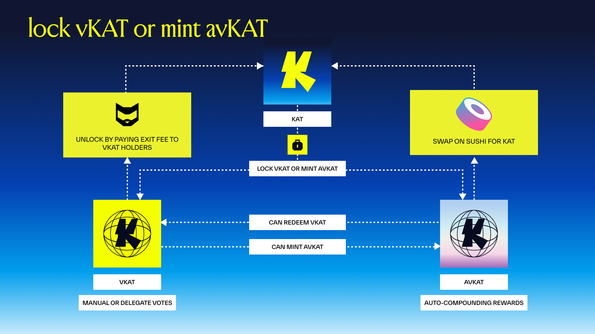

# KAT Staking

## The vKAT Armory

### What is the vKAT Armory?

The vKAT Armory is Katana's chain-wide voting system. It implements a modified ve(3,3) tokenomics model across the entire Katana DeFi ecosystem. The Armory encompasses the vKAT and avKAT staking contracts, the gauge voting system, relayer infrastructure, and the reward distribution mechanism.

### What is ve(3,3)?

ve(3,3) is a tokenomics model that combines two DeFi concepts: **vote-escrowed (ve) tokens** and **(3,3) game theory**. Vote-escrowed tokens, pioneered by Curve, require users to lock tokens in exchange for voting power over where protocol rewards are directed. The (3,3) element, introduced by OlympusDAO, refers to a game-theoretic framework where all participants benefit most when they cooperate by staking rather than selling. Together, ve(3,3) creates a system where locking tokens gives you a say in how emissions are distributed, and the incentive structure rewards long-term commitment — the more participants who lock and vote, the better the outcomes for everyone. Katana's implementation applies this model chain-wide, allowing vKAT holders to direct emissions across the entire DeFi ecosystem rather than a single protocol.

### What role does Aragon play?

[Aragon](https://aragon.org) built the core technical infrastructure behind the Armory. Aragon brings years of experience designing coordination systems for protocols like Curve, Lido, and Polygon. Their delivery includes the vKAT/avKAT staking UI, the voting interface for bi-weekly epochs, the protocol vote incentives claims mechanism, the indexer and backend infrastructure, and the locker manager that automates revoting, compounding, and reward routing. Aragon also provides tokenomics advisory support for long-term sustainability.

---

## KAT, vKAT & avKAT

### What is KAT?

KAT is the native token of the Katana Foundation. It is transferable and can be held in any Ethereum-compatible wallet. On its own, KAT does not grant voting power — you must stake it to participate in governance and emissions voting.

### What is vKAT?

vKAT (voting KAT) is a **non-transferable NFT** you receive when you lock KAT. Each vKAT represents a locked position with voting power that scales 1:1 with the lock amount. vKAT holders can vote on which liquidity pools receive KAT emissions, claim rewards manually, and set preferences for reward tokens (USDC, WETH, WBTC, KAT, or custom mixes).

### What is avKAT?

avKAT (autocompounding vote KAT) is a **liquid, transferable token** that wraps vKAT. The vault automatically votes for the highest-yield pools, compounds rewards into additional vKAT, and increases the avKAT:KAT exchange rate over time — requiring no user action other than delegating your KAT to avKAT. It is the first tokenized relayer, strategy voting and reward compounding on your behalf.

### What is the difference between vKAT and avKAT?

| Feature | vKAT (Direct) | avKAT (Vault) |
|---------|---------------|---------------|
| **Token Type** | Non-transferable NFT | Liquid, transferable token |
| **Transferable** | No | Yes |
| **Voting** | Manual — you choose gauges | Automatic — strategy votes |
| **Reward Claiming** | Manual | Handled by vault |
| **Reward Preferences** | Customizable (USDC, WETH, WBTC, KAT, custom) | Default (strategy) |
| **Exit Speed** | 60-day cooldown | Instant (DEX) or 60-day |
| **Best For** | Active governance participants | Users who vault strategy, liquid staking |

---

## Staking & Participation

### What are the two ways to participate?

1. **vKAT (Manual)** — Full control. You choose which pools to vote for and receive flexible reward payouts in your preferred tokens.
2. **avKAT (Automated Staking)** — Automatic profit-maximizing strategy with autocompounded rewards. Value accrues directly to your position with delegation of your voting power.

### What is a relayer?

A relayer is an entity that votes on gauges and compounds rewards on behalf of delegators. The relayer role is open to anyone. avKAT is the first tokenized relayer, automating voting and reward claiming. As more relayers become available, vKAT holders will be able to pick a relayer based on the voting strategy that works for them and delegate their votes accordingly.

### How do I stake KAT to get vKAT?

Lock your KAT through the [Katana staking app](https://app.katana.network/stake) to receive a vKAT NFT. You can hold multiple vKAT NFTs, each representing a separate lock position.

### How do I get avKAT?

Deposit KAT into the avKAT vault through the [Katana staking app](https://app.katana.network/stake). The vault locks your KAT, issues you avKAT tokens representing your proportional ownership, and handles gauge voting and reward compounding through an optimized strategy.

### Can I convert between vKAT and avKAT?

Yes. You can deposit your vKAT NFT into the avKAT vault at any time. This is a one-way operation — the original NFT is consumed and you receive avKAT tokens in return. To go the other direction, you can redeem avKAT back to a new vKAT NFT and then follow the standard exit process.

### Can I merge or split vKAT positions?

Yes. vKAT positions can be merged into a single NFT or split into multiple NFTs, giving you flexibility in managing your locked positions.

---

## Gauge Voting & Emissions

### How does gauge voting work?

vKAT holders direct KAT emissions to specific liquidity pools by voting on gauges. Starting with Sushi, gauge voting will expand to cover Morpho, perpetuals DEXs, and yield trading protocols. You allocate your voting power as percentages across the gauges you want to support. Votes automatically roll over each epoch; changes only occur when you manually adjust or delegate to a relayer.

### What is the emissions flywheel?

The gauge system creates a self-reinforcing cycle: **emissions attract liquidity → liquidity drives volume → volume generates fees → fees return to voters who directed the emissions**. This flywheel aligns incentives between liquidity providers, voters, and protocols competing for emissions.

### What rewards do vKAT voters earn?

vKAT voters **direct** where KAT emissions go, but the emissions themselves are claimed by LPs in those pools. The rewards vKAT voters earn are:

- **Vote incentives** — Earned for directing emissions to gauges
- **Trading fees** — Generated by the pools you voted for
- **Exit fees** — Redistributed from users who unstake their vKAT

### Can I choose which tokens I receive as rewards?

Yes, if you hold vKAT directly, you will be rewarded in the fee pools you vote for. avKAT holders do not need to customize rewards — the vault handles reward compounding automatically.

!!! note "Current reward tokens"
    Custom reward token selection is not active. Currently, the token you receive varies by reward type:

    - **Trading fees** — fee tokens (USDC, WETH, etc.)
    - **Vote incentives (bribes)** — whatever the incentivizer offers (could be KAT)
    - **Exit fees** — vKAT
    - **35% top-up for pre-stakers** — vKAT

### How are rewards distributed?

Rewards are distributed through the [Merkl platform](https://app.merkl.xyz/status) each epoch. vKAT holders claim manually through the Katana app; avKAT holders have rewards auto-compounded by the vault.

---

## Exiting & Fees

### How do I exit my vKAT position?

Initiating an unlock triggers a **60-day cooldown** during which your vKAT has zero voting power and generates no rewards. Your active votes are reset when you begin the withdrawal. After the full cooldown, a **2.5% exit fee** applies. All exit fees are redistributed to remaining vKAT holders. You can also cancel a withdrawal during the cooldown to resume staking.

### Can I exit early?

Yes. There are two fee schedules depending on when you staked relative to TGE. Note that the stabilization fees below are based on *days since TGE* (calendar time), while the steady-state fees are based on *days since you began your withdrawal* (cooldown time).

**Stabilization window (Day 0–60 after TGE):** Exit fees are elevated based on how far along the network is from launch:

| Days Since TGE | Max Exit Fee | Example (1,000 KAT staked) |
|--------|-----|---------------------------|
| **Day 0–14** | 80% | Receive 200 KAT |
| **Day 15–30** | 60% | Receive 400 KAT |
| **Day 31–45** | 45% | Receive 550 KAT |
| **Day 46–60** | 30% | Receive 700 KAT |

**Steady state (Day 61+ after TGE):** Fees are based on how long you wait after starting your 60-day cooldown:

| Days in Cooldown | Fee | Example (1,000 KAT staked) |
|--------|-----|---------------------------|
| **Day 0** (rage quit) | 25% | Receive 750 KAT |
| **Day 15** | ~19.4% | Receive ~806 KAT |
| **Day 30** | ~13.8% | Receive ~863 KAT |
| **Day 45** | ~8.1% | Receive ~919 KAT |
| **Day 60** (full cooldown) | 2.5% | Receive 975 KAT |

### Where do exit fees go?

All exit fees are redistributed to remaining active vKAT holders. During the stabilization window (Day 0–60), exit fees are accumulated and distributed to Founding Stakers after Day 60. From Day 61 onward, exit fees are distributed in real-time.

### How do I exit an avKAT position?

Two options:

1. **Sell on a DEX (instant)** — avKAT is fully transferable and tradeable. Swap it on any DEX with liquidity. No cooldown or exit fee, but subject to market slippage.
2. **Redeem through the vault (60-day cooldown)** — Convert avKAT back to a new vKAT NFT, then follow the standard vKAT exit process with cooldown and fees.

### What is the Stabilization Window?

The first 60 days after TGE feature elevated exit fees to protect price discovery and early staker positions. See the fee tables in [Can I exit early?](#can-i-exit-early) for the full breakdown.

---

## Launch Programs

### What is Pre-Staking?

Before TGE, you can pre-commit KAT through the [Katana staking app](https://app.katana.network/stake). At TGE, your commitment is auto-executed into avKAT with no manual action required after performing the approval signature. Pre-stakers receive a **3x vote boost** (decaying to 1x over 8 weeks) and qualify for Founding Staker status.

### What are Founding Stakers?

Founding Stakers are participants who stake within 72 hours of TGE and maintain their position for 60 days. They receive a share of all exit fees accumulated during the stabilization window. Two groups qualify: pre-stakers (auto-executed via relayer) and early stakers (manual stake within 72h of TGE).

### How does the Vote Boost work?

Pre-stakers receive a temporary multiplier on voting power and rewards:

| Period | Boost |
|--------|-------|
| Day 0–14 | 3.0x |
| Day 15–28 | 2.5x |
| Day 29–42 | 2.0x |
| Day 43–56 | 1.5x |
| Day 57+ | 1.0x |

### What is the aggregate program cap?

The aggregate program payout cannot exceed **123 million KAT tokens** (35% of the 350 million participation cap).

---

## Risks

### What are the main risks of staking?

- **Smart contract risk** — Potential bugs or exploits in the staking, vault, and gauge contracts, even after audits.
- **Vote concentration** — Short-term risk of voting power being concentrated among early or large stakers.
- **avKAT market liquidity** — avKAT's instant exit relies on DEX liquidity, which may be limited, especially early on.
- **Exit fee exposure** — Early exits incur significant fees (up to 25% at steady state, up to 80% during stabilization).

### What mitigations are in place?

- **Cooldowns and exit fees** protect against bank-run dynamics and redistribute value to committed stakers.
- **Relayer automation** reduces vote concentration by making it easy to delegate to algorithmic strategies.
- **Revenue-backed emissions** ensure the system is not purely inflationary — fees from real DeFi activity underpin rewards.
- **DeFi Security Council** — A 13-member multisig with emergency powers can intervene if critical issues arise.

---

## Roadmap

### When does the Armory launch?

**Phase 1 (Q1 2026):** Core infrastructure launch including vKAT/avKAT locker, Sushi voting, gauges, indexer, and UI integration; locker manager and relayer tools operational.

**Phase 2 (Q1–Q2 2026):** Expansion of vKAT voting and avKAT support across additional ecosystem applications beyond Sushi.

---

## Learn More

For a deeper look at the vKAT Armory, the Aragon partnership, and the design behind Katana's governance system, read the full blog post: [Katana x Aragon: Inside the vKAT Armory](https://katana.network/blog/katana-x-aragon-inside-the-vkat-armory).
