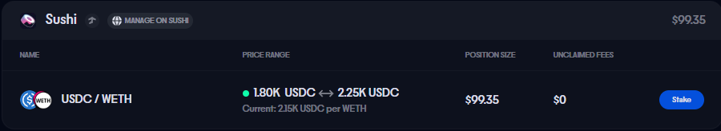
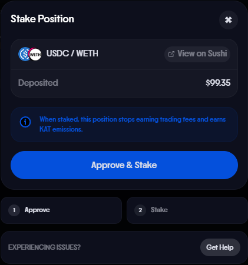

# Stake Your Sushi LP Position

Staking your Sushi LP position on Katana earns you KAT token emissions. This guide walks you through how to stake your LP tokens so you can start earning rewards when Epoch 1 begins.

!!! warning "Staking is required to earn KAT emissions"
    Starting with Epoch 1 on **March 26, 2026**, only staked LP positions earn KAT emissions. Unstaked LP positions will **no longer** receive KAT rewards. Make sure to stake your LP tokens before Epoch 1 begins.

## What You Need

- A Sushi LP position on Katana
- Your wallet connected to the [Katana app](https://app.katana.network/portfolio)

## How to Stake Your LP Position

1. Go to the [Katana Portfolio page](https://app.katana.network/portfolio).
2. Find your Sushi LP position in the list.
3. Click the **Stake** button next to your position.
{ .img-left }
4. **Approve** the transaction in your wallet, this allows the staking contract to access your LP tokens.
{ .img-left }
5. **Confirm the stake** transaction in your wallet.
6. Once confirmed, your LP position is staked and will begin earning KAT emissions starting Epoch 1.

## Rewards

Once your LP tokens are staked, rewards are distributed in **KAT tokens**. Emissions are directed to liquidity pools through the gauge voting system — vKAT and avKAT holders vote on which pools receive emissions each epoch.

For more on how gauge voting and emissions work, see [KAT Staking](katana-staking.md#gauge-voting--emissions).
