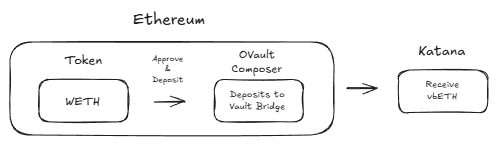
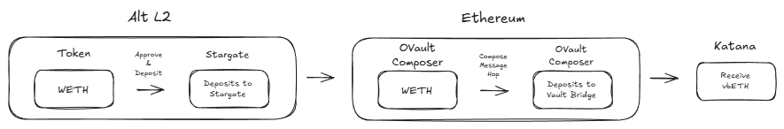

Crypto is lovely. Not only do you get Blockchain fragmentation, Asset fragmentation, but also Bridge fragmentation!

On this Episode of Katana Docs, we explain the different bridges for the different (Core) Assets.

### Bridging Assets

Do you just wanna quickly bridge some ETH to cover some gas costs? Check out [gas.zip](https://gas.zip).

The vast majority of tokens that are not "native" to Katana are [Canonically Bridged](https://bridge.katana.network/) from EthMainnet.

A few exceptions, being:

- jitoSOL: bridged with LayerZero, available on [Stargate](https://stargate.finance/bridge?srcChain=solana&srcToken=J1toso1uCk3RLmjorhTtrVwY9HJ7X8V9yYac6Y7kGCPn&dstChain=katana&dstToken=0x6C16E26013f2431e8B2e1Ba7067ECCcad0Db6C52)
- LBTC: bridged with CCIP, available on [Lombard](https://www.lombard.finance/app/bridge/)
- uAssets (such as uSOL): mintable on [Universal](https://app.universal.xyz/) (KYC required), or tradeable (no KYC)

NOTE: liquidity-based bridges, such as [Relay](https://relay.link/bridge/katana?includeChainIds=562da1f0-bffe-4208-a3d8-143c2fbdb380&fromChainId=747474) support all tokens, as they only require liquidity on Sushi.

### Bridging for Devs

If you're building a protocol that requires bridging, you have different alternatives.

#### Agglayer (Katana's Canonical Bridge)

Learn about [building crosschain apps using Agglayer](https://build.agglayer.dev/), and check the [Agglayer Docs](https://docs.agglayer.dev/) for other information about bridging with the Agglayer.

| Bridge Contracts | Value                                        | Block Explorer                                                                        |
| ---------------- | -------------------------------------------- | ------------------------------------------------------------------------------------- |
| `Unified Bridge` | `0x2a3DD3EB832aF982ec71669E178424b10Dca2EDe` | [explorer](https://katanascan.com/address/0x2a3DD3EB832aF982ec71669E178424b10Dca2EDe) |
| `Bridge & Call`  | `0x64B20Eb25AEd030FD510EF93B9135278B152f6a6` | [explorer](https://katanascan.com/address/0x64B20Eb25AEd030FD510EF93B9135278B152f6a6) |

Note: The `networkId` (i.e. Agglayer Id) for Katana is `20`. For EthMainnet it's `0`.

#### Cross-Chain Interoperability Protocol (aka Chainlink CCIP)

| Contract                  | Address                                      | Block Explorer                                                                        |
| ------------------------- | -------------------------------------------- | ------------------------------------------------------------------------------------- |
| Katana router             | `0x7c19b79D2a054114Ab36ad758A36e92376e267DA` | [explorer](https://katanascan.com/address/0x7c19b79D2a054114Ab36ad758A36e92376e267DA) |
| Ethereum router           | `0x80226fc0Ee2b096224EeAc085Bb9a8cba1146f7D` | [explorer](https://etherscan.io/address/0x80226fc0Ee2b096224EeAc085Bb9a8cba1146f7D)   |
| Katana → Ethereum offramp | `0xa8c12a859225531254dDef7079030f7DD6992A14` | [explorer](https://etherscan.io/address/0xa8c12a859225531254dDef7079030f7DD6992A14)   |
| Ethereum → Katana offramp | `0x2FA4962EbaeB7b1dC066FA3f8Fc07489Fd34DA63` | [explorer](https://katanascan.com/address/0x2FA4962EbaeB7b1dC066FA3f8Fc07489Fd34DA63) |

#### LayerZero

Due to the nature of Vault Bridge (vb) Assets, all bridged funds must go through the Vault Bridge for all Katana assets to continue to earn yield for its users  
`Ethereum → Katana`  

`L2 → Ethereum → Katana`

| config            | value                                        |                                                                                       |
| ----------------- | -------------------------------------------- | ------------------------------------------------------------------------------------- |
| chainKey          | `katana`                                     |                                                                                       |
| stage             | `mainnet`                                    |                                                                                       |
| EID               | `30375`                                      |                                                                                       |
| endpointV2        | `0x6F475642a6e85809B1c36Fa62763669b1b48DD5B` | [explorer](https://katanascan.com/address/0x6F475642a6e85809B1c36Fa62763669b1b48DD5B) |
| sendUln302        | `0xC39161c743D0307EB9BCc9FEF03eeb9Dc4802de7` | [explorer](https://katanascan.com/address/0xC39161c743D0307EB9BCc9FEF03eeb9Dc4802de7) |
| receiveUln302     | `0xe1844c5D63a9543023008D332Bd3d2e6f1FE1043` | [explorer](https://katanascan.com/address/0xe1844c5D63a9543023008D332Bd3d2e6f1FE1043) |
| blockedMessageLib | `0xc1ce56b2099ca68720592583c7984cab4b6d7e7a` | [explorer](https://katanascan.com/address/0xc1ce56b2099ca68720592583c7984cab4b6d7e7a) |
| executor          | `0x4208D6E27538189bB48E603D6123A94b8Abe0A0b` | [explorer](https://katanascan.com/address/0x4208D6E27538189bB48E603D6123A94b8Abe0A0b) |
| deadDVN           | `0x6788f52439ACA6BFF597d3eeC2DC9a44B8FEE842` | [explorer](https://katanascan.com/address/0x6788f52439ACA6BFF597d3eeC2DC9a44B8FEE842) |

| config            | value                                        |                                                                                       |
| ----------------- | -------------------------------------------- | ------------------------------------------------------------------------------------- |
| chainKey          | `Ethereum mainnet`                           |                                                                                       |
| stage             | `mainnet`                                    |                                                                                       |
| EID               | `30101`                                      |                                                                                       |
| OVault composer   | `0x8A35897fda9E024d2aC20a937193e099679eC477` | [explorer](https://etherscan.io/address/0x8A35897fda9E024d2aC20a937193e099679eC477)   |
| shareOFT          | `0xC39161c743D0307EB9BCc9FEF03eeb9Dc4802de7` | [explorer](https://etherscan.io/address/0xb5bADA33542a05395d504a25885e02503A957Bb3)   |
| vbUSDC            | `0x53E82ABbb12638F09d9e624578ccB666217a765e` | [explorer](https://etherscan.io/address/0x53E82ABbb12638F09d9e624578ccB666217a765e)   |
| vbUSDT            | `0x6d4f9f9f8f0155509ecd6Ac6c544fF27999845CC` | [explorer](https://etherscan.io/address/0x6d4f9f9f8f0155509ecd6Ac6c544fF27999845CC)   |
| vbWBTC            | `0x2C24B57e2CCd1f273045Af6A5f632504C432374F` | [explorer](https://etherscan.io/address/0x2C24B57e2CCd1f273045Af6A5f632504C432374F)   |
| vbETH             | `0x2DC70fb75b88d2eB4715bc06E1595E6D97c34DFF` | [explorer](https://etherscan.io/address/0x2DC70fb75b88d2eB4715bc06E1595E6D97c34DFF)   |

An example for bridging through LayerZero can be found [here](https://github.com/katana-network/lz-ops-demo)